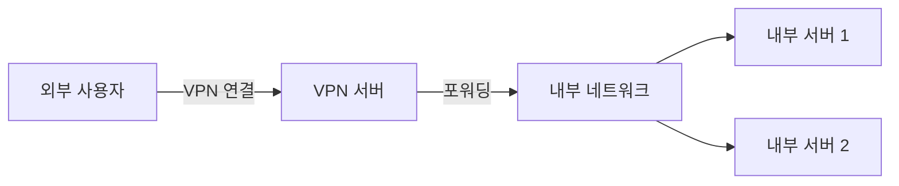
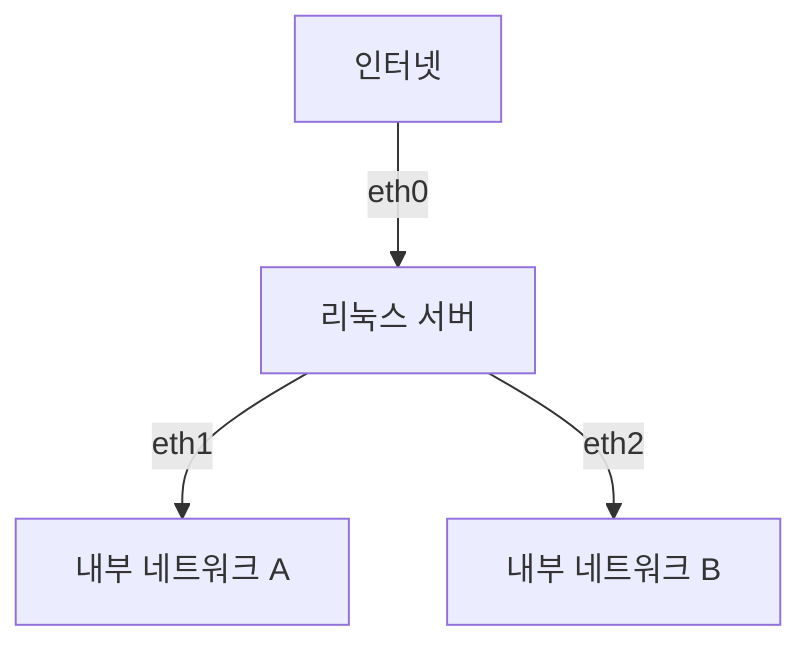
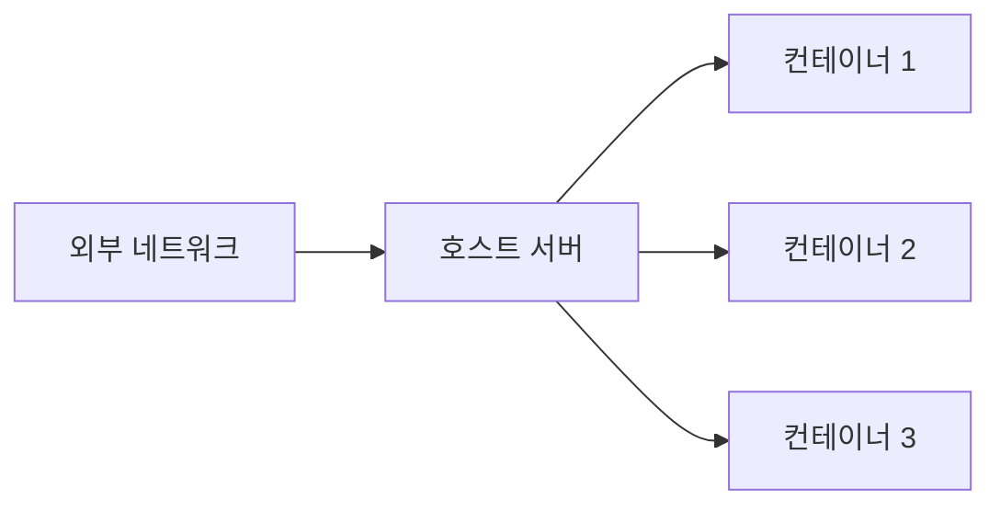

```table-of-contents
title: # 목차
style: nestedList # TOC style (nestedList|nestedOrderedList|inlineFirstLevel)
minLevel: 0 # Include headings from the specified level
maxLevel: 0 # Include headings up to the specified level
includeLinks: true # Make headings clickable
hideWhenEmpty: false # Hide TOC if no headings are found
debugInConsole: false # Print debug info in Obsidian console
```
# IP 포워딩이란?

## 기본 개념
IP 포워딩은 한 네트워크에서 다른 네트워크로 패킷을 전달하는 기능이다. 마치 우체국이 다른 지역으로 우편물을 전달하는 것과 같다.

## 필요한 배경 지식
- IP 주소의 개념
- 네트워크의 기본 구조
- 라우팅의 기본 개념

# IP 포워딩이 필요한 상황

## 1. VPN 서버 구축


### 실제 예시
- 회사 VPN으로 내부 시스템 접속
- 집에서 회사 네트워크 사용
- 원격 근무 환경 구축

## 2. 라우터/게이트웨이 구축


### 실제 예시
- 소규모 사무실 네트워크 구성
- 테스트 환경 네트워크 분리
- 네트워크 간 통신 제어

## 3. Docker/컨테이너 네트워크


### 실제 예시
- 도커 컨테이너 간 통신
- 쿠버네티스 클러스터 구성
- 마이크로서비스 아키텍처

# IP 포워딩 설정 방법

## 1. 상태 확인
```bash
# 현재 IP 포워딩 상태 확인
cat /proc/sys/net/ipv4/ip_forward

# 출력값
# 0 = 비활성화 (기본값)
# 1 = 활성화
```

## 2. 임시 활성화
```bash
# root 권한 필요
echo 1 > /proc/sys/net/ipv4/ip_forward
# 또는
sysctl -w net.ipv4.ip_forward=1
```

## 3. 영구 활성화
```bash
# /etc/sysctl.conf 수정
net.ipv4.ip_forward = 1

# 설정 적용
sysctl -p
```

# 실제 구현 예시

## 1. VPN 서버 구성
```bash
# 1. IP 포워딩 활성화
echo 1 > /proc/sys/net/ipv4/ip_forward

# 2. NAT 설정
iptables -t nat -A POSTROUTING -o eth0 -j MASQUERADE

# 3. OpenVPN 설정
# /etc/openvpn/server.conf
push "route 192.168.1.0 255.255.255.0"
```

## 2. 네트워크 브리지 구성
```bash
# 1. IP 포워딩 활성화
sysctl -w net.ipv4.ip_forward=1

# 2. 브리지 생성
ip link add name br0 type bridge
ip link set dev br0 up

# 3. 인터페이스 연결
ip link set dev eth1 master br0
ip link set dev eth2 master br0
```

# 주의사항

## 1. 보안 고려사항
```bash
# 1. 필요한 포워딩만 허용
iptables -A FORWARD -i eth0 -o eth1 -j ACCEPT
iptables -A FORWARD -i eth1 -o eth0 -j ACCEPT

# 2. 불필요한 포워딩 차단
iptables -P FORWARD DROP
```

## 2. 성능 고려사항
```bash
# 네트워크 버퍼 크기 조정
net.core.rmem_max = 16777216
net.core.wmem_max = 16777216
net.ipv4.tcp_rmem = 4096 87380 16777216
net.ipv4.tcp_wmem = 4096 65536 16777216
```

# 문제 해결

## 1. 포워딩이 작동하지 않는 경우
```bash
# 1. IP 포워딩 상태 확인
cat /proc/sys/net/ipv4/ip_forward

# 2. iptables 규칙 확인
iptables -L -v -n

# 3. 라우팅 테이블 확인
ip route show
```

## 2. 성능 문제
```bash
# 네트워크 상태 모니터링
netstat -s

# 인터페이스 상태 확인
ip -s link show
```

# 결론
IP 포워딩은 현대 네트워크 환경에서 필수적인 기능이다. VPN, 컨테이너화, 네트워크 분리 등 다양한 용도로 사용되며, 적절한 설정과 보안 조치를 통해 안전하게 구현할 수 있다. 다만, 불필요한 경우에는 보안을 위해 비활성화하는 것이 좋다.