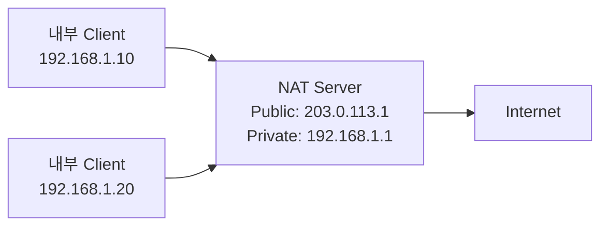
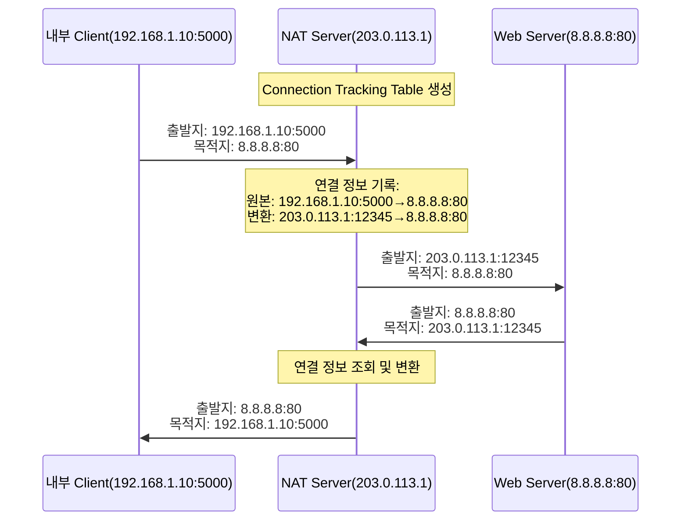

```table-of-contents
title: # 목차
style: nestedList # TOC style (nestedList|nestedOrderedList|inlineFirstLevel)
minLevel: 0 # Include headings from the specified level
maxLevel: 0 # Include headings up to the specified level
includeLinks: true # Make headings clickable
hideWhenEmpty: false # Hide TOC if no headings are found
debugInConsole: false # Print debug info in Obsidian console
```
# Network Address Translation의 이해
Network Address Translation(이하 NAT)은 내부 네트워크의 Private IP 주소를 Public IP 주소로 변환하는 기술이다. 마치 회사의 대표 전화번호 시스템처럼, 내부의 여러 구성원이 하나의 대표 번호를 공유하는 방식으로 작동한다.

## 배경 지식
이 문서를 이해하기 위해서는 다음 개념들에 대한 기본적인 이해가 필요하다:
- IP 주소 체계 (Private IP, Public IP)
- Network 기본 개념
- Linux 기본 명령어

# NAT의 동작 방식
## 기본 구조


## Connection Tracking 메커니즘


# NAT 구현하기
## 기본 설정 방법
```bash
# 1. IP Forwarding 활성화
echo 1 > /proc/sys/net/ipv4/ip_forward

# 2. NAT 설정 (firewalld 사용)
# 외부 인터페이스 설정
firewall-cmd --permanent --zone=external --change-interface=eth0

# NAT 활성화
firewall-cmd --permanent --zone=external --add-masquerade

# 설정 적용
firewall-cmd --reload
```

## 고급 설정
### 특정 네트워크 NAT 설정
```bash
# 192.168.1.0/24 네트워크에 대해서만 NAT 적용
firewall-cmd --permanent --zone=external --add-rich-rule='rule family=ipv4 source address=192.168.1.0/24 masquerade'
```

### 특정 서비스 NAT 설정
```bash
# HTTP 트래픽만 NAT 적용
firewall-cmd --permanent --zone=external --add-rich-rule='rule family=ipv4 source address=192.168.1.0/24 port port=80 protocol=tcp masquerade'
```

# 성능 최적화
## Connection Tracking 설정
```bash
# /etc/sysctl.conf 설정
net.netfilter.nf_conntrack_max = 131072
net.netfilter.nf_conntrack_tcp_timeout_established = 7200

# 설정 적용
sysctl -p
```

# 문제 해결 가이드
## 일반적인 문제 상황
### 1. 연결 추적 테이블 초과
증상: "nf_conntrack: table full, dropping packet" 메시지 발생

해결 방법:
```bash
# 테이블 크기 증가
echo 262144 > /proc/sys/net/netfilter/nf_conntrack_max
```

### 2. NAT 동작 확인
```bash
# NAT 상태 확인
firewall-cmd --zone=external --query-masquerade

# 연결 추적 상태 확인
cat /proc/net/nf_conntrack
```

# 보안 고려사항
## 기본 보안 설정
```bash
# 1. 기본 정책 설정
firewall-cmd --set-default-zone=drop

# 2. 필요한 서비스만 허용
firewall-cmd --permanent --zone=internal --add-service=dns
firewall-cmd --permanent --zone=internal --add-service=dhcp
```

## 로깅 설정
```bash
# NAT 트래픽 로깅 설정
firewall-cmd --permanent --zone=external --add-rich-rule='rule family=ipv4 source address=192.168.1.0/24 log prefix="NAT-LOG: " level="notice" limit value="1/m" masquerade'
```

# 결론
NAT는 Private Network와 Public Network를 연결하는 핵심 기술이다. 적절한 설정과 모니터링을 통해 안정적인 네트워크 운영이 가능하며, 특히 보안과 성능 최적화에 주의를 기울여야 한다.