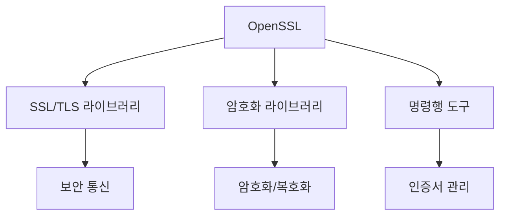
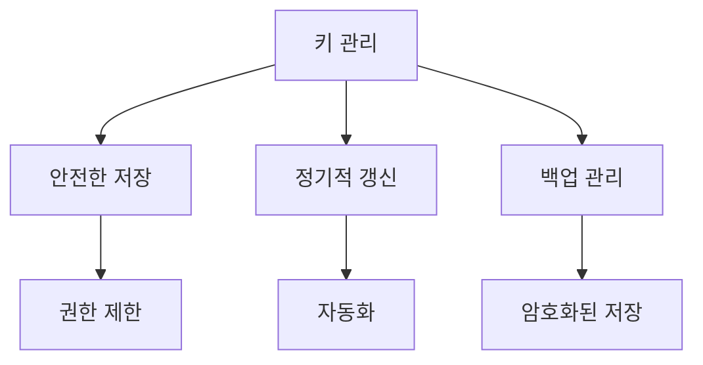

# 개념 이해

## OpenSSL이란?
OpenSSL은 SSL/TLS 프로토콜과 다양한 암호화 기능을 제공하는 오픈소스 라이브러리이다. 대부분의 웹 서버와 보안 애플리케이션에서 사용된다.

## 주요 구성 요소


# 주요 기능

## 1. 인증서 관리
```bash
# 개인키 생성
openssl genrsa -out private.key 2048

# CSR 생성
openssl req -new -key private.key -out request.csr

# 자체 서명 인증서 생성
openssl x509 -req -days 365 -in request.csr -signkey private.key -out certificate.crt
```

## 2. SSL/TLS 연결 테스트
```bash
# 서버 SSL 연결 테스트
openssl s_client -connect example.com:443

# 특정 프로토콜 테스트
openssl s_client -connect example.com:443 -tls1_2
```

## 3. 암호화/복호화
```bash
# 파일 암호화
openssl enc -aes-256-cbc -in plaintext.txt -out encrypted.txt

# 파일 복호화
openssl enc -d -aes-256-cbc -in encrypted.txt -out decrypted.txt
```

# 실제 사용 사례

## 웹 서버 설정


## 개발 환경


# 주요 명령어 모음

## 1. 인증서 관련
```bash
# 인증서 정보 확인
openssl x509 -text -in certificate.crt

# 인증서 체인 확인
openssl verify -CAfile ca.crt certificate.crt

# 만료일 확인
openssl x509 -enddate -noout -in certificate.crt
```

## 2. 암호화 스위트 확인
```bash
# 지원되는 암호화 목록
openssl ciphers -v

# 특정 암호화 테스트
openssl s_client -cipher 'ECDHE-RSA-AES128-GCM-SHA256' -connect example.com:443
```

## 3. 성능 테스트
```bash
# 암호화 속도 테스트
openssl speed aes-256-cbc

# RSA 연산 속도 테스트
openssl speed rsa
```

# 문제 해결 가이드

## 일반적인 문제

### 1. 인증서 오류
```bash
# 인증서 체인 문제 확인
openssl verify -verbose certificate.crt

# 인증서 형식 확인
openssl x509 -inform PEM -text -in certificate.crt
```

### 2. SSL/TLS 연결 문제
```bash
# 자세한 연결 정보 확인
openssl s_client -debug -connect example.com:443

# 프로토콜 지원 확인
openssl s_client -tls1_2 -connect example.com:443
```

# 보안 모범 사례

## 1. 키 관리


## 2. 설정 최적화
```bash
# 강력한 암호화 설정
openssl dhparam -out dhparams.pem 2048

# 권한 설정
chmod 600 private.key
```

# 모니터링 및 유지보수

## 정기 점검 항목
1. 인증서 만료 확인
2. 취약점 스캔
3. 프로토콜 설정 검토
4. 키 관리 상태 확인

## 자동화 스크립트 예시
```bash
#!/bin/bash
# 인증서 만료 모니터링
for cert in /etc/ssl/certs/*.crt; do
    echo "Checking $cert..."
    openssl x509 -enddate -noout -in "$cert"
done
```

# 결론

## OpenSSL의 중요성
1. 보안 통신의 기반
2. 표준 암호화 구현
3. 인증서 관리 도구
4. 보안 테스트 도구

## 활용 분야
1. 웹 서버 보안
2. 개발 환경 구성
3. 보안 감사
4. 암호화 구현