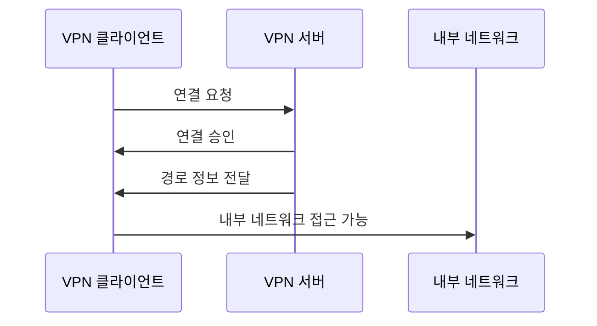
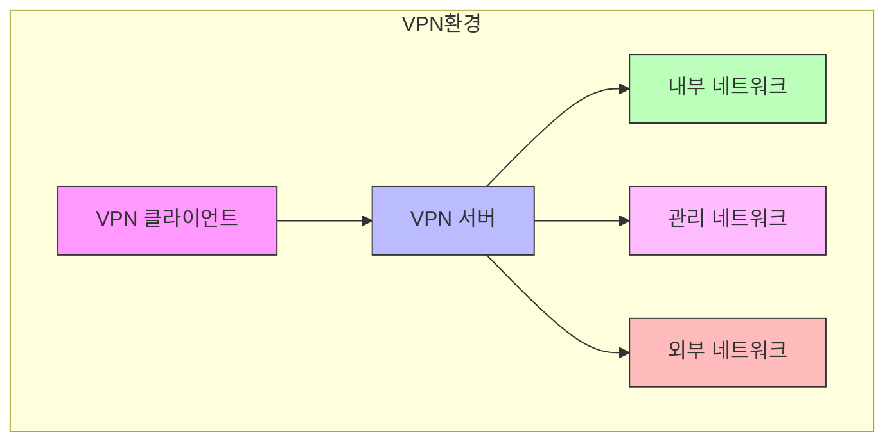

```table-of-contents
title: 
style: nestedList # TOC style (nestedList|nestedOrderedList|inlineFirstLevel)
minLevel: 0 # Include headings from the specified level
maxLevel: 0 # Include headings up to the specified level
includeLinks: true # Make headings clickable
hideWhenEmpty: false # Hide TOC if no headings are found
debugInConsole: false # Print debug info in Obsidian console
```


# 개요
VPN 환경에서 클라이언트에게 네트워크 경로를 전달하는 방법에 대해 설명한다. 이는 마치 택배 기사에게 상세한 배송 경로를 알려주는 것과 같다.

# 기본 개념
## 네트워크 경로 전파란?
VPN 서버가 클라이언트에게 접근 가능한 네트워크 정보를 전달하는 기능이다. 이는 다음과 같은 구성 요소를 포함한다:
- 대상 네트워크 주소
- 서브넷 마스크
- 게이트웨이 정보

## 기본 동작 방식



# 구현 방법
## 기본 설정
```bash
# OpenVPN 서버 설정 파일 (server.conf)
# 기본적인 경로 설정
push "route 10.0.0.0 255.255.255.0"  # 내부 네트워크 접근 경로

# 추가 네트워크 설정
push "route 192.168.1.0 255.255.255.0"  # 부가 네트워크 접근 경로
```

## 단계별 구현 과정
### 1단계: 단일 네트워크 설정
```bash
# 기본 네트워크 접근 설정
push "route 10.0.0.0 255.255.255.0"
```

### 2단계: 다중 네트워크 설정
```bash
# 여러 네트워크 동시 접근 설정
push "route 10.0.0.0 255.255.255.0"    # 주요 네트워크
push "route 172.16.0.0 255.255.0.0"    # 보조 네트워크
push "route 192.168.1.0 255.255.255.0" # 관리용 네트워크
```

### 3단계: 고급 설정
```bash
# 세부 경로 및 메트릭 설정
push "route 10.0.0.0 255.255.255.0 10.0.0.1"    # 게이트웨이 지정
push "route 172.16.0.0 255.255.0.0 172.16.0.1"  # 다른 게이트웨이 사용
```

# 시스템 구조도


# 주의사항
## 보안 고려사항
- 필요한 네트워크 경로만 정확히 설정한다
- 전체 네트워크 접근은 피한다
- 정기적으로 경로 설정을 검토한다

## 성능 고려사항
- 경로 수가 많아지면 라우팅 테이블이 커진다
- 네트워크 단위를 적절히 통합한다
- 불필요한 경로는 제거한다

# 문제 해결 가이드
## 일반적인 문제
 경로 충돌
```bash
# 잘못된 설정
push "route 10.0.0.0 255.0.0.0"
push "route 10.1.0.0 255.255.0.0"  # 충돌 발생

# 올바른 설정
push "route 10.1.0.0 255.255.0.0"  # 구체적인 경로만 설정
```

# 결론
네트워크 경로 설정은 VPN 환경에서 매우 중요한 요소이다. 올바른 설정과 지속적인 관리를 통해 안정적인 네트워크 접근을 보장할 수 있다.

# 참고 자료
- OpenVPN 공식 문서
- TCP/IP 네트워크 기초
- 라우팅 프로토콜 이해