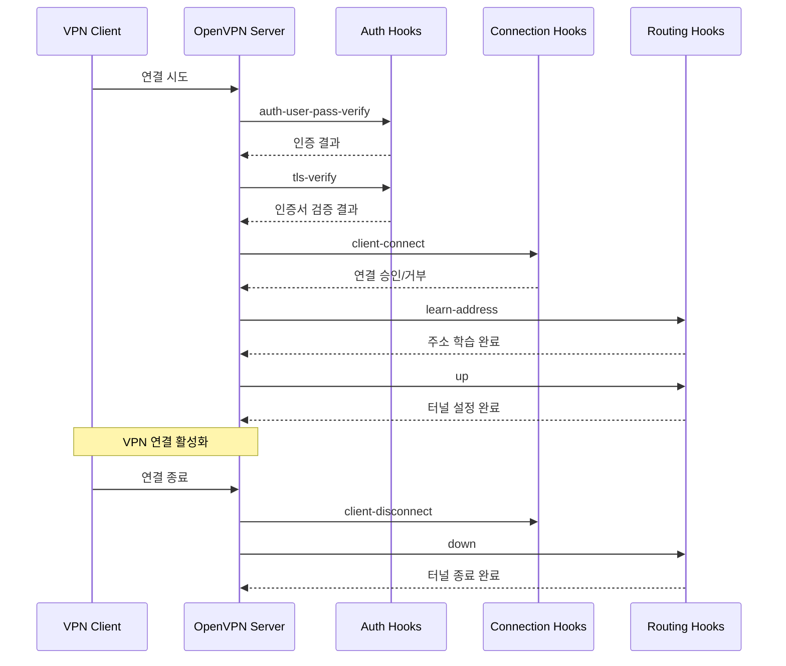

```table-of-contents
title: 
style: nestedList # TOC style (nestedList|nestedOrderedList|inlineFirstLevel)
minLevel: 0 # Include headings from the specified level
maxLevel: 0 # Include headings up to the specified level
includeLinks: true # Make headings clickable
hideWhenEmpty: false # Hide TOC if no headings are found
debugInConsole: false # Print debug info in Obsidian console
```
# OpenVPN Hook 스크립트 개요

## 주요 Hook 스크립트

### 1. 인증 관련 Hook
- `auth-user-pass-verify`
  - 사용자 인증 시 실행
  - 사용자명과 비밀번호 검증에 사용
  - 데이터베이스나 외부 인증 시스템과 연동 가능

- `tls-verify`
  - SSL/TLS 인증서 검증 시 실행
  - 인증서의 추가적인 확인 작업 수행
  - 특정 조건에 따른 인증서 거부 가능

### 2. 연결 관련 Hook
- `client-connect`
  - 클라이언트 연결 시점에 실행
  - 연결 승인 전 추가 검증 수행
  - 동적 설정 적용 가능

- `client-disconnect`
  - 클라이언트 연결 종료 시 실행
  - 세션 정리 및 로깅
  - 리소스 정리 작업 수행

### 3. 라우팅 관련 Hook
- `learn-address`
  - 클라이언트 IP 주소 할당 시 실행
  - 동적 라우팅 테이블 관리
  - IP 주소 기반 정책 적용

- `up`
  - VPN 터널 생성 완료 시 실행
  - 네트워크 인터페이스 설정
  - 시스템 라우팅 테이블 수정

- `down`
  - VPN 터널 종료 시 실행
  - 네트워크 설정 복원
  - 리소스 정리

## 동작 흐름도


## Hook 스크립트 작성 시 고려사항

### 1. 보안
- 스크립트 실행 권한 제한
- 입력값 검증
- 로그 파일 보안
- 민감 정보 처리 주의

### 2. 성능
- 실행 시간 최소화
- 리소스 사용 효율화
- 오류 처리 구현

### 3. 유지보수
- 명확한 주석 작성
- 로그 기록 구현
- 모듈화된 구조
- 설정 파일 분리

## 활용 예시

### 1. 통합 인증 시스템
```bash
#!/bin/bash
# auth-user-pass-verify 예시
# LDAP 인증 구현

username="$1"
password="$2"

# LDAP 서버 연동 및 인증
ldapauth "$username" "$password" || exit 1
exit 0
```

### 2. 접속 제어
```bash
#!/bin/bash
# tls-verify 예시
# 인증서 시리얼 번호 확인

serial="$1"
# 폐기된 인증서 목록 확인
grep -q "$serial" /etc/openvpn/revoked.txt && exit 1
exit 0
```

### 3. 동적 라우팅
```bash
#!/bin/bash
# learn-address 예시
# 클라이언트 IP 기반 정책 적용

action="$1"
address="$2"
cn="$3"

case "$action" in
    add)
        # 새로운 라우팅 규칙 추가
        ip route add "$address" via "$cn"
        ;;
    delete)
        # 라우팅 규칙 제거
        ip route del "$address"
        ;;
esac
```

## 주의사항
1. script-security 설정 필요
2. 스크립트 실행 권한 관리
3. 오류 처리 및 로깅 구현
4. 성능 영향 고려
5. 보안 위험 요소 검토

## 결론
OpenVPN의 다양한 hook 스크립트를 활용하면 VPN 서버의 동작을 세밀하게 제어하고 모니터링할 수 있다. 각 hook의 특성을 이해하고 적절히 활용하면 보안성과 효율성을 크게 향상시킬 수 있다. 다만, 스크립트 구현 시 보안과 성능에 대한 충분한 고려가 필요하다.