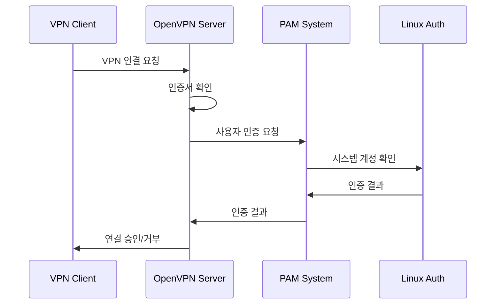

# PAM 인증이란?

## 개념 설명
PAM(Pluggable Authentication Modules)은 Linux 시스템의 인증 프레임워크로, OpenVPN에서 시스템 계정을 이용한 사용자 인증을 가능하게 한다. 실생활로 비유하면 건물의 출입증(인증서)과 더불어 키패드 비밀번호(계정 로그인)를 추가로 확인하는 것과 같다.

## 기본 동작 방식
1. 클라이언트가 VPN 연결 시도
2. 인증서 확인 (기본 인증)
3. 시스템 사용자 계정으로 추가 인증
4. 모든 인증 통과 시 연결 허용



## 설정 방법

### 1. PAM 모듈 설치
```bash
# Debian/Ubuntu
sudo apt-get install openvpn-auth-pam

# CentOS/RHEL
sudo yum install openvpn-auth-pam
```

### 2. PAM 설정 파일 생성
```bash
# /etc/pam.d/openvpn
auth    required    pam_unix.so    shadow nodelay
account required    pam_unix.so
```

> [! info] auth required pam_unix.so shadow nodelay
> 📍 인증(authentication) 설정 라인
> - required: 이 단계는 반드시 통과해야 함
> - pam_unix.so: 기본 Unix 시스템 인증 모듈 사용
> - shadow: 암호화된 비밀번호가 저장된 /etc/shadow 파일 사용
> - nodelay: 로그인 실패시 지연 시간 없음

> [!info] account required pam_unix.so
> 📍 계정(account) 검증 라인
> - required: 이 단계는 반드시 통과해야 함
> - pam_unix.so: 기본 Unix 시스템 계정 검증
> - 계정 만료, 접근 시간 제한 등을 확인

[[PAM(Pluggable Authentication Modules)]]
### 3. OpenVPN 서버 설정
```conf
# /etc/openvpn/server.conf
plugin /usr/lib/openvpn/openvpn-plugin-auth-pam.so openvpn
verify-client-cert require
username-as-common-name
```

### 4. 클라이언트 설정
```conf
# client.ovpn
auth-user-pass
```

## 실제 사용 예시

### 1. 기본 인증 흐름
```plaintext
1. 클라이언트 연결 시도
2. 인증서 확인
3. 사용자이름/비밀번호 입력 프롬프트
4. PAM 인증 수행
5. 연결 설정
```

### 2. 스크립트를 통한 자동 인증
```bash
#!/bin/bash
# auth.txt
username
password
```
```conf
# client.ovpn
auth-user-pass auth.txt
```

## 보안 고려사항

### 1. 계정 보안
- 강력한 비밀번호 정책 적용
- 계정 잠금 정책 설정
- 정기적인 비밀번호 변경

### 2. 시스템 설정
```bash
# /etc/security/limits.conf
* hard maxlogins 3
```

### 3. 로깅 설정
```conf
# syslog 설정
facility=daemon
log-append /var/log/openvpn.log
verb 3
```

## 장단점

### 장점
1. 이중 인증으로 보안 강화
2. 시스템 계정 관리 통합
3. 기존 인증 인프라 활용
4. 사용자별 접근 제어 용이

### 단점
1. 시스템 계정 관리 부담
2. 인증 절차 증가
3. 설정 복잡도 상승
4. 성능 overhead 발생

## 주의사항
1. 시스템 보안
   - 계정 생성/삭제 관리 철저
   - sudo 권한 제한적 부여
   - 로그인 시도 제한 설정

2. 성능 고려사항
   - 동시 접속자 수 제한
   - 인증 timeout 설정
   - 로그 관리 계획

## 결론
PAM 인증은 OpenVPN의 보안을 강화할 수 있는 효과적인 방법이지만, 시스템 관리 부담이 증가하는 트레이드오프가 있다. 조직의 보안 요구사항과 관리 역량을 고려하여 도입을 결정해야 한다.