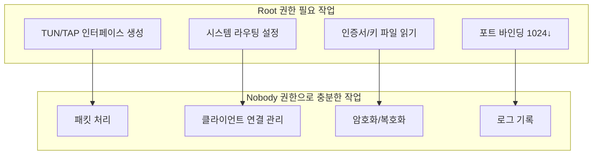
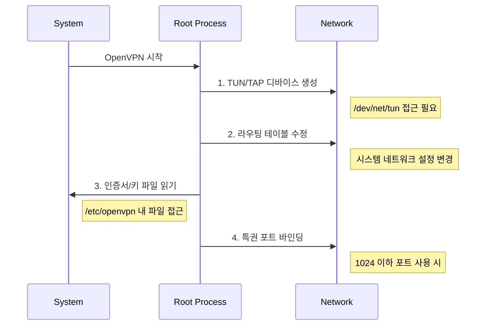
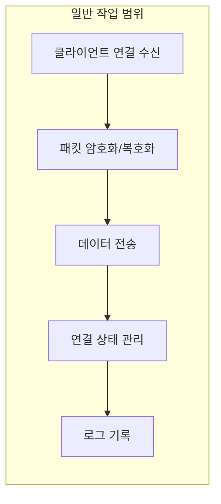
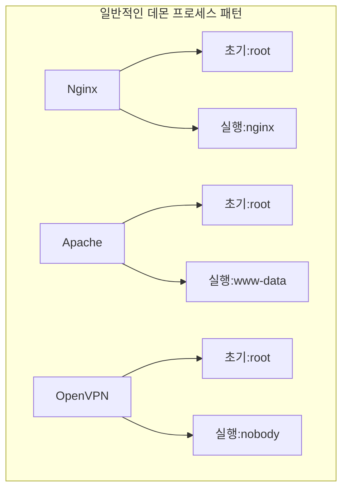

# 개념 설명
## 권한 설계의 기본 원칙
서버 프로세스의 권한 관리는 은행 금고 접근과 유사하다. 금고를 열 때는 높은 권한이 필요하지만, 일상적인 창구 업무는 제한된 권한으로 충분한 것처럼, OpenVPN도 시작 시에만 높은 권한이 필요하고 일반 작업은 제한된 권한으로 수행한다.

## 권한 분리의 필요성


# Process 권한 단계
## 1. 초기화 단계 (Root 권한)


## 2. 권한 전환
```bash
# OpenVPN 서버 설정
user nobody
group nogroup

# Process 실행 로그
[Initial] Starting OpenVPN with root privileges
[Init] TUN/TAP device created
[Init] Routing table updated
[Init] Certificates and keys loaded
[Init] Port 1194 bound successfully
[Security] Dropping root privileges
[Ready] Running as user nobody
```

## 3. 일반 동작 단계 (Nobody 권한)


# 권한별 필요 작업 상세
## 1. Root 권한이 필요한 작업
```plaintext
1. 네트워크 인터페이스 관리
   - TUN/TAP 디바이스 생성/제거
   - 인터페이스 설정 변경
   
2. 시스템 네트워크 설정
   - 라우팅 테이블 수정
   - IP 포워딩 설정
   
3. 보안 파일 접근
   - 인증서 읽기 (/etc/openvpn/server.crt)
   - 개인키 읽기 (/etc/openvpn/server.key)
   
4. 네트워크 바인딩
   - 1024 이하 포트 사용
   - 네트워크 인터페이스 선택
```

## 2. Nobody 권한으로 충분한 작업
```plaintext
1. 연결 관리
   - 클라이언트 세션 유지
   - 연결 상태 모니터링
   
2. 데이터 처리
   - 패킷 암호화/복호화
   - 데이터 압축/해제
   
3. 로깅
   - 상태 로그 기록
   - 오류 메시지 기록
```

# 파일 권한 설정
## 1. Root 소유 파일
```bash
# 인증서와 키
chmod 600 /etc/openvpn/server.key
chmod 644 /etc/openvpn/server.crt
chown root:root /etc/openvpn/server.*

# 설정 파일
chmod 644 /etc/openvpn/server.conf
chown root:root /etc/openvpn/server.conf
```

## 2. Nobody 접근 파일
```bash
# 로그 디렉토리
mkdir /var/log/openvpn
chown nobody:nogroup /var/log/openvpn
chmod 755 /var/log/openvpn

# 상태 파일
touch /var/log/openvpn/status.log
chown nobody:nogroup /var/log/openvpn/status.log
chmod 644 /var/log/openvpn/status.log
```

# 보안 강화 방안
## 1. 추가적인 권한 제한
```bash
# server.conf
chroot /etc/openvpn/jail
persist-key
persist-tun
```

## 2. systemd 서비스 강화
```ini
[Service]
CapabilityBoundingSet=CAP_IPC_LOCK CAP_NET_ADMIN CAP_NET_BIND_SERVICE CAP_NET_RAW CAP_SETGID CAP_SETUID CAP_SYS_CHROOT CAP_DAC_OVERRIDE
AmbientCapabilities=CAP_IPC_LOCK CAP_NET_ADMIN CAP_NET_BIND_SERVICE CAP_NET_RAW CAP_SETGID CAP_SETUID CAP_SYS_CHROOT CAP_DAC_OVERRIDE
SecurityLimitNOFILE=1048576
LimitNPROC=10
PrivateTmp=true
ProtectSystem=strict
ProtectHome=true
```

# 다른 서비스와의 비교
## 1. 유사한 설계를 가진 서비스


## 2. 차이점
```plaintext
1. Nginx/Apache
   - 정적 파일 서비스를 위한 읽기 권한 필요
   - 웹 로그 기록을 위한 쓰기 권한 필요
   
2. OpenVPN
   - 네트워크 인터페이스 생성 권한 필요
   - 시스템 라우팅 설정 권한 필요
   
3. MySQL
   - 데이터 디렉토리 접근 권한 필요
   - 시스템 사용자 인증 권한 필요
```

# 보안 감사
## 1. 권한 확인
```bash
#!/bin/bash
# 권한 감사 스크립트

check_process_user() {
    user=$(ps -ef | grep '[o]penvpn' | awk '{print $1}')
    if [ "$user" != "nobody" ]; then
        echo "경고: OpenVPN이 nobody가 아닌 $user로 실행 중"
        return 1
    fi
    echo "정상: OpenVPN이 nobody로 실행 중"
    return 0
}

check_file_permissions() {
    # 키 파일 권한 확인
    if [ "$(stat -c %a /etc/openvpn/server.key)" != "600" ]; then
        echo "경고: server.key 권한이 600이 아님"
    fi
    
    # 인증서 권한 확인
    if [ "$(stat -c %a /etc/openvpn/server.crt)" != "644" ]; then
        echo "경고: server.crt 권한이 644가 아님"
    fi
}

check_process_user
check_file_permissions
```

## 2. 정기적 점검 사항
```plaintext
1. Process 권한 확인
   - ps aux | grep openvpn
   - systemctl status openvpn

2. 파일 권한 확인
   - ls -la /etc/openvpn/
   - namei -l /etc/openvpn/server.key

3. 네트워크 설정 확인
   - ip link show
   - ip route show

4. 로그 모니터링
   - tail -f /var/log/openvpn/openvpn.log
   - grep 'privilege' /var/log/openvpn/openvpn.log
```

# 결론
OpenVPN의 권한 설계는 다음과 같은 특징을 가진다:

1. 이원화된 권한 구조
   - 초기화: root 권한으로 필요한 시스템 설정
   - 실행: nobody 권한으로 일반 작업 수행

2. 보안 강화
   - 최소 권한 원칙 준수
   - 필요한 시점에만 높은 권한 사용
   - 권한 분리를 통한 위험 최소화

3. 운영 효율성
   - 명확한 권한 구분으로 관리 용이
   - 표준화된 보안 모델 적용
   - 체계적인 모니터링 가능

이러한 설계는 보안과 기능성의 균형을 이루면서, 시스템의 안전한 운영을 가능하게 한다.