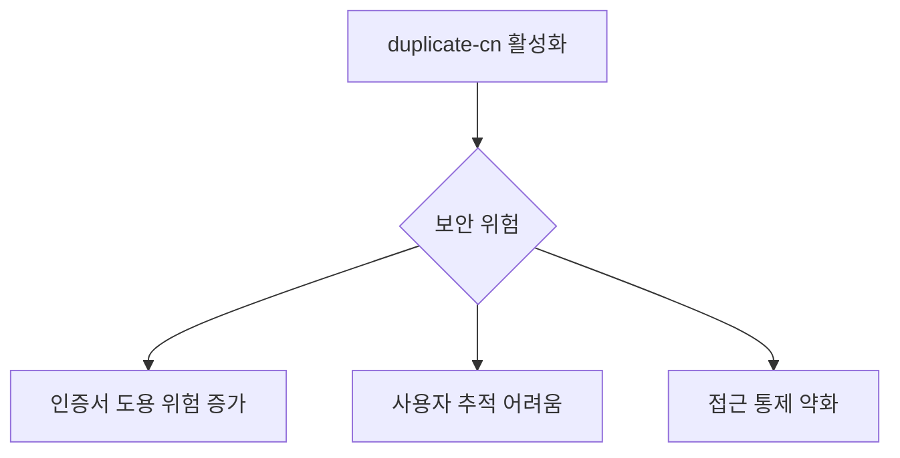

# duplicate-cn 설정의 이해

## 개념 설명
duplicate-cn은 동일한 인증서(Common Name)를 사용하는 다중 클라이언트 연결을 허용할지 결정하는 OpenVPN 서버 설정이다. 실생활에 비유하면 하나의 출입카드로 여러 사람이 동시에 건물에 들어올 수 있게 허용하는 것과 같다.

## 기본 동작 방식
### duplicate-cn 비활성화 (기본값)
```conf
# /etc/openvpn/server.conf
# duplicate-cn 설정 없음 또는 주석 처리
```
- 하나의 인증서당 하나의 연결만 허용
- 새로운 연결 시도시 기존 연결 강제 종료

### duplicate-cn 활성화
```conf
# /etc/openvpn/server.conf
duplicate-cn
```
- 동일 인증서로 다중 동시 연결 허용
- 모든 연결이 독립적으로 유지

## 영향과 고려사항

### 보안 영향


### 장단점 비교
장점:
- 간편한 인증서 관리
- 동일 계정의 멀티 디바이스 지원
- 빠른 재연결 지원

단점:
- 보안성 저하
- 사용자별 트래픽 구분 어려움
- 리소스 사용량 증가

## 실제 사용 예시

### 일반적인 설정
```conf
# 엄격한 보안이 필요한 경우
# duplicate-cn 설정 제외

# 개발/테스트 환경
duplicate-cn
```

### 사용 시나리오
1. 테스트/개발 환경
   - 여러 개발자가 동일 인증서 사용
   - 빠른 테스트를 위한 환경

2. 공유 계정이 필요한 환경
   - 가족용 VPN 서버
   - 소규모 팀 공유 접속

## 주의사항
1. 보안 고려사항
   - 프로덕션 환경에서는 사용 자제
   - 인증서 공유 시 책임 소재 불분명
   - 접속 기록 추적 어려움

2. 리소스 관리
   - 서버 부하 증가 가능성
   - 네트워크 대역폭 고려
   - IP 주소 풀 고갈 주의

## 결론
duplicate-cn 설정은 편의성과 보안성이 상충하는 대표적인 예시이다. 테스트 환경이나 특수한 상황에서만 제한적으로 사용하고, 프로덕션 환경에서는 가급적 사용을 피하는 것이 바람직하다.