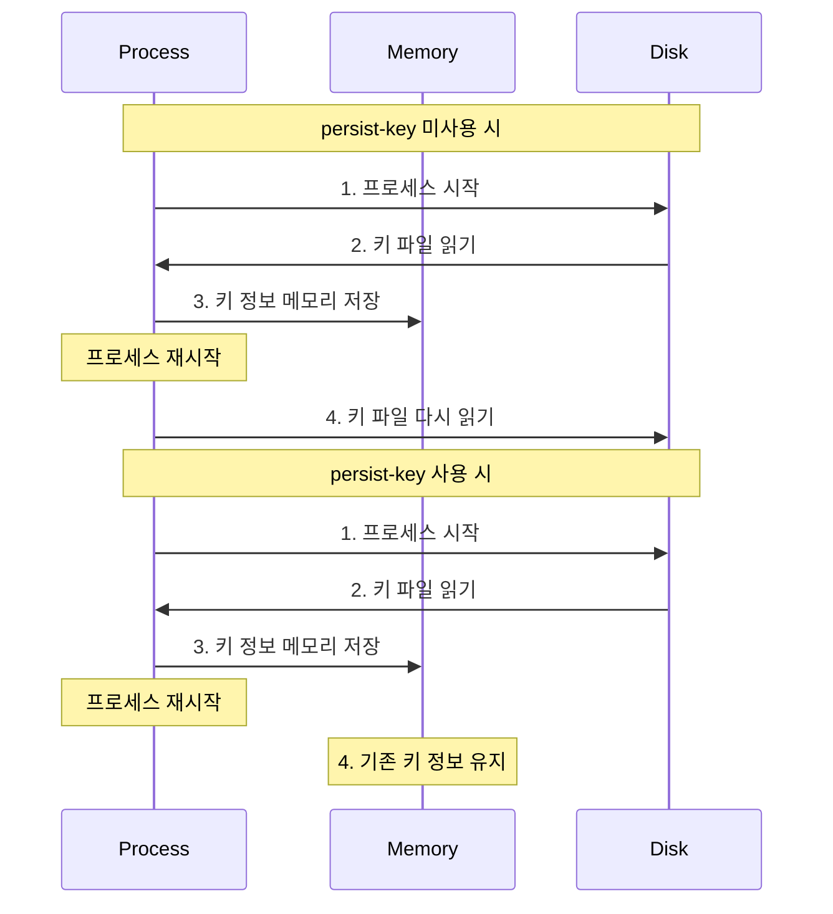
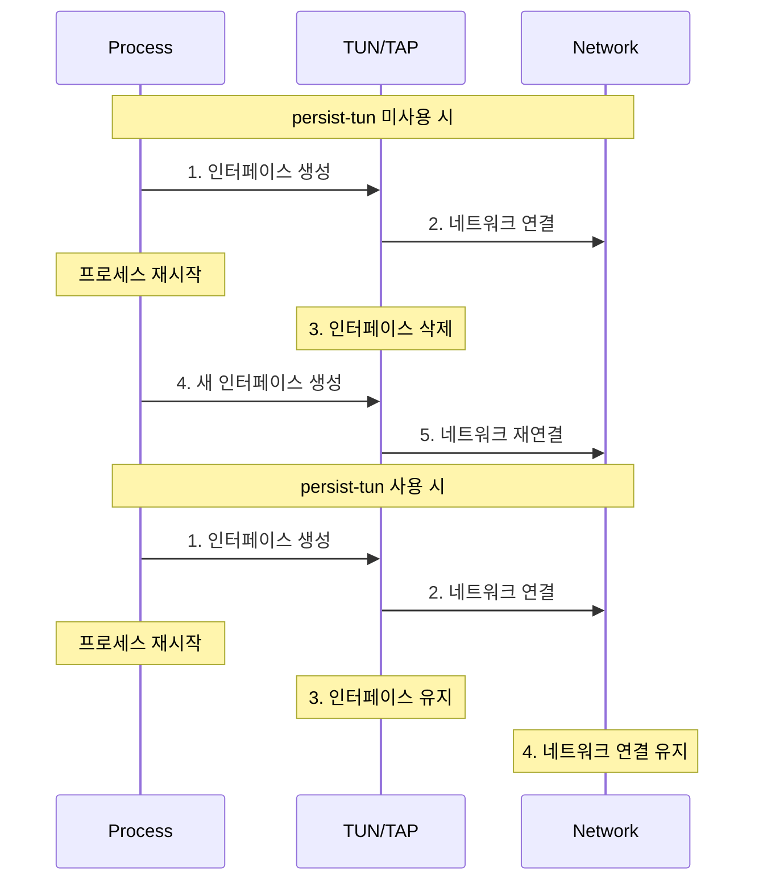

## persist-key 설정
### 기본 개념
- OpenVPN 프로세스가 재시작될 때 SSL/TLS 키와 인증서를 다시 읽지 않도록 하는 설정
- 메모리에 키 정보를 유지하여 보안성과 성능을 향상

### 작동 방식


## persist-tun 설정
### 기본 개념
- 가상 네트워크 인터페이스(tun/tap)를 재시작 시에도 유지
- 네트워크 연결의 연속성 보장

### 작동 방식


## 설정이 필요한 이유

### persist-key가 없을 때의 문제점
1. 보안 위험
   - 키 파일 접근 횟수 증가
   - 키 파일 읽기 권한 필요
   
2. 성능 저하
   - 매 재시작마다 키 파일 읽기
   - 인증 프로세스 재수행

### persist-tun이 없을 때의 문제점
1. 연결 불안정
   - 인터페이스 재생성으로 인한 패킷 손실
   - IP 주소 재할당 가능성

2. 리소스 낭비
   - 불필요한 인터페이스 생성/삭제
   - 라우팅 테이블 재설정

## 권장 설정
```bash
# 기본 권장 설정
persist-key
persist-tun
```

## 실제 사용 예시와 영향

### 1. 정상적인 재시작 시나리오
```plaintext
# persist-key와 persist-tun 사용 시
1. systemctl restart openvpn
2. 기존 연결 유지
3. 클라이언트 재연결 불필요

# 미사용 시
1. systemctl restart openvpn
2. 모든 연결 종료
3. 클라이언트 수동 재연결 필요
```

### 2. 문제 해결 시 장점
- 설정 변경 시 연결 유지 가능
- 빠른 서비스 복구
- 클라이언트 영향 최소화

## 주의사항
1. 메모리 사용
   - persist-key 사용 시 메모리에 키 정보 유지
   - 적절한 메모리 관리 필요

2. 보안 고려사항
   - 프로세스 권한 설정 중요
   - 주기적인 키 갱신 권장

3. 네트워크 설정
   - 방화벽 규칙과의 호환성 확인
- 라우팅 테이블 관리 필요