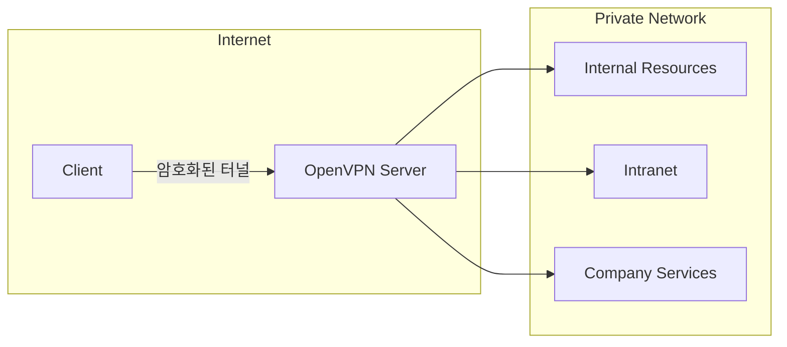
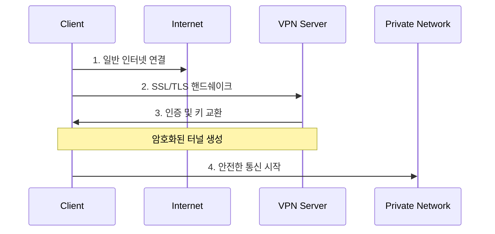
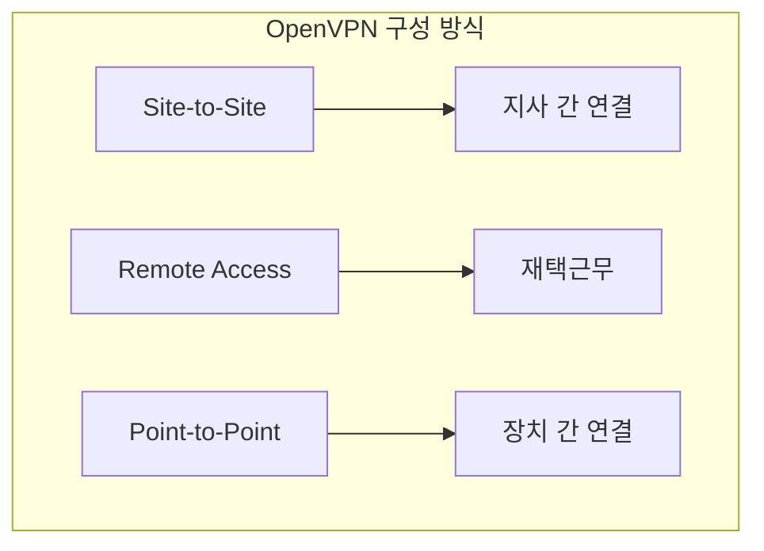
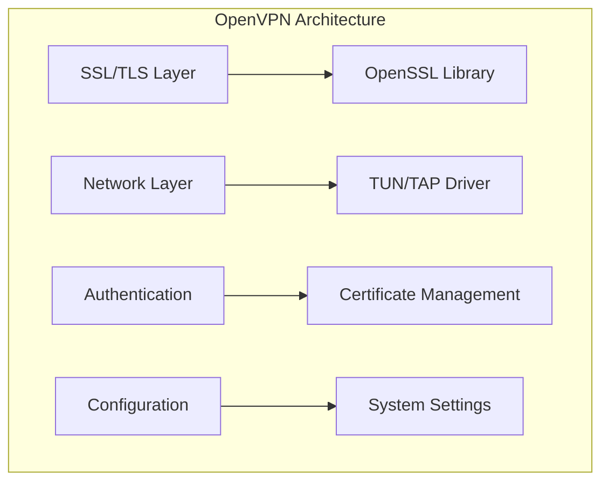
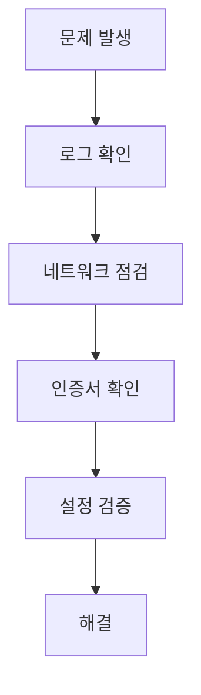

# VPN의 개념 이해

## 실생활 비유
VPN은 마치 '비밀 지하터널'과 같다:
- 공용 인터넷(공개된 도로)을 통해
- 암호화된 터널(비밀 지하터널)을 만들어
- 안전하게 통신(이동)하는 방법이다

## OpenVPN이란?
OpenVPN은 가장 널리 사용되는 오픈소스 VPN Protocol이다. SSL/TLS 기반으로 동작하여 높은 보안성을 제공한다.

# 동작 방식

## 기본 구조

## 연결 프로세스

# OpenVPN의 주요 특징

## 1. 보안 특징
- SSL/TLS 프로토콜 사용
- 강력한 암호화 알고리즘
- 인증서 기반 인증
- 데이터 무결성 검증

## 2. 네트워크 특징
- TCP 또는 UDP 프로토콜 지원
- NAT 통과 기능
- 포트 유연성
- 압축 지원

## 3. 구성 유연성

# 실제 활용 사례

## 1. 기업 환경
- 재택근무 보안 연결
- 지사 간 네트워크 연결
- 클라우드 자원 접근

## 2. 개인 사용
- 공공 Wi-Fi 보안
- 지역 제한 우회
- 프라이버시 보호

# 타 VPN 솔루션과의 비교

## 기술 비교표
| 특징 | OpenVPN | IPSec | PPTP | L2TP |
|------|----------|--------|-------|-------|
| 보안성 | 매우 높음 | 높음 | 낮음 | 중간 |
| 설정 난이도 | 중간 | 높음 | 낮음 | 중간 |
| 안정성 | 높음 | 높음 | 중간 | 중간 |
| 속도 | 좋음 | 매우 좋음 | 좋음 | 중간 |

# OpenVPN 아키텍처

## 시스템 구성

# Best Practices

## 1. 구축 시 고려사항
- 적절한 프로토콜 선택 (TCP/UDP)
- 인증서 기반 인증 사용
- 강력한 암호화 설정
- 로깅 및 모니터링 구성

## 2. 성능 최적화
- MTU 크기 최적화
- 압축 설정
- 하드웨어 리소스 할당
- 네트워크 대역폭 관리

## 3. 보안 강화
- 최신 버전 유지
- 정기적인 인증서 갱신
- 접근 제어 정책 수립
- 보안 감사 수행

# 문제 해결 가이드

## 일반적인 문제
1. 연결 실패
2. 속도 저하
3. 인증 오류

## 트러블슈팅 단계

# 결론
OpenVPN은 강력한 보안성과 유연성을 제공하는 VPN 솔루션이다. 올바른 이해와 구성을 통해 안전한 네트워크 환경을 구축할 수 있다.

## 학습 로드맵
1. 네트워크 기초 이해
2. SSL/TLS 개념 학습
3. 인증서 관리 방법 습득
4. OpenVPN 설정 실습
5. 보안 강화 방안 학습

## 참고사항
- 지속적인 업데이트가 필요하다
- 보안 정책을 정기적으로 검토한다
- 사용자 교육이 중요하다