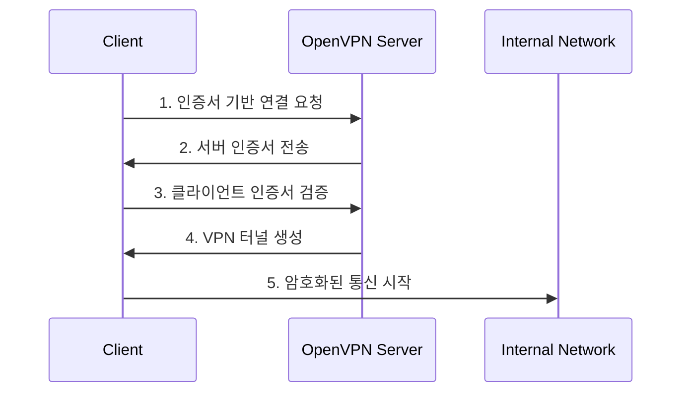

# 개념 이해
OpenVPN은 PKI 기반의 VPN(Virtual Private Network) 솔루션이다. 인증서를 사용하여 서버와 클라이언트 간의 안전한 통신을 보장한다.

## 기본 동작 방식


# 구현 가이드

## 환경 설정
```bash
# OpenVPN 설치
sudo apt update
sudo apt install openvpn easy-rsa

# 설정 디렉토리 생성
mkdir ~/openvpn-ca
cd ~/openvpn-ca
```

## 단계별 구현

### 1. CA 및 서버 인증서 설정
```bash
# PKI 초기화
cp -r /usr/share/easy-rsa/* .
./easyrsa init-pki

# CA 생성
./easyrsa build-ca nopass

# 서버 인증서 생성
./easyrsa gen-req server nopass
./easyrsa sign-req server server

# Diffie-Hellman 파라미터 생성
./easyrsa gen-dh
```
[[OpenVPN에서의 Diffie-Hellman 매개변수]]
### 2. 클라이언트 인증서 생성
```bash
# 클라이언트 인증서 생성
./easyrsa gen-req client1 nopass
./easyrsa sign-req client client1

# 인증서 복사
mkdir ~/client-configs
cp pki/ca.crt ~/client-configs/
cp pki/issued/client1.crt ~/client-configs/
cp pki/private/client1.key ~/client-configs/
```

### 3. OpenVPN 서버 설정
```bash
# 서버 설정 파일 생성
cat > /etc/openvpn/server.conf << EOF
port 1194
proto udp
dev tun
ca ca.crt
cert server.crt
key server.key
dh dh.pem
server 10.8.0.0 255.255.255.0
push "redirect-gateway def1 bypass-dhcp"
push "dhcp-option DNS 8.8.8.8"
keepalive 10 120
cipher AES-256-CBC
user nobody
group nogroup
persist-key
persist-tun
status openvpn-status.log
verb 3
EOF
```
[[OpenVPN 서버 설정 파일]]

## 잘못된 예시와 올바른 예시

### 잘못된 설정 (하지 말아야 할 것)
```bash
# 취약한 설정
cipher none  # 암호화 없음
tls-auth disable  # TLS 인증 비활성화
verify-client-cert none  # 클라이언트 인증서 검증 비활성화
```

### 올바른 설정
```bash
# 권장 설정
cipher AES-256-GCM  # 강력한 암호화
tls-auth ta.key 0  # TLS 추가 인증
verify-client-cert require  # 클라이언트 인증서 필수 검증
```

# 고급 활용법

## 인증서 관리
```bash
# 인증서 폐기
./easyrsa revoke client1

# CRL 생성 및 적용
./easyrsa gen-crl
cp pki/crl.pem /etc/openvpn/
```

## 보안 강화 설정
```bash
# TLS 버전 제한
tls-version-min 1.2

# 암호화 스위트 제한
tls-cipher TLS-ECDHE-ECDSA-WITH-AES-256-GCM-SHA384
```

# 문제 해결 가이드

## 일반적인 문제

### 연결 실패 시
```bash
# 서버 로그 확인
tail -f /var/log/openvpn/openvpn.log

# 인증서 유효성 검증
openssl verify -CAfile ca.crt server.crt
openssl verify -CAfile ca.crt client1.crt
```

### 성능 문제
```bash
# MTU 최적화
mtu-test
fragment 1300
mssfix 1300
```

# Security 고려사항

## 필수 보안 설정
1. 인증서 보안
   - Private Key 파일 권한 설정
   ```bash
   chmod 600 /etc/openvpn/server.key
   chmod 600 /etc/openvpn/ca.key
   ```

2. 네트워크 보안
   - 방화벽 설정
   ```bash
   ufw allow 1194/udp
   ufw allow OpenSSH
   ```

3. 시스템 보안
   ```bash
   # OpenVPN 프로세스 격리
   user nobody
   group nogroup
   ```

# 성능 최적화

## 네트워크 최적화
```bash
# 압축 설정
compress lz4-v2
push "compress lz4-v2"

# TCP 최적화
sndbuf 393216
rcvbuf 393216
```

# 결론
OpenVPN 설정에서 인증서 관리는 보안의 핵심이다. 올바른 인증서 설정과 관리를 통해 안전한 VPN 서비스를 제공할 수 있다.

## 참고사항
- 정기적인 인증서 갱신이 필요하다
- 사용자별 고유 인증서를 발급한다
- 인증서 폐기 절차를 문서화한다
- 백업 및 복구 절차를 수립한다