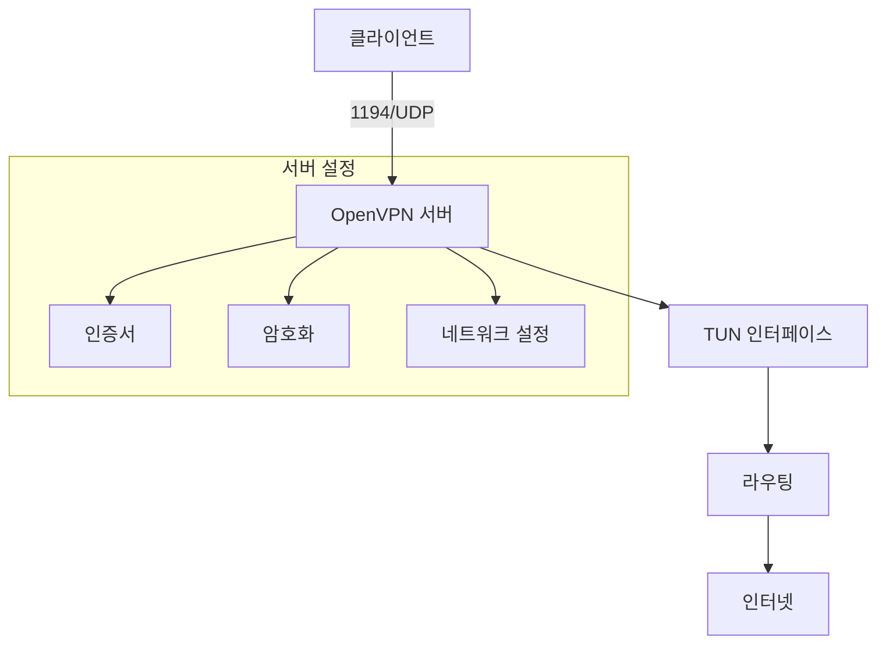
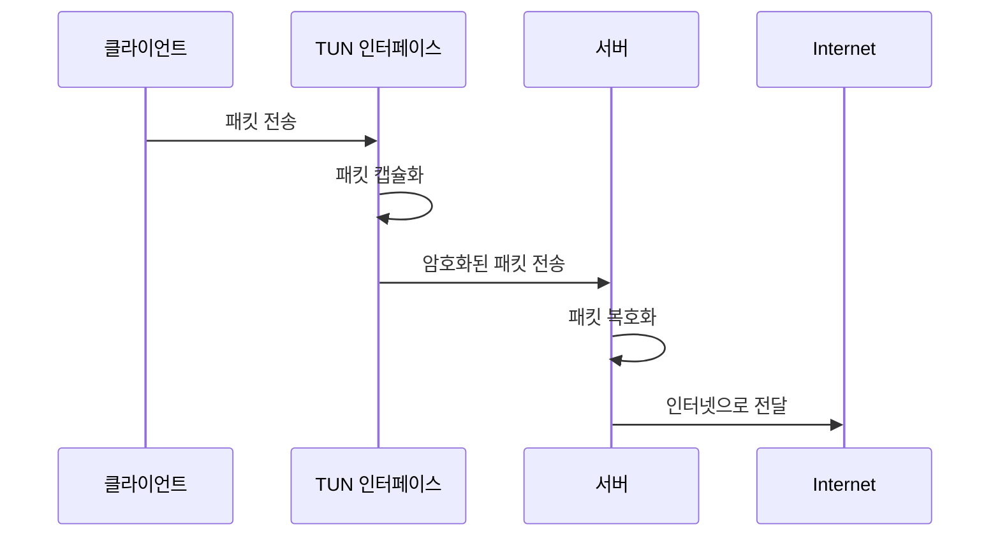

# 기본 개념
OpenVPN 서버 설정 파일(`server.conf`)은 VPN 서버의 동작 방식을 정의하는 핵심 구성 파일이다. 이 파일은 보안, 네트워크, 인증 등 VPN 서버의 모든 측면을 제어한다.

## 실생활 비유
식당의 운영 매뉴얼과 같다. 영업 시간(포트), 좌석 배치(네트워크 설정), 보안 절차(인증서), 직원 규칙(권한) 등을 정의하는 문서와 같은 역할을 한다.

# 설정 항목 상세 설명

## 1. 기본 네트워크 설정
```bash
port 1194         # VPN 서버가 사용할 포트
proto udp         # 통신 프로토콜 (UDP 사용)
dev tun           # 가상 네트워크 인터페이스 종류
```
[[TUN 인터페이스]]
## 2. 인증서 및 암호화 설정
```bash
ca ca.crt         # 인증 기관(CA) 인증서
cert server.crt   # 서버 인증서
key server.key    # 서버 개인키
dh dh.pem        # Diffie-Hellman 매개변수
cipher AES-256-CBC # 암호화 알고리즘
```

## 3. 네트워크 구성
```bash
server 10.8.0.0 255.255.255.0  # VPN 네트워크 주소 범위
push "redirect-gateway def1 bypass-dhcp"  # 클라이언트 트래픽 라우팅
push "dhcp-option DNS 8.8.8.8"  # DNS 서버 설정
```

```
10.8.0.0   - 네트워크 주소 (사용 불가)
10.8.0.1   - 일반적으로 VPN 서버 주소
10.8.0.2   - 첫 번째 클라이언트에 할당 가능
...
10.8.0.254 - 마지막 클라이언트에 할당 가능
10.8.0.255 - 브로드캐스트 주소 (사용 불가)

총 사용 가능한 주소 수: 253개
(255개 - 네트워크 주소 1개 - 브로드캐스트 주소 1개)
```
(macOS)실제로 로컬 컴퓨터에서 연결된 utun에 해당 ip가 표시된다
따라서 로컬 네트워크에서 사용되는 네트워크를 명시하지 않도록 조심해야 한다

## 4. 연결 관리
```bash
keepalive 10 120  # 연결 유지 및 점검 간격
persist-key      # 재시작 시 키 유지
persist-tun      # 재시작 시 터널 유지
```
10초마다 ping을 보내고 120 timeout
[[OpenVPN persist-key와 persist-tun 설정 상세 설명]]
## 5. 보안 설정
```bash
user nobody      # 낮은 권한의 사용자로 실행
group nogroup    # 낮은 권한의 그룹으로 실행
```
[[OpenVPN Process 권한 관리와 보안 설계]]
## 6. 로깅 및 모니터링
```bash
status openvpn-status.log  # 상태 로그 파일
verb 3                     # 로그 상세도 (1-9)
```

# 시스템 구성도



# 주요 설정별 작동 방식

## 1. TUN 인터페이스 동작


# 실제 사용 시 고려사항

## 1. 포트 설정
- 기본 포트(1194) 사용 시 방화벽 설정 필요
- 다른 포트로 변경 시 모든 클라이언트 설정도 변경 필요

```bash
# 방화벽 설정 예시
iptables -A INPUT -p udp --dport 1194 -j ACCEPT
```

## 2. 성능 최적화
```bash
# 성능 향상을 위한 추가 설정
sndbuf 0
rcvbuf 0
tx-queue-len 1000
```

## 3. 보안 강화
```bash
# 추가 보안 설정
auth SHA512
tls-auth ta.key 0
tls-version-min 1.2
```

# 문제 해결 가이드

## 1. 연결 문제
- 포트 개방 확인
- 인증서 권한 확인
- 로그 확인 방법

```bash
# 로그 확인
tail -f /var/log/openvpn/openvpn.log
```

## 2. 성능 문제
- MTU 설정 조정
- 압축 설정 최적화

```bash
# MTU 최적화 설정
fragment 1400
mssfix 1360
```

# 고급 설정

## 1. 이중화 구성
```bash
# 이중화를 위한 추가 설정
duplicate-cn
max-clients 100
client-to-client
```

## 2. 트래픽 제어
```bash
# 대역폭 제한 설정
txqueuelen 1000
shaper 1000000
```

# 주의사항

1. 보안
- 인증서 파일 권한 관리 철저
- 정기적인 키 갱신
- 로그 모니터링

2. 백업
- 설정 파일 정기 백업
- 인증서 안전한 보관

3. 모니터링
- 연결 상태 정기 점검
- 리소스 사용량 모니터링

# 결론
OpenVPN 서버 설정 파일은 VPN 서버의 운영에 있어 가장 중요한 요소이다. 각 설정의 의미를 이해하고 적절히 구성함으로써 안전하고 효율적인 VPN 서비스를 제공할 수 있다. 특히:

1. 보안 설정에 특별한 주의
2. 네트워크 환경에 맞는 최적화
3. 정기적인 모니터링과 관리
4. 문제 발생 시 빠른 대응을 위한 로깅 설정

이러한 요소들을 고려하여 설정 파일을 구성하면 안정적인 VPN 서비스 운영이 가능하다.