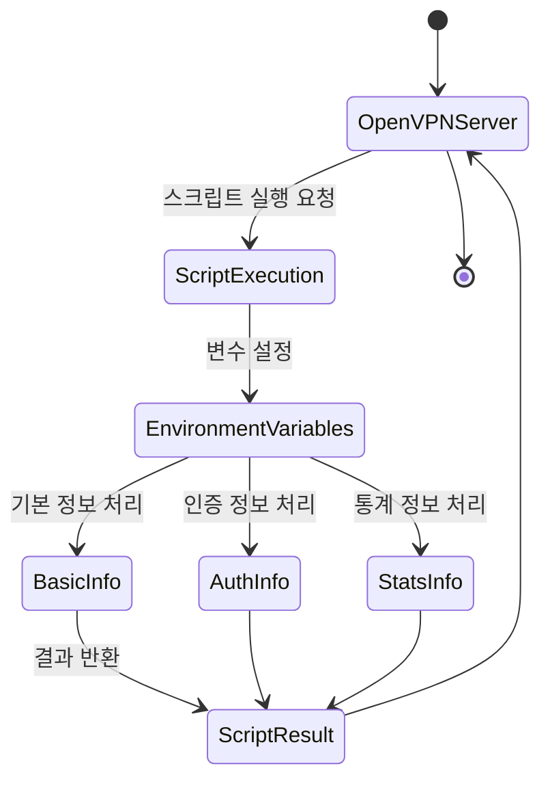

```table-of-contents
title: # 목차
style: nestedList # TOC style (nestedList|nestedOrderedList|inlineFirstLevel)
minLevel: 0 # Include headings from the specified level
maxLevel: 0 # Include headings up to the specified level
includeLinks: true # Make headings clickable
hideWhenEmpty: false # Hide TOC if no headings are found
debugInConsole: false # Print debug info in Obsidian console
```
OpenVPN 스크립트의 환경 변수 활용

# 환경 변수의 이해

## 개념 설명
Environment Variable(환경 변수)은 마치 택배 송장과 같다. 택배 송장에 보내는 사람, 받는 사람, 물품 정보가 기록되어 있듯이, OpenVPN의 환경 변수에는 접속자 정보, 연결 상태, 통신량 등이 기록된다.

이 문서를 이해하기 위해서는 다음과 같은 기본 지식이 필요하다:
- Shell Script 기본 문법
- OpenVPN 기본 동작 방식
- 네트워크 기본 개념 (IP, Port)

## 기본 동작 방식
OpenVPN은 스크립트 실행 시 다음과 같은 정보를 환경 변수로 전달한다:

1. 연결 기본 정보
   - `script_type`: 현재 실행 중인 스크립트의 종류를 나타낸다
   - `common_name`: 클라이언트 인증서의 일반 이름을 나타낸다
   - `status`: 현재 연결 상태를 나타낸다
   - `time_unix`: Unix timestamp 형식의 현재 시간을 나타낸다

2. 접속자 정보
   - `trusted_ip`: 클라이언트의 실제 IP 주소를 나타낸다
   - `trusted_port`: 클라이언트의 포트 번호를 나타낸다
   - `ifconfig_pool_remote_ip`: 클라이언트에 할당된 VPN IP 주소를 나타낸다
   - `ifconfig_pool_netmask`: VPN 네트워크의 넷마스크를 나타낸다

3. 인증 관련 정보
   - `username`: 사용자 이름을 나타낸다 (auth-user-pass 사용 시)
   - `password`: 사용자 비밀번호를 나타낸다 (auth-user-pass 사용 시)
   - `cert_depth`: 인증서 체인의 깊이를 나타낸다
   - `X509_0_CN`: 클라이언트 인증서의 Common Name을 나타낸다
   - `X509_0_O`: 클라이언트 인증서의 Organization 필드를 나타낸다
   - `tls_serial_0`: 클라이언트 인증서의 시리얼 번호를 나타낸다
   - `tls_digest_0`: 클라이언트 인증서의 다이제스트를 나타낸다

4. 통계 정보
   - `bytes_sent`: 전송된 바이트 수를 나타낸다
   - `bytes_received`: 수신된 바이트 수를 나타낸다
   - `time_duration`: 연결 지속 시간을 초 단위로 나타낸다
   - `time_ascii`: 사람이 읽기 쉬운 형식의 시간을 나타낸다

## 시스템 구조


## 실제 사용 예시

### 잘못된 예시
```bash
#!/bin/bash
# 문제점: 오류 처리가 없고, 로그 내용이 불충분함
echo "$common_name connected from $trusted_ip" >> /var/log/vpn.log
```

### 올바른 예시
```bash
#!/bin/bash
# OpenVPN 연결 정보 기록 스크립트
# 작성자: 시스템 관리자
# 최종 수정일: 2024-03-20

# 로그 디렉토리 확인 및 생성
LOG_DIR="/var/log/openvpn"
if [ ! -d "$LOG_DIR" ]; then
    mkdir -p "$LOG_DIR"
    chmod 750 "$LOG_DIR"
fi

# 로그 파일 경로 설정
LOG_FILE="$LOG_DIR/connections.log"

# 현재 시간 가져오기
CURRENT_TIME=$(date '+%Y-%m-%d %H:%M:%S')

# 연결 정보 로그 기록
{
    echo "=== Connection Log ==="
    echo "Time: $CURRENT_TIME"
    echo "Script Type: $script_type"
    echo "Common Name: $common_name"
    echo "Real IP: $trusted_ip:$trusted_port"
    echo "VPN IP: $ifconfig_pool_remote_ip"
    echo "Certificate Info:"
    echo "  - Serial: $tls_serial_0"
    echo "  - Organization: $X509_0_O"
    if [ "$script_type" = "client-disconnect" ]; then
        echo "Statistics:"
        echo "  - Duration: $time_duration seconds"
        echo "  - Bytes Sent: $bytes_sent"
        echo "  - Bytes Received: $bytes_received"
    fi
    echo "----------------------------------------"
} >> "$LOG_FILE"

# 로그 파일 권한 설정
chmod 640 "$LOG_FILE"
```

## 단계별 발전 과정

### 1단계: 기본 로깅
```bash
#!/bin/bash
# 가장 기본적인 연결 로깅
echo "$common_name connected" >> vpn.log
```

### 2단계: 시간과 IP 정보 추가
```bash
#!/bin/bash
# 시간과 IP 정보를 포함한 로깅
echo "$(date) - $common_name from $trusted_ip" >> vpn.log
```

### 3단계: 구조화된 로깅
```bash
#!/bin/bash
# 구조화된 형식으로 로깅
{
    echo "=== Connection Event ==="
    echo "Time: $(date)"
    echo "User: $common_name"
    echo "IP: $trusted_ip"
    echo "VPN IP: $ifconfig_pool_remote_ip"
} >> vpn.log
```

### 4단계: 완성된 스크립트
위의 '올바른 예시' 참조

## 고급 활용법

### 1. 데이터베이스 연동
```bash
#!/bin/bash
# MySQL 데이터베이스에 연결 정보 저장

MYSQL_USER="vpnuser"
MYSQL_PASS="password"
MYSQL_DB="vpnlogs"

# 데이터베이스 연결 및 데이터 입력
mysql -u "$MYSQL_USER" -p"$MYSQL_PASS" "$MYSQL_DB" << EOF
INSERT INTO connections (
    connection_time,
    username,
    real_ip,
    vpn_ip,
    bytes_sent,
    bytes_received,
    duration
) VALUES (
    NOW(),
    '$common_name',
    '$trusted_ip',
    '$ifconfig_pool_remote_ip',
    '$bytes_sent',
    '$bytes_received',
    '$time_duration'
);
EOF
```

### 2. 모니터링 시스템 연동
```bash
#!/bin/bash
# Prometheus 노드 익스포터 형식으로 메트릭 저장

METRIC_FILE="/var/lib/node_exporter/vpn_metrics.prom"

# 메트릭 생성
cat << EOF > "$METRIC_FILE"
# VPN 연결 수
vpn_connections{common_name="$common_name"} 1
# 전송된 데이터량
vpn_bytes_sent{common_name="$common_name"} $bytes_sent
vpn_bytes_received{common_name="$common_name"} $bytes_received
# 연결 지속 시간
vpn_connection_duration{common_name="$common_name"} $time_duration
EOF
```

## 주의사항

### 보안 고려사항
1. 파일 권한 설정
   - 로그 파일: 640 (소유자 읽기/쓰기, 그룹 읽기)
   - 스크립트 파일: 750 (소유자 전체 권한, 그룹 읽기/실행)
   - 설정 파일: 600 (소유자만 읽기/쓰기)

2. 데이터 보호
   - 민감한 정보(password 등)는 로그에 기록하지 않는다
   - 로그 파일은 보안이 설정된 디렉토리에 저장한다
   - 데이터베이스 연결 정보는 별도 설정 파일로 관리한다

### 성능 고려사항
1. 디스크 입출력 최소화
   - 로그 버퍼링 사용
   - 한 번에 여러 줄 기록
   - 불필요한 정보 제외

2. 리소스 관리
   - 로그 순환(rotation) 설정
   - 데이터베이스 연결 풀링 사용
   - 주기적인 로그 정리

## 결론
OpenVPN의 환경 변수들은 VPN 연결의 모든 중요 정보를 제공한다. 이러한 환경 변수들을 활용하여 보안 감사, 사용량 분석, 문제 해결 등 다양한 시스템 관리 작업을 수행할 수 있다. 다만, 보안과 성능을 고려한 신중한 구현이 필요하며, 지속적인 모니터링과 관리가 필요하다.