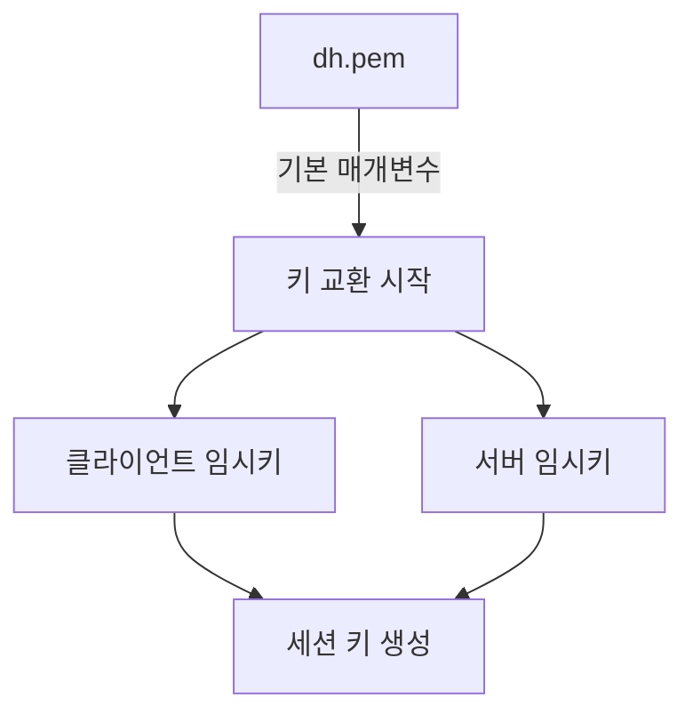
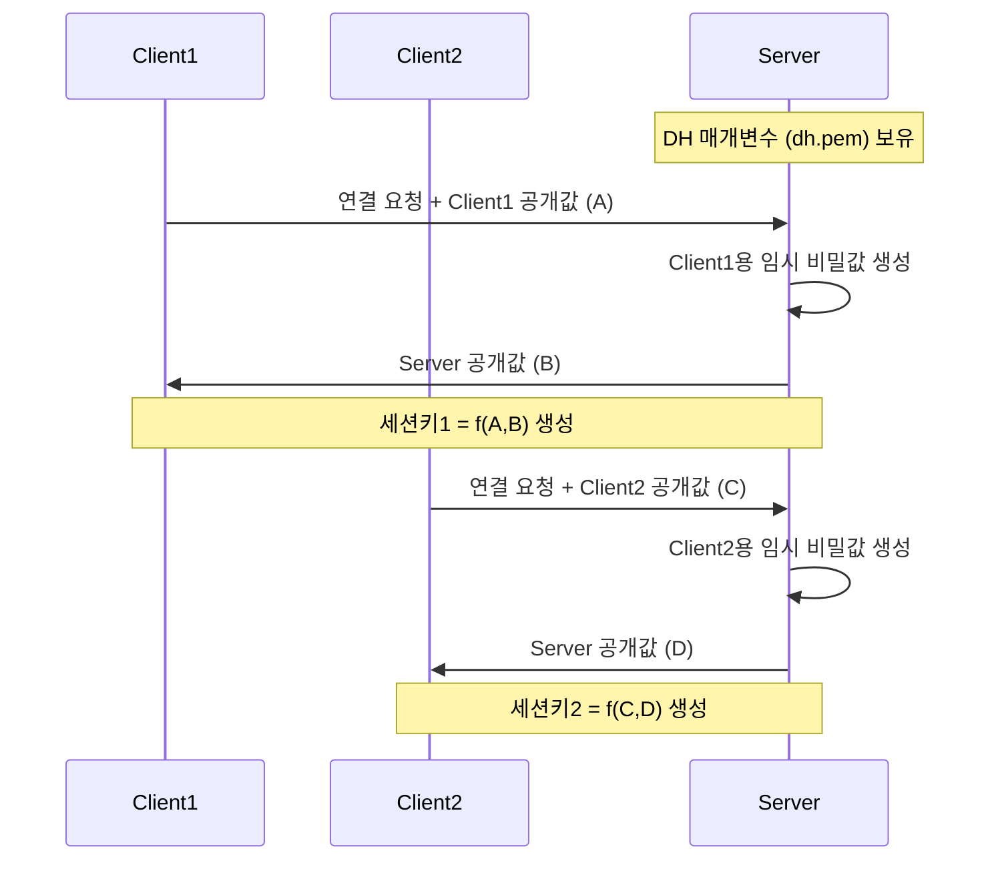
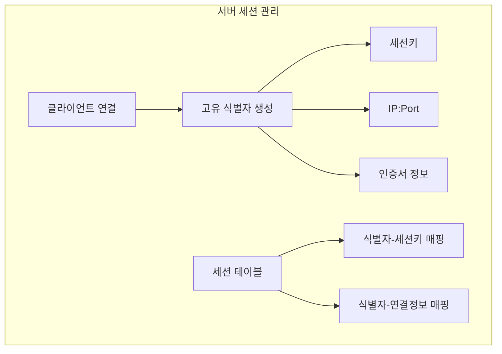
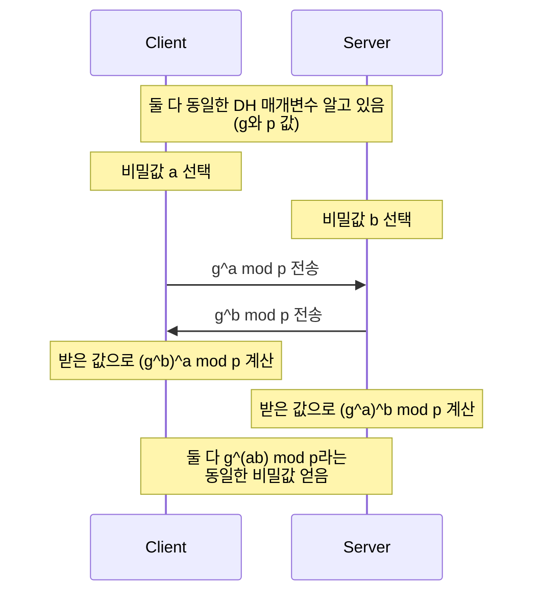
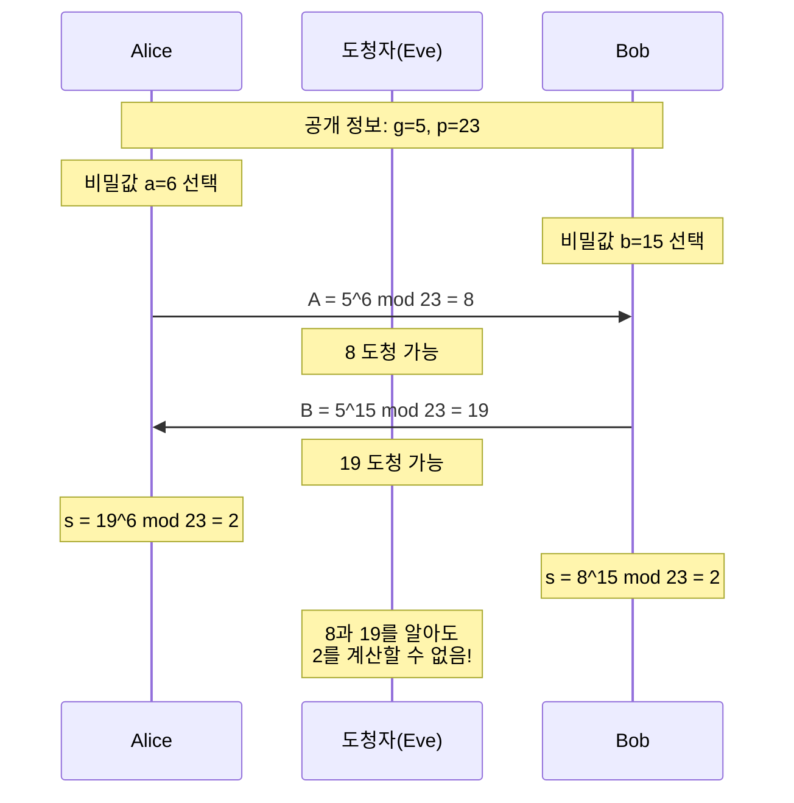
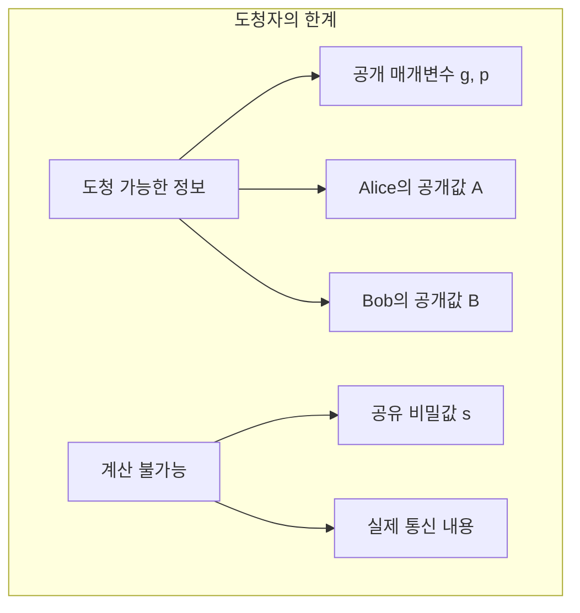
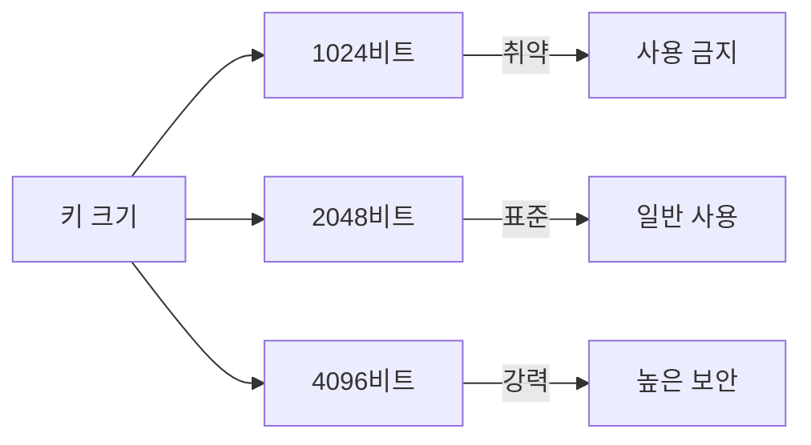
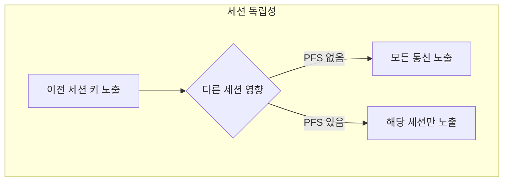

# 개념 이해

## OpenVPN에서 DH가 필요한 이유
OpenVPN은 VPN 터널 생성 시 각 세션마다 새로운 암호화 키가 필요하다. Diffie-Hellman 매개변수는 이 키를 안전하게 교환하는 방법을 제공한다.

## 실생활 비유
비밀 색상 교환과 유사하다:
- VPN 서버와 클라이언트가 기본 색상(DH 매개변수) 공유
- 각자의 비밀 색상(임시 키) 선택
- 혼합 결과만 교환하여 최종 색상(세션 키) 생성

# 동작 과정

## VPN 연결 시 키 교환

## 세션 키 생성 프로세스


각 클라이언트와 서버 간의 세션 키 생성과 관리 과정:



### 서버가 각 클라이언트 구분하는 방법:

1. 연결 식별자


2. 실제 구현 예시:
```python
class VPNServer:
    def __init__(self):
        self.sessions = {}  # 세션 저장소
        
    def create_session(self, client_id, client_pub_key):
        """새로운 클라이언트 세션 생성"""
        # 1. 서버의 임시 키 생성
        server_private = generate_private_key()
        server_public = generate_public_key(server_private)
        
        # 2. 세션키 생성
        session_key = compute_session_key(server_private, client_pub_key)
        
        # 3. 세션 정보 저장
        self.sessions[client_id] = {
            'session_key': session_key,
            'client_ip': client_ip,
            'client_port': client_port,
            'client_cert': client_cert,
            'created_at': timestamp
        }
        
        return server_public
        
    def handle_client_data(self, client_id, encrypted_data):
        """클라이언트 데이터 처리"""
        if client_id not in self.sessions:
            raise Exception("Unknown client")
            
        session = self.sessions[client_id]
        decrypted = decrypt(session['session_key'], encrypted_data)
        # 데이터 처리
```

따라서:
1. 각 클라이언트는 서버와 고유한 세션키를 생성
2. 서버는 클라이언트 정보와 세션키를 매핑하여 저장
3. 이후 통신은 이 세션키로 암호화/복호화

DH 매개변수(dh.pem)는 키 교환의 기반이 되는 공개 값들입니다. 자세히 설명하겠습니다:



여기서 dh.pem에 포함된 내용:
```bash
# DH 매개변수 내용
- p: 큰 소수 (예: 2048비트)
- g: 생성자 (보통 2 또는 5)
```

실제 예시:
```python
class DHKeyExchange:
    def __init__(self, dh_params):
        # dh.pem에서 p와 g 읽기
        self.p = dh_params.parameter_p
        self.g = dh_params.parameter_g
        
    def generate_public_key(self, private_key):
        """공개키 생성: g^private_key mod p"""
        return pow(self.g, private_key, self.p)
        
    def generate_shared_secret(self, my_private, their_public):
        """공유 비밀 생성: (their_public)^my_private mod p"""
        return pow(their_public, my_private, self.p)
```

중요한 점:
1. dh.pem의 매개변수(p, g)는 공개되어도 안전
2. 실제 비밀성은 개인키(a, b)에서 나옴
3. 수학적 특성으로 인해 중간자가 결과값을 알아낼 수 없음

네, 이것이 Diffie-Hellman의 핵심입니다! 



이것이 중요한 이유:

1. 암호화 키로 사용
```python
# 동일한 값(2)을 얻은 후
shared_secret = 2

# Alice와 Bob 모두 이 값으로 암호화 키 생성
encryption_key = derive_key(shared_secret)

# Alice의 암호화
encrypted_message = encrypt(message, encryption_key)

# Bob의 복호화
decrypted_message = decrypt(encrypted_message, encryption_key)
```

2. 도청 방지


3. 안전한 키 교환
- 공개 채널로 통신하면서도
- 누구도 모르는 비밀값을 공유
- 이 비밀값으로 실제 통신 암호화

따라서:
1. 같은 값을 얻는다는 것 = 안전한 암호화 키 공유
2. 도청자는 이 값을 알 수 없음
3. 이 공유된 비밀값으로 안전한 통신 가능

# 구현 방법

## DH 매개변수 생성
```bash
# 기본 생성 방법
sudo easyrsa gen-dh

# 생성 결과
# pki/dh.pem 파일 생성됨
```

## OpenVPN 서버 설정
```bash
# OpenVPN 서버 설정 파일
# /etc/openvpn/server.conf
dh dh.pem  # 생성된 DH 파일 지정

# 추가 보안 설정
tls-version-min 1.2
tls-cipher TLS-ECDHE-RSA-WITH-AES-256-GCM-SHA384
```

# 보안 고려사항

## 키 크기 선택


## 성능 영향
```python
# DH 키 크기별 성능 비교
def measure_dh_performance():
    key_sizes = [1024, 2048, 4096]
    
    for size in key_sizes:
        start_time = time.time()
        # DH 연산 수행
        params = dh.generate_parameters(
            generator=2,
            key_size=size
        )
        end_time = time.time()
        print(f"{size}비트: {end_time - start_time}초")
```

# Perfect Forward Secrecy

## PFS의 중요성


## DH의 역할
1. 세션별 고유 키 생성
2. 이전 통신 보호
3. 키 독립성 보장

# 문제 해결 가이드

## 일반적인 문제

### 1. 생성 시간이 오래 걸릴 때
```bash
# 하드웨어 난수 생성기 사용
sudo apt-get install rng-tools
sudo rngd -r /dev/urandom
```

### 2. 호환성 문제
```bash
# DH 파라미터 확인
openssl dhparam -in dh.pem -text -noout
```

# 성능 최적화

## 캐싱 전략
```bash
# DH 매개변수 재사용
cp dh.pem /etc/openvpn/
chmod 644 /etc/openvpn/dh.pem
```

## 리소스 사용
```bash
# 시스템 리소스 모니터링
top -b -n 1 | grep openvpn
```

# 결론

## DH 매개변수의 중요성
1. 안전한 키 교환 보장
2. Perfect Forward Secrecy 제공
3. 세션 독립성 유지

## 실무 권장사항
1. 최소 2048비트 키 사용
2. 정기적인 매개변수 갱신
3. 시스템 리소스 모니터링
4. 보안 업데이트 유지