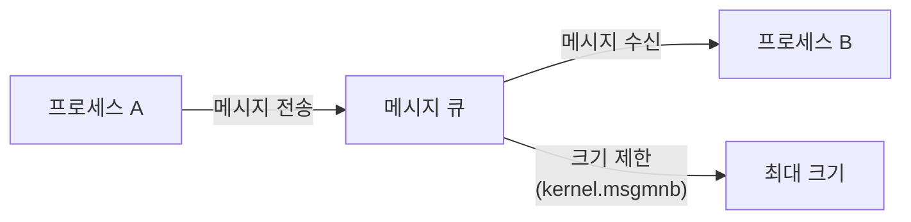
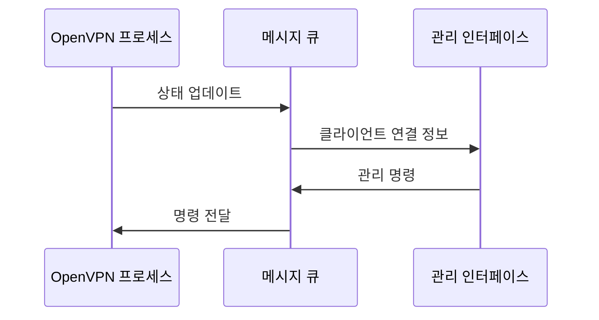
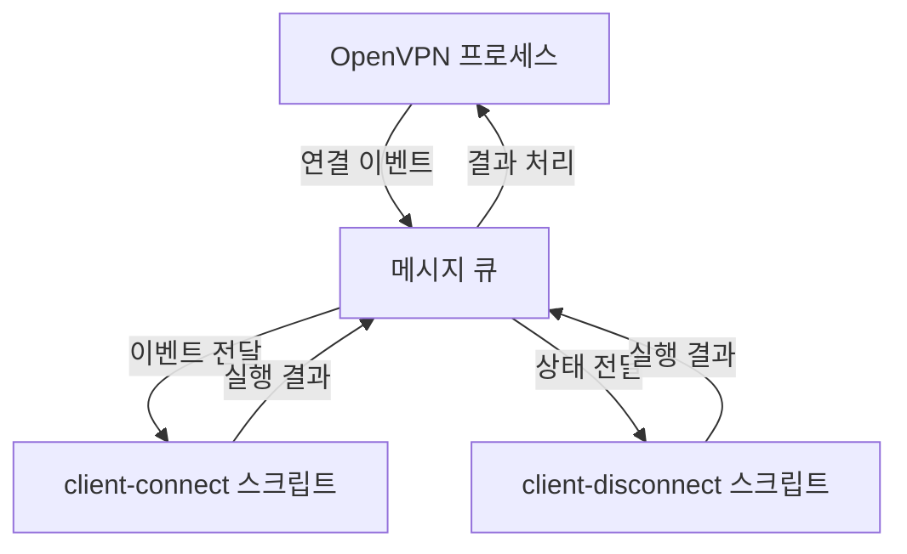
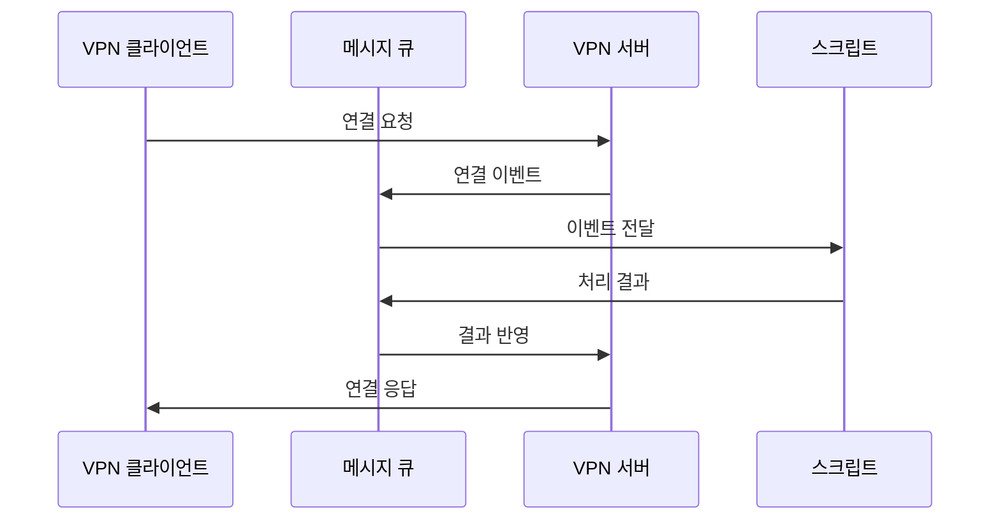
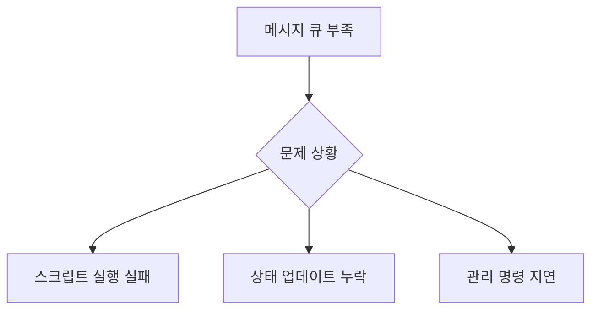

```table-of-contents
title: # 목차
style: nestedList # TOC style (nestedList|nestedOrderedList|inlineFirstLevel)
minLevel: 0 # Include headings from the specified level
maxLevel: 0 # Include headings up to the specified level
includeLinks: true # Make headings clickable
hideWhenEmpty: false # Hide TOC if no headings are found
debugInConsole: false # Print debug info in Obsidian console
```
# OpenVPN의 메시지 큐 사용 사례

## Message Queue
메시지 큐는 프로세스 간 통신(IPC: Inter-Process Communication)을 위한 메커니즘이다. 마치 우체통처럼, 한 프로세스가 메시지를 넣으면 다른 프로세스가 그것을 꺼내 읽을 수 있다.

## 작동 방식



## 1. 관리 인터페이스 통신


### 주요 용도
1. 클라이언트 연결 상태 전달
2. 연결 통계 정보 전달
3. 관리 명령어 처리

## 2. 스크립트 실행과 통신


### 사용 예시:
```bash
# client-connect 스크립트
#!/bin/bash
# 메시지 큐를 통해 전달된 환경변수 사용
echo "클라이언트 연결: $common_name"
echo "할당된 IP: $ifconfig_pool_remote_ip"

# 결과를 메시지 큐로 반환
exit 0
```

## 3. 내부 프로세스 통신


### 주요 정보 교환:
1. 라우팅 테이블 업데이트
2. 방화벽 규칙 변경
3. 네트워크 설정 변경

## 4. 클라이언트-서버 이벤트 처리


# 메시지 큐 설정의 중요성

## 1. 성능 영향
```bash
# 권장 설정
kernel.msgmnb = 65536  # 큐 전체 크기
kernel.msgmax = 16384  # 단일 메시지 크기

# 이유:
- 많은 클라이언트 동시 연결 처리
- 대량의 상태 정보 전달
- 스크립트 실행 결과 처리
```

## 2. 문제 발생 시나리오


# 모니터링과 문제 해결

## 1. 상태 확인
```bash
# 메시지 큐 사용량 확인
ipcs -q

# OpenVPN 로그 확인
tail -f /var/log/openvpn/openvpn.log | grep "Message queue"
```

## 2. 문제 해결
```bash
# 문제 해결 스크립트
#!/bin/bash
# OpenVPN 메시지 큐 모니터링

QUEUE_USAGE=$(ipcs -q | awk 'NR>3 {print $5}' | sort -n | tail -1)
MAX_SIZE=$(sysctl -n kernel.msgmnb)

if [ $QUEUE_USAGE -gt $((MAX_SIZE * 80 / 100)) ]; then
    echo "경고: 메시지 큐 사용량 높음"
    # 관리자에게 알림 전송
fi
```

# 권장 설정

## 1. 소규모 환경
```bash
kernel.msgmnb = 16384
kernel.msgmax = 8192
```

## 2. 대규모 환경
```bash
kernel.msgmnb = 65536
kernel.msgmax = 16384
kernel.msgmni = 32000  # 메시지 큐 개수
```

# 결론
OpenVPN에서 메시지 큐는 내부 프로세스 간 통신의 핵심 메커니즘입니다. 적절한 설정은 VPN 서버의 안정성과 성능에 직접적인 영향을 미치므로, 환경에 맞는 적절한 값 설정이 중요합니다.