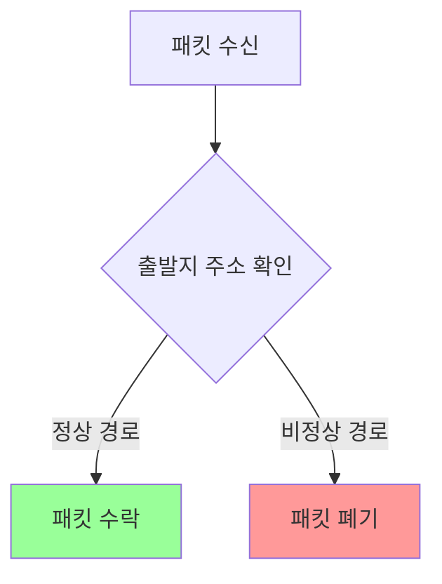
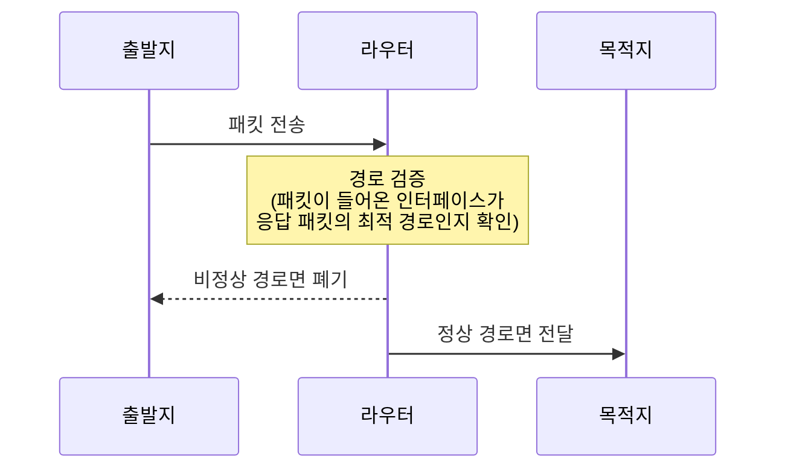
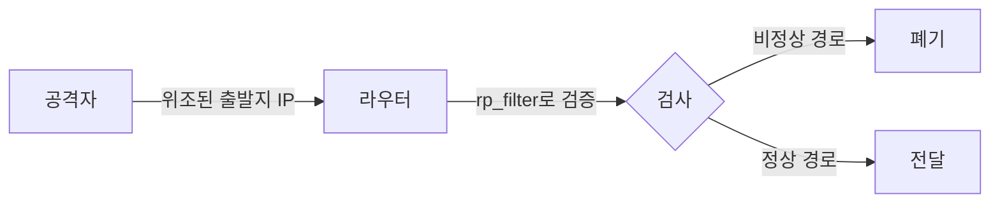
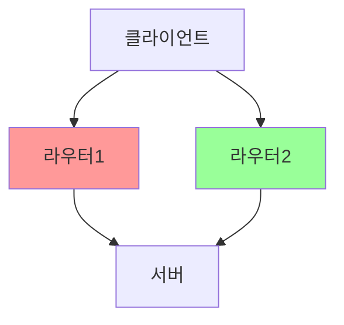

```table-of-contents
title: # 목차
style: nestedList # TOC style (nestedList|nestedOrderedList|inlineFirstLevel)
minLevel: 0 # Include headings from the specified level
maxLevel: 0 # Include headings up to the specified level
includeLinks: true # Make headings clickable
hideWhenEmpty: false # Hide TOC if no headings are found
debugInConsole: false # Print debug info in Obsidian console
```
# Reverse Path Filtering이란?

## 기본 개념
Reverse Path Filtering은 마치 우체국에서 발신자 주소를 확인하는 것과 같다. 패킷이 들어올 때 해당 패킷의 출발지 주소가 정상적인 경로로 들어왔는지 검증하는 보안 메커니즘이다.

예시:
- 정상적인 경우: eth0으로 들어온 패킷의 출발지가 eth0의 라우팅 테이블에 있음
- 비정상적인 경우: eth1으로 들어와야 할 패킷이 eth0으로 들어옴 (스푸핑 의심)

## 동작 방식


# rp_filter 설정값의 의미

## 설정 옵션
```bash
# 0 - 비활성화
# 1 - 엄격 모드 (Strict Mode)
# 2 - 느슨 모드 (Loose Mode)
net.ipv4.conf.default.rp_filter = 1
net.ipv4.conf.all.rp_filter = 1
```

## 각 모드 설명

### 1. 엄격 모드 (값: 1)


### 2. 느슨 모드 (값: 2)
- 들어온 패킷의 출발지로 가는 경로가 어느 인터페이스든 존재하면 허용
- 엄격 모드보다 유연하지만 보안성은 낮음

# 실제 구현 예시

## 1. rp_filter 상태 확인
```bash
# 전체 인터페이스 설정 확인
sysctl net.ipv4.conf.all.rp_filter

# 특정 인터페이스 설정 확인
sysctl net.ipv4.conf.eth0.rp_filter
```

## 2. rp_filter 설정
```bash
# 엄격 모드 활성화
# /etc/sysctl.conf 파일에 추가
net.ipv4.conf.default.rp_filter = 1
net.ipv4.conf.all.rp_filter = 1

# 설정 적용
sysctl -p
```

## 3. 특정 인터페이스만 설정
```bash
# eth0 인터페이스에 대해 엄격 모드 설정
echo 1 > /proc/sys/net/ipv4/conf/eth0/rp_filter
```

# rp_filter가 필요한 상황

## 1. IP 스푸핑 방지


## 2. 비대칭 라우팅 문제


# 일반적인 문제와 해결

## 1. 패킷 폐기 문제
증상:
- 정상적인 패킷이 폐기됨
- 연결이 간헐적으로 끊김

해결방법:
```bash
# 1. 로깅 활성화로 문제 확인
ip route show
ip rule show

# 2. 필요한 경우 느슨 모드로 변경
sysctl -w net.ipv4.conf.all.rp_filter=2
```

## 2. 비대칭 라우팅 환경
```bash
# 비대칭 라우팅이 필요한 경우
# 느슨 모드 사용
net.ipv4.conf.all.rp_filter = 2
net.ipv4.conf.default.rp_filter = 2
```

# 보안 권장사항

## 1. 일반 서버
```bash
# 최대 보안을 위한 설정
net.ipv4.conf.all.rp_filter = 1
net.ipv4.conf.default.rp_filter = 1
```

## 2. 라우터/방화벽
```bash
# 라우팅 환경에 따라 선택
# 단일 경로 환경
net.ipv4.conf.all.rp_filter = 1

# 멀티호밍 환경
net.ipv4.conf.all.rp_filter = 2
```

# 결론
Reverse Path Filtering은 IP 스푸핑을 방지하는 중요한 보안 메커니즘이다. 기본적으로 엄격 모드(1)를 사용하되, 네트워크 구성에 따라 느슨 모드(2)가 필요할 수 있다. 보안과 네트워크 요구사항을 고려하여 적절한 설정을 선택해야 한다.