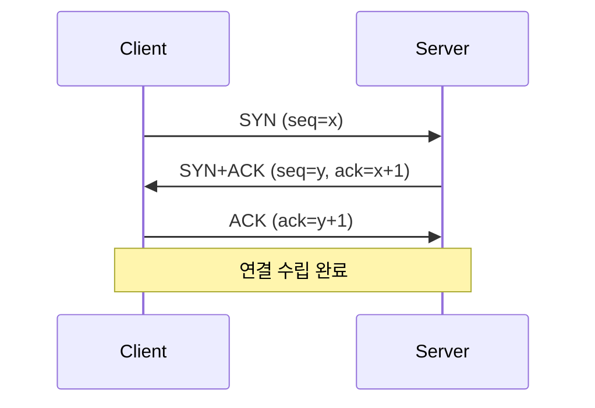
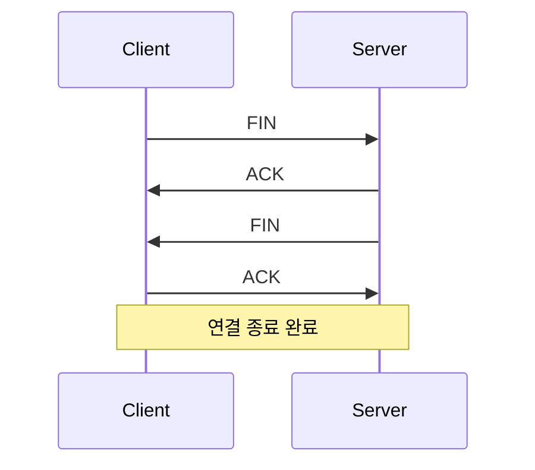
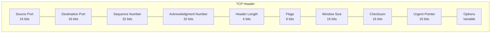
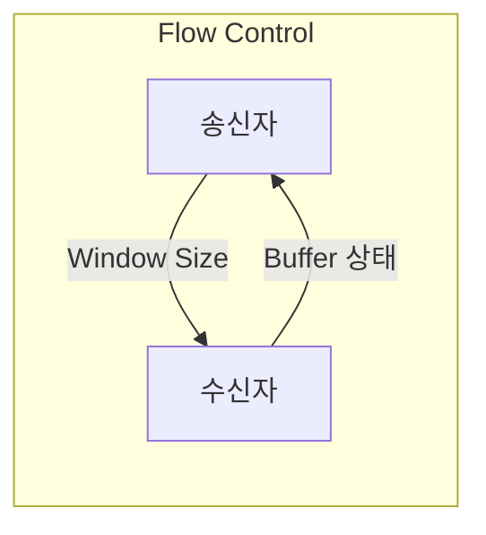
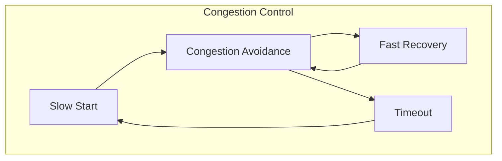
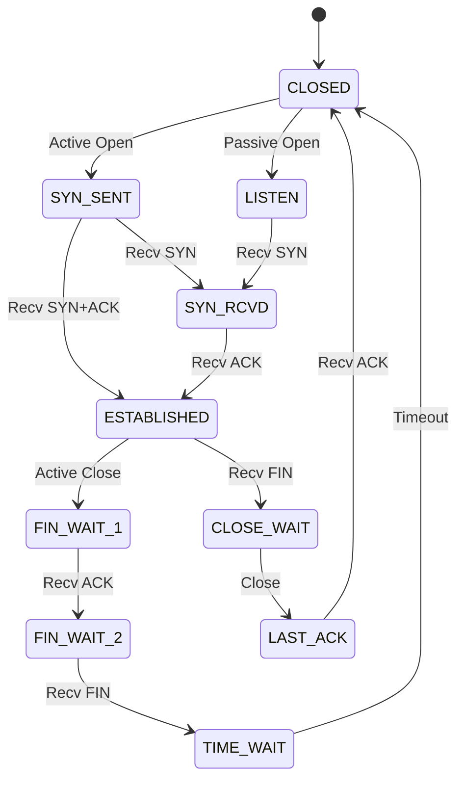

# 개념 이해

## TCP란?
TCP는 신뢰성 있는 데이터 전송을 보장하는 연결 지향적 프로토콜이다. OSI 7계층 중 전송 계층(Transport Layer)에 위치한다.

## 실생활 비유
TCP는 우체국 등기우편과 유사하다:
- 발송 확인을 한다 (SYN)
- 수신 확인을 한다 (ACK)
- 순서대로 전달한다
- 분실 시 재전송한다

# 동작 방식

## TCP 연결 수립 (3-Way Handshake)


## TCP 연결 종료 (4-Way Handshake)


# TCP 헤더 구조

## 헤더 필드


# TCP의 주요 특징

## 1. 흐름 제어


## 2. 혼잡 제어


# 구현 예시

## TCP 서버 (Python)
```python
import socket

def create_tcp_server(host='localhost', port=8080):
    # 서버 소켓 생성
    server_socket = socket.socket(socket.AF_INET, socket.SOCK_STREAM)
    
    # SO_REUSEADDR 설정
    server_socket.setsockopt(socket.SOL_SOCKET, socket.SO_REUSEADDR, 1)
    
    # 바인딩
    server_socket.bind((host, port))
    
    # 리스닝 시작
    server_socket.listen(5)
    print(f"서버가 {host}:{port}에서 대기 중입니다.")
    
    while True:
        # 클라이언트 연결 수락
        client_socket, addr = server_socket.accept()
        print(f"클라이언트가 연결되었습니다: {addr}")
        
        try:
            # 데이터 수신
            data = client_socket.recv(1024)
            if data:
                print(f"수신된 데이터: {data.decode()}")
                # 응답 전송
                client_socket.send("데이터를 수신했습니다.".encode())
        finally:
            client_socket.close()

if __name__ == "__main__":
    create_tcp_server()
```

## TCP 클라이언트 (Python)
```python
import socket

def create_tcp_client(host='localhost', port=8080):
    # 클라이언트 소켓 생성
    client_socket = socket.socket(socket.AF_INET, socket.SOCK_STREAM)
    
    try:
        # 서버에 연결
        client_socket.connect((host, port))
        print(f"서버에 연결되었습니다: {host}:{port}")
        
        # 데이터 전송
        message = "Hello, Server!"
        client_socket.send(message.encode())
        
        # 응답 수신
        response = client_socket.recv(1024)
        print(f"서버 응답: {response.decode()}")
        
    finally:
        client_socket.close()

if __name__ == "__main__":
    create_tcp_client()
```

# 성능 최적화

## 1. TCP 튜닝 파라미터
```bash
# TCP 윈도우 크기 조정
sysctl -w net.ipv4.tcp_wmem="4096 87380 4194304"
sysctl -w net.ipv4.tcp_rmem="4096 87380 4194304"

# TCP 타임아웃 설정
sysctl -w net.ipv4.tcp_keepalive_time=60
sysctl -w net.ipv4.tcp_keepalive_intvl=10
sysctl -w net.ipv4.tcp_keepalive_probes=6
```

## 2. 소켓 옵션 설정
```python
# TCP_NODELAY (Nagle 알고리즘 비활성화)
socket.setsockopt(socket.IPPROTO_TCP, socket.TCP_NODELAY, 1)

# SO_KEEPALIVE
socket.setsockopt(socket.SOL_SOCKET, socket.SO_KEEPALIVE, 1)

# SO_RCVBUF/SO_SNDBUF (버퍼 크기 설정)
socket.setsockopt(socket.SOL_SOCKET, socket.SO_RCVBUF, 87380)
```

# 문제 해결 가이드

## 일반적인 문제

### 1. 연결 문제
```bash
# 포트 상태 확인
netstat -an | grep 8080

# TCP 연결 추적
tcpdump -i any port 8080
```

### 2. 성능 문제
```bash
# TCP 상태 모니터링
ss -s

# 연결 상태 확인
netstat -n | awk '/^tcp/ {print $6}' | sort | uniq -c
```

# TCP 상태 다이어그램



# 보안 고려사항

## 1. SYN Flood 방어
```bash
# SYN Cookie 활성화
sysctl -w net.ipv4.tcp_syncookies=1

# SYN 백로그 큐 크기 조정
sysctl -w net.ipv4.tcp_max_syn_backlog=2048
```

## 2. 연결 타임아웃 관리
```bash
# FIN_WAIT_2 타임아웃 설정
sysctl -w net.ipv4.tcp_fin_timeout=30

# TIME_WAIT 재사용 설정
sysctl -w net.ipv4.tcp_tw_reuse=1
```

# 결론
TCP는 신뢰성 있는 데이터 전송을 보장하는 핵심 프로토콜이다. 올바른 이해와 설정을 통해 안정적인 네트워크 애플리케이션을 구현할 수 있다.

## 주요 포인트
1. 연결 지향적 통신을 제공한다
2. 데이터 전송의 신뢰성을 보장한다
3. 흐름 제어와 혼잡 제어를 수행한다
4. 적절한 튜닝으로 성능을 최적화할 수 있다