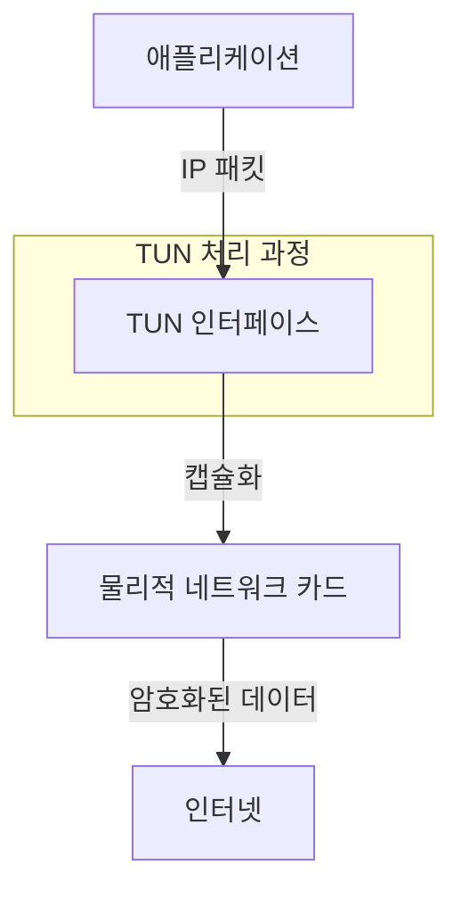
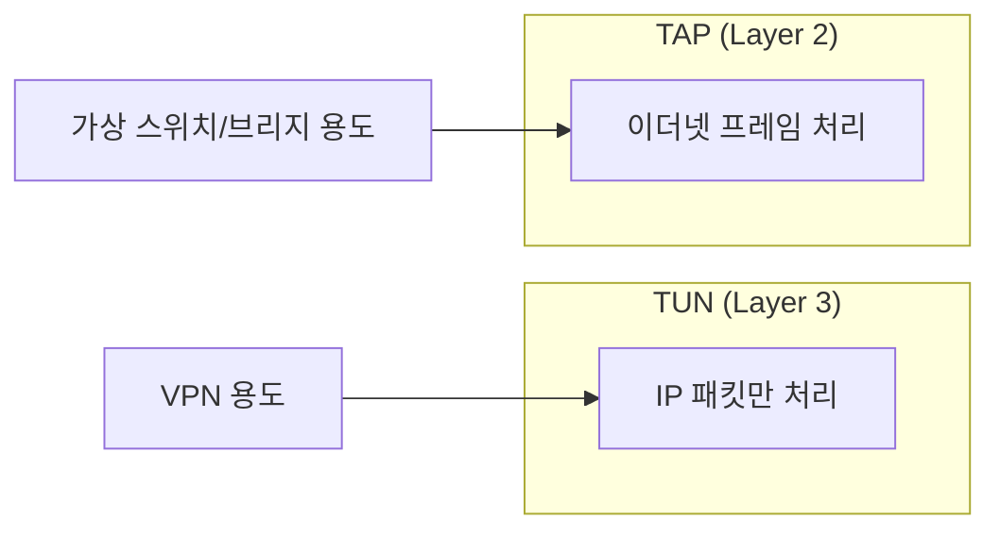
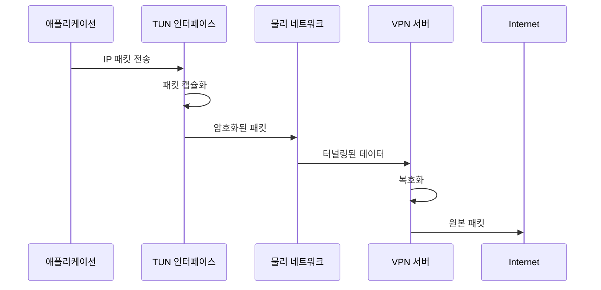

## 기본 개념
TUN(네트워크 터널링)은 운영체제에서 제공하는 가상 네트워크 인터페이스다. 물리적 네트워크 카드를 소프트웨어로 구현한 것으로, 주로 VPN과 같은 터널링 용도로 사용된다.

## 실생활 비유
지하철 터널과 유사하다:
- 지상(일반 네트워크)에서 지하(암호화된 터널)로 들어가는 입구
- 승객(데이터)이 터널을 통해 안전하게 이동
- 다른 출구(원격지)로 나가는 구조

# 동작 방식



## TUN vs TAP 차이점



# 실제 구현 예시

## 1. TUN 인터페이스 생성
```bash
# TUN 인터페이스 수동 생성
ip tuntap add dev tun0 mode tun

# 인터페이스 활성화
ip link set tun0 up

# IP 주소 할당
ip addr add 10.8.0.1/24 dev tun0
```

## 2. 상태 확인
```bash
# 인터페이스 상태 확인
ip addr show tun0

# 라우팅 테이블 확인
ip route show
```

## 3. OpenVPN에서의 TUN 설정
```bash
# OpenVPN 서버 설정
dev tun                  # TUN 모드 사용
topology subnet          # 서브넷 토폴로지
server 10.8.0.0 255.255.255.0  # IP 할당 범위
```

# TUN 패킷 흐름



# 주요 특징

1. Layer 3 동작
   - IP 패킷만 처리
   - 브로드캐스트 불가
   - 효율적인 포인트-투-포인트 통신

2. 성능 최적화
   - 낮은 오버헤드
   - 높은 처리량
   - 적은 지연시간

# 문제 해결 가이드

## 1. 일반적인 문제
```bash
# 권한 문제
sudo chmod 666 /dev/net/tun

# 모듈 로드 확인
lsmod | grep tun
```

## 2. 성능 문제
```bash
# MTU 최적화
ip link set tun0 mtu 1500

# 큐 길이 조정
ip link set tun0 txqueuelen 1000
```

# 모니터링

## 1. 트래픽 모니터링
```bash
# tcpdump로 패킷 확인
tcpdump -i tun0

# 통계 확인
ip -s link show tun0
```

## 2. 성능 측정
```bash
# iperf3로 성능 테스트
iperf3 -c 10.8.0.1 -i 1
```

# 보안 고려사항

1. 접근 제어
   - 인터페이스 권한 관리
   - 라우팅 테이블 보호
   - 패킷 필터링

2. 암호화
   - 데이터 암호화 필수
   - 키 관리 중요성
   - 프로토콜 보안

# 결론
TUN 인터페이스는 VPN 구현의 핵심 컴포넌트로, 다음과 같은 이유로 중요하다:

1. 효율적인 터널링 제공
2. 높은 성능과 안정성
3. 유연한 네트워크 구성
4. 보안 통신 지원

올바른 설정과 관리를 통해 안전하고 효율적인 VPN 서비스를 구현할 수 있다.