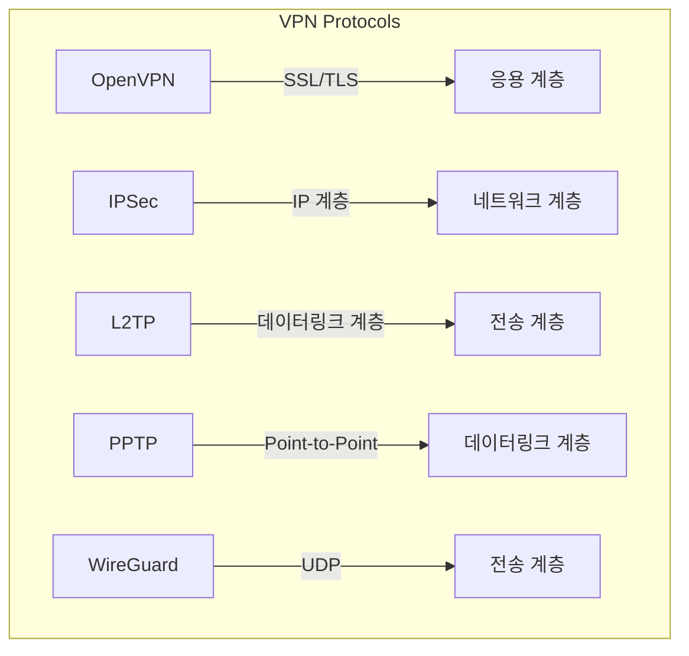
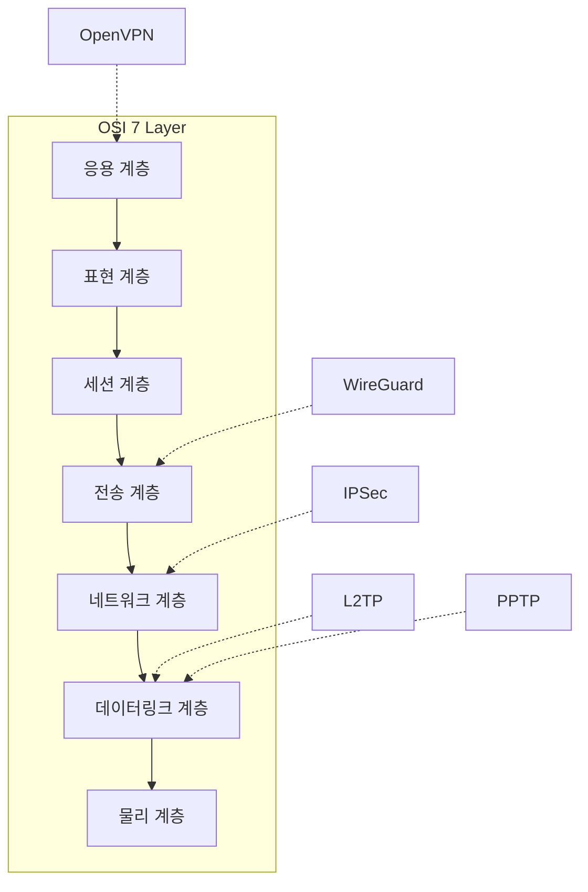
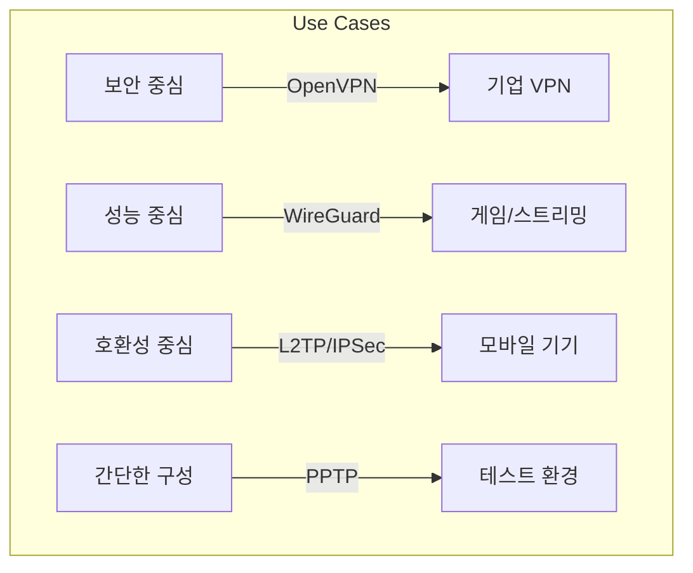

# Protocol 개요

## 주요 VPN Protocol
- OpenVPN (SSL/TLS 기반)
- IPSec (Internet Protocol Security)
- L2TP/IPSec (Layer 2 Tunneling Protocol)
- PPTP (Point-to-Point Tunneling Protocol)
- WireGuard
- SSTP (Secure Socket Tunneling Protocol)
- IKEv2 (Internet Key Exchange version 2)

# Protocol 상세 분석

## 동작 방식 비교

## 계층별 동작 위치

# Protocol 특징 비교

## 1. OpenVPN
- SSL/TLS 기반 암호화 사용
- Port: 기본 1194 (UDP/TCP)
- 장점:
  - 높은 보안성
  - 방화벽 통과 용이
  - 설정 유연성
- 단점:
  - 초기 설정 복잡
  - 리소스 사용량 높음

## 2. IPSec
- IP 패킷 레벨 암호화
- Port: 500 (IKE), 4500 (NAT-T)
- 장점:
  - 커널 레벨 지원
  - 높은 성능
  - 표준화된 프로토콜
- 단점:
  - 방화벽 설정 복잡
  - NAT 통과 문제

## 3. WireGuard
- 최신 암호화 기술 사용
- Port: 기본 51820 (UDP)
- 장점:
  - 매우 빠른 성능
  - 코드 단순성
  - 적은 리소스 사용
- 단점:
  - 상대적으로 신규 기술
  - 동적 IP 할당 제한

## 4. L2TP/IPSec
- L2TP와 IPSec 결합
- Port: 500, 1701, 4500
- 장점:
  - 널리 지원됨
  - 안정적인 연결
- 단점:
  - 이중 캡슐화로 속도 저하
  - 설정 복잡

## 5. PPTP
- 가장 오래된 VPN 프로토콜
- Port: 1723
- 장점:
  - 설정 간단
  - 빠른 속도
- 단점:
  - 취약한 보안
  - 최신 기기 미지원

# 성능 비교

## 속도 및 보안성 비교
| Protocol | 속도 | 보안성 | 안정성 | 설정 난이도 |
|----------|------|--------|--------|--------------|
| OpenVPN | 중간 | 매우 높음 | 높음 | 높음 |
| IPSec | 빠름 | 높음 | 높음 | 매우 높음 |
| WireGuard | 매우 빠름 | 높음 | 중간 | 낮음 |
| L2TP/IPSec | 중간 | 높음 | 높음 | 높음 |
| PPTP | 빠름 | 낮음 | 중간 | 낮음 |

# 활용 시나리오

## 사용 목적별 권장 프로토콜

# 구현 시 고려사항

## 1. 보안 요구사항
- 데이터 기밀성 수준
- 인증 방식
- 키 관리 방식

## 2. 성능 요구사항
- 대역폭 요구사항
- 지연시간 허용치
- 동시 사용자 수

## 3. 운영 환경
- 방화벽 정책
- NAT 환경
- 하드웨어 리소스

# 결론
VPN Protocol은 각각의 특성과 장단점이 있다. 사용 목적과 환경에 따라 적절한 프로토콜을 선택해야 한다.

## 권장 사항
1. 기업용: OpenVPN 또는 IPSec
2. 개인용: WireGuard 또는 OpenVPN
3. 레거시 시스템: L2TP/IPSec
4. 테스트 환경: PPTP (보안이 중요하지 않은 경우)

> [!info] 최근 떠오르고 있는 vpn protocol
> [[wireguard]]
