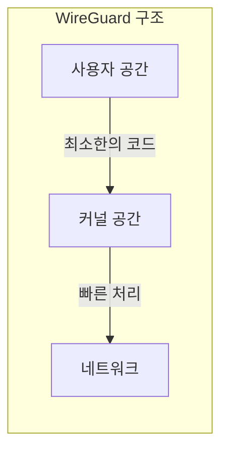
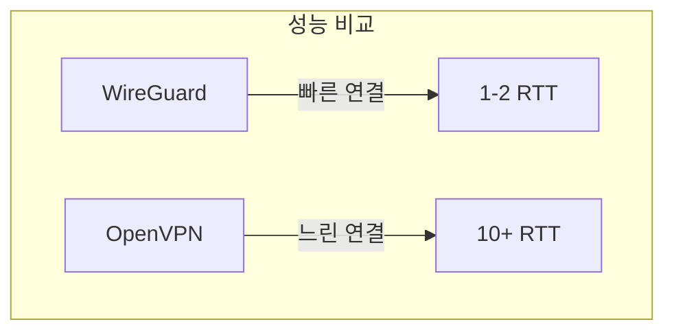
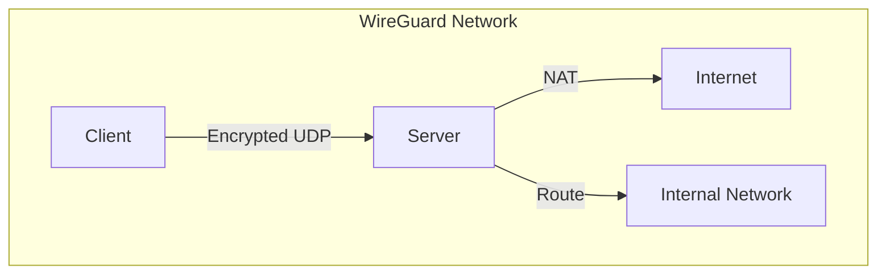

# 개념 이해

## WireGuard란?
WireGuard는 Linux 커널에 구현된 최신 VPN Protocol이다. OpenVPN이나 IPSec보다 단순하고 빠른 성능을 제공한다.

## 기본 원리


# 주요 특징

## 1. 코드 단순성
- 전체 코드가 약 4,000줄 (OpenVPN은 100,000줄 이상)
- 버그 발생 가능성 감소
- 보안 감사 용이

## 2. 성능


## 3. 암호화
- ChaCha20: 스트림 암호화
- Poly1305: 인증
- Curve25519: 키 교환
- BLAKE2: 해싱
- SipHash24: 해시테이블

# 구현 가이드

## 기본 설정

### 1. 서버 설정
```bash
# 서버 프라이빗 키 생성
wg genkey > server_private.key
wg pubkey < server_private.key > server_public.key

# 서버 설정 파일 생성
cat > wg0.conf << EOF
[Interface]
PrivateKey = $(cat server_private.key)
Address = 10.0.0.1/24
ListenPort = 51820

# 클라이언트 설정은 여기에 추가
[Peer]
PublicKey = 클라이언트_공개키
AllowedIPs = 10.0.0.2/32
EOF
```

### 2. 클라이언트 설정
```bash
# 클라이언트 키 생성
wg genkey > client_private.key
wg pubkey < client_private.key > client_public.key

# 클라이언트 설정 파일
cat > client.conf << EOF
[Interface]
PrivateKey = $(cat client_private.key)
Address = 10.0.0.2/24
DNS = 1.1.1.1

[Peer]
PublicKey = 서버_공개키
Endpoint = server.example.com:51820
AllowedIPs = 0.0.0.0/0
PersistentKeepalive = 25
EOF
```

## 잘못된 설정과 올바른 설정

### 잘못된 예시
```bash
# 보안에 취약한 설정
[Interface]
# 프라이빗 키 직접 노출
PrivateKey = ABC123...
# 모든 인터페이스에서 리스닝
ListenPort = 51820
```

### 올바른 예시
```bash
# 보안이 강화된 설정
[Interface]
# 파일에서 프라이빗 키 읽기
PostUp = wg set %i private-key /etc/wireguard/private.key
# 특정 인터페이스만 리스닝
ListenPort = 51820
BindAddress = 203.0.113.1
```

# 네트워크 구성

## 기본 구조


# 성능 최적화

## 1. MTU 최적화
```bash
# MTU 설정
MTU = 1420
```

## 2. 커널 파라미터
```bash
# 성능 향상을 위한 시스템 설정
net.core.rmem_max = 2500000
net.core.wmem_max = 2500000
```

# Security 고려사항

## 1. 키 관리
- 안전한 키 생성
- 정기적인 키 갱신
- 키 백업 관리

## 2. 방화벽 설정
```bash
# UFW 설정
sudo ufw allow 51820/udp
```

# 문제 해결 가이드

## 일반적인 문제

### 1. 연결 문제
```bash
# 연결 상태 확인
wg show

# 인터페이스 상태 확인
ip link show wg0
```

### 2. 라우팅 문제
```bash
# 라우팅 테이블 확인
ip route show table all
```

# 모니터링

## 상태 확인
```bash
# 실시간 모니터링
watch -n 1 wg show all

# 트래픽 모니터링
tcpdump -i wg0
```

# 결론
WireGuard는 단순성, 성능, 보안성을 모두 갖춘 현대적인 VPN Protocol이다. 특히 모바일 환경에서 뛰어난 성능을 보여준다.

## 적용 시 고려사항
1. 커널 버전 확인이 필요하다
2. IPv6 지원을 고려한다
3. 키 관리 정책을 수립한다
4. 모니터링 체계를 구축한다

[devsister - wireguard vpn 서버 구축](https://tech.devsisters.com/posts/wireguard-vpn-1/)