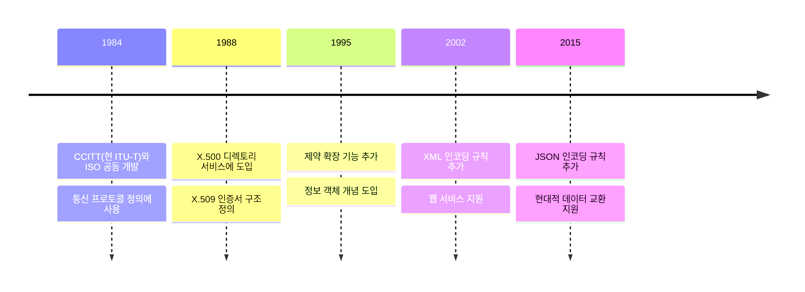
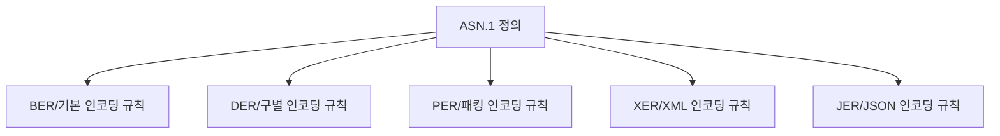

# ASN.1의 개념

ASN.1은 Abstract Syntax Notation One의 줄임말이다. 이는 플랫폼과 언어에 독립적인 방식으로 데이터 구조를 정의하기 위한 표준 인터페이스 언어다.

이름의 의미:
- Abstract (추상): 구현 세부사항으로부터 독립적
- Syntax (구문): 데이터 구조를 정의하는 규칙
- Notation (표기법): 표준화된 작성 방식
- One (하나): 첫 번째이자 유일한 ASN 표준

실생활 비유:
- 설계도면과 같은 역할을 한다
- 마치 건축 설계도가 어떤 자재를 쓸지 지정하지 않고 구조만 정의하는 것처럼, ASN.1은 데이터의 논리적 구조만 정의한다

# 역사적 발전 과정



# 기본 데이터 타입과 구조

## 기본 타입
```asn1
-- 간단한 타입들
BOOLEAN         -- True/False
INTEGER         -- 정수
OCTET STRING    -- 바이트 문자열
PrintableString -- 출력 가능한 문자
UTCTime         -- 시간 정보
```

## 복합 타입
```asn1
SEQUENCE        -- 순서가 있는 구조체
SET             -- 순서가 없는 집합
CHOICE          -- 선택 구조
```

# 실제 사용 예시

## X.509 인증서 구조 정의
```asn1
Certificate ::= SEQUENCE {
    tbsCertificate       TBSCertificate,
    signatureAlgorithm   AlgorithmIdentifier,
    signatureValue       BIT STRING
}

TBSCertificate ::= SEQUENCE {
    version         [0]  EXPLICIT Version DEFAULT v1,
    serialNumber         CertificateSerialNumber,
    signature           AlgorithmIdentifier,
    issuer              Name,
    validity            Validity,
    subject             Name,
    subjectPublicKeyInfo SubjectPublicKeyInfo
}
```

## SNMP MIB 정의
```asn1
SNMPv2-MIB DEFINITIONS ::= BEGIN
    sysDescr OBJECT-TYPE
        SYNTAX      DisplayString (SIZE (0..255))
        MAX-ACCESS  read-only
        STATUS      current
        DESCRIPTION "시스템 설명"
    ::= { system 1 }
END
```

# 인코딩 규칙

ASN.1은 다양한 인코딩 규칙을 지원한다:



## 주요 인코딩 규칙 비교
1. BER (Basic Encoding Rules)
   - 가장 기본적인 인코딩 방식
   - 유연하지만 효율성이 떨어짐

2. DER (Distinguished Encoding Rules)
   - BER의 제한된 형태
   - 암호화 응용에서 주로 사용
   - X.509 인증서의 표준 인코딩

3. PER (Packed Encoding Rules)
   - 공간 효율적인 인코딩
   - 통신 프로토콜에서 주로 사용

# 실무 활용

## 1. 인증서 처리
```bash
# OpenSSL을 사용한 ASN.1 구조 확인
openssl asn1parse -in certificate.der -inform DER

# 결과 예시
    0:d=0  hl=4 l=1164 cons: SEQUENCE          
    4:d=1  hl=4 l= 888 cons: SEQUENCE          
    8:d=2  hl=2 l=   3 cons: cont [ 0 ]        
   10:d=3  hl=2 l=   1 prim: INTEGER           :02
```

## 2. 프로토콜 개발
```python
# Python ASN.1 라이브러리 사용 예시
from pyasn1.type import namedtype
from pyasn1.type import univ

class Person(univ.Sequence):
    componentType = namedtype.NamedTypes(
        namedtype.NamedType('name', univ.OctetString()),
        namedtype.NamedType('age', univ.Integer())
    )
```

# 문제 해결 가이드

## 일반적인 문제들

1. 인코딩 불일치
```text
문제: DER로 인코딩된 데이터를 BER로 처리 시도
해결: 올바른 인코딩 규칙 사용 확인
```

2. 구조 파싱 오류
```text
문제: 잘못된 ASN.1 구조 정의
해결: ASN.1 문법 검증 도구 사용
```

# 성능 고려사항

## 1. 인코딩 선택
- DER: 보안성 중요 시
- PER: 대역폭 효율성 중요 시
- XER: 사람이 읽기 쉬워야 할 때

## 2. 메모리 사용
```text
BER/DER: TLV 구조로 인한 오버헤드
PER: 최소한의 오버헤드
XER: XML로 인한 큰 오버헤드
```

# 보안 고려사항

1. DER 사용
   - 암호화 응용에서는 반드시 DER 사용
   - 유일한 인코딩 보장

2. 길이 검증
   - 버퍼 오버플로우 방지
   - 최대 길이 제한 설정

# 결론

ASN.1은 플랫폼 독립적인 데이터 구조 정의의 표준으로:
- 다양한 프로토콜의 기반이 된다
- 여러 인코딩 옵션을 제공한다
- 현대 보안 인프라의 핵심 요소다

향후에도 새로운 인코딩 규칙과 기능이 추가되며 발전할 것으로 예상된다.