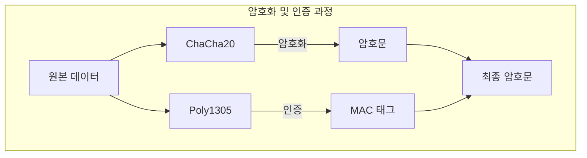
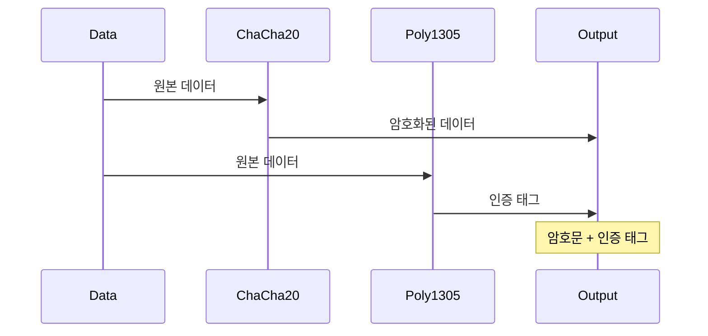
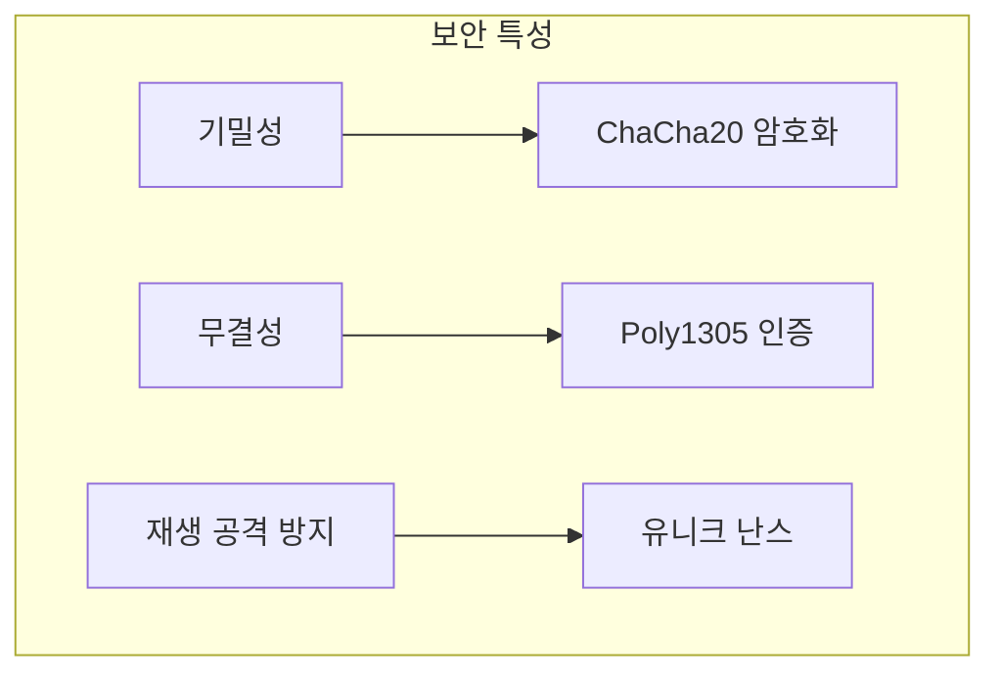
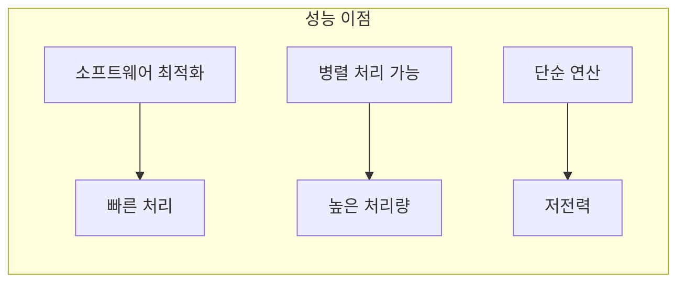

# 개념 이해

## ChaCha20-Poly1305란?
ChaCha20-Poly1305는 AEAD(Authenticated Encryption with Associated Data) 암호화 시스템이다. 암호화(ChaCha20)와 인증(Poly1305)을 결합하여 데이터의 기밀성과 무결성을 동시에 보장한다.

## 실생활 비유
특수 제작된 금고와 같다:
- 내용물 암호화 = 금고에 내용물 보관 (ChaCha20)
- 인증 태그 = 특수 봉인 스티커 (Poly1305)
- 무결성 검증 = 스티커 훼손 여부 확인

# 동작 방식

## 기본 구조


## 데이터 흐름


# 구현 예시

## Python 구현
```python
from cryptography.hazmat.primitives.ciphers.aead import ChaCha20Poly1305
import os

class SecureChannel:
    def __init__(self):
        # 32바이트 키 생성
        self.key = os.urandom(32)
    
    def encrypt(self, message: bytes) -> tuple[bytes, bytes]:
        """
        메시지를 암호화하고 인증하는 함수
        
        Args:
            message: 암호화할 메시지
            
        Returns:
            (nonce, ciphertext): 난스와 암호문
        """
        cipher = ChaCha20Poly1305(self.key)
        nonce = os.urandom(12)  # 12바이트 난스
        
        # 암호화 및 인증 태그 생성
        ciphertext = cipher.encrypt(nonce, message, None)
        return nonce, ciphertext
    
    def decrypt(self, nonce: bytes, ciphertext: bytes) -> bytes:
        """
        암호문을 복호화하고 인증을 검증하는 함수
        
        Args:
            nonce: 암호화에 사용된 난스
            ciphertext: 암호문과 인증 태그
            
        Returns:
            복호화된 메시지
        """
        cipher = ChaCha20Poly1305(self.key)
        try:
            # 복호화 및 인증 검증
            plaintext = cipher.decrypt(nonce, ciphertext, None)
            return plaintext
        except InvalidTag:
            raise SecurityError("메시지가 변조되었습니다!")

# 사용 예시
channel = SecureChannel()
message = b"Hello, Secure World!"
nonce, ciphertext = channel.encrypt(message)
decrypted = channel.decrypt(nonce, ciphertext)
```

## 잘못된 구현과 올바른 구현

### 잘못된 예시 (하지 말 것)
```python
# 잘못된 구현 - 재사용되는 난스
class InsecureChannel:
    def __init__(self):
        self.key = os.urandom(32)
        self.nonce = os.urandom(12)  # 고정된 난스 사용!
    
    def encrypt(self, message):
        cipher = ChaCha20Poly1305(self.key)
        return cipher.encrypt(self.nonce, message, None)  # 같은 난스 재사용
```

### 올바른 예시
```python
# 안전한 구현
class SecureChannel:
    def __init__(self):
        self.key = os.urandom(32)
    
    def encrypt(self, message):
        cipher = ChaCha20Poly1305(self.key)
        nonce = os.urandom(12)  # 매번 새로운 난스 사용
        return nonce, cipher.encrypt(nonce, message, None)
```

# 보안 특성

## 보안 보장


## 성능 특성


# 모범 사용 사례

## 1. TLS 통신
```nginx
# Nginx 설정 예시
ssl_ciphers CHACHA20:AES-128-GCM-SHA256;
ssl_prefer_server_ciphers off;
```

## 2. 파일 암호화
```python
def encrypt_file(filename: str, key: bytes):
    cipher = ChaCha20Poly1305(key)
    nonce = os.urandom(12)
    
    with open(filename, 'rb') as f:
        data = f.read()
    
    encrypted = cipher.encrypt(nonce, data, None)
    
    with open(filename + '.encrypted', 'wb') as f:
        f.write(nonce + encrypted)
```

# 성능 모니터링

## 성능 측정
```python
import time

def benchmark_encryption(size: int, iterations: int):
    data = os.urandom(size)
    cipher = ChaCha20Poly1305(os.urandom(32))
    
    start = time.time()
    for _ in range(iterations):
        nonce = os.urandom(12)
        cipher.encrypt(nonce, data, None)
    end = time.time()
    
    return (end - start) / iterations
```

# 보안 고려사항

## 1. 난스 관리
- 절대 재사용하지 않음
- 충분한 무작위성 보장
- 적절한 길이(12바이트) 사용

## 2. 키 관리
```python
class KeyManager:
    def __init__(self):
        self.active_key = None
        self.key_creation_time = None
    
    def get_key(self):
        if self.should_rotate_key():
            self.rotate_key()
        return self.active_key
    
    def should_rotate_key(self):
        if not self.active_key:
            return True
        # 24시간마다 키 교체
        return time.time() - self.key_creation_time > 86400
    
    def rotate_key(self):
        self.active_key = os.urandom(32)
        self.key_creation_time = time.time()
```

# 결론

## 장점
1. 높은 보안성
2. 우수한 성능
3. 모바일 환경 최적화
4. 구현 단순성

## 주의사항
1. 난스 재사용 금지
2. 키 관리 중요성
3. 인증 검증 필수
4. 버전 호환성 고려