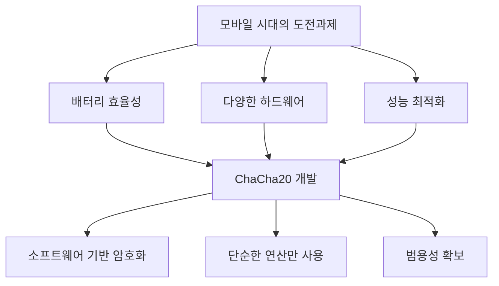
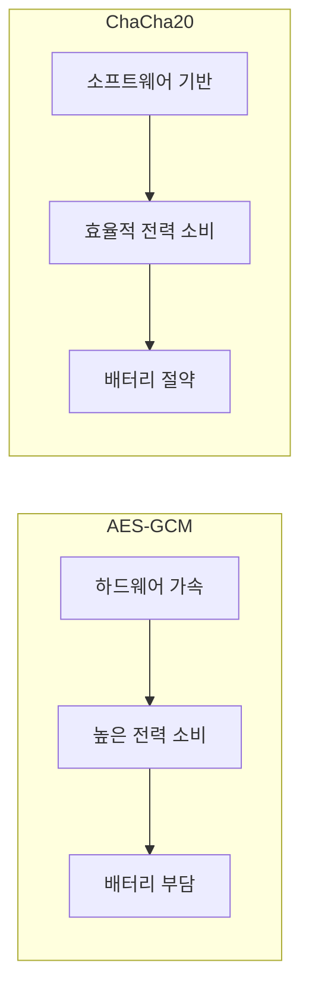
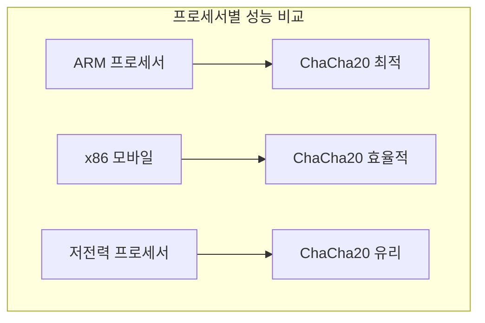
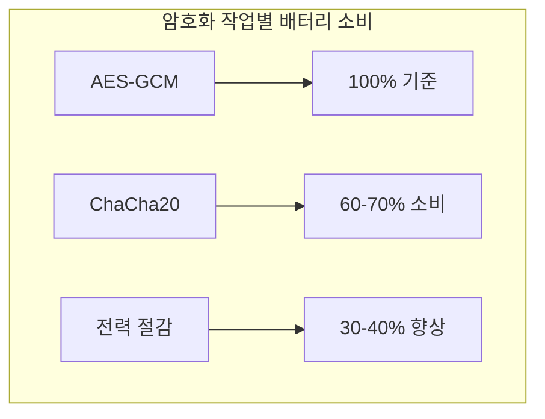
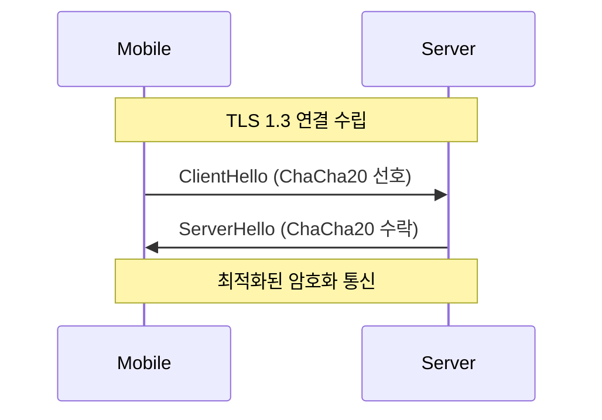
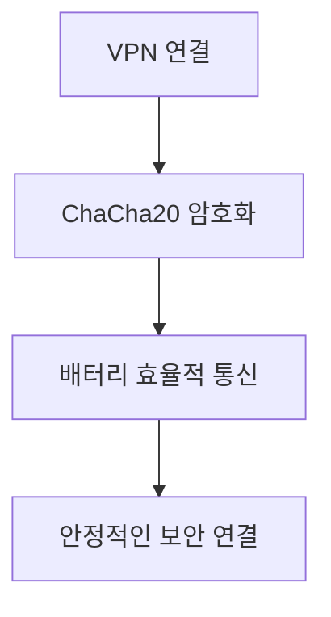

# 개념 이해

## 모바일 환경에서의 암호화
모바일 기기는 데스크톱과 다른 특성을 가진다:
- 제한된 배터리 용량
- 다양한 프로세서 아키텍처
- 네트워크 변동성
- 전력 소비 최적화 필요

## ChaCha20의 탄생 배경


# 모바일 최적화 특성

## 전력 소비 비교


## 모바일 프로세서별 성능


# 실제 구현 사례

## Android 구현 예시
```kotlin
import javax.crypto.Cipher
import javax.crypto.SecretKey
import javax.crypto.spec.ChaCha20ParameterSpec

class ChaCha20Crypto {
    fun encrypt(data: ByteArray, key: SecretKey, nonce: ByteArray): ByteArray {
        val cipher = Cipher.getInstance("ChaCha20")
        val paramSpec = ChaCha20ParameterSpec(nonce, 1)
        
        cipher.init(Cipher.ENCRYPT_MODE, key, paramSpec)
        return cipher.doFinal(data)
    }
    
    fun decrypt(encrypted: ByteArray, key: SecretKey, nonce: ByteArray): ByteArray {
        val cipher = Cipher.getInstance("ChaCha20")
        val paramSpec = ChaCha20ParameterSpec(nonce, 1)
        
        cipher.init(Cipher.DECRYPT_MODE, key, paramSpec)
        return cipher.doFinal(encrypted)
    }
}
```

## iOS 구현 예시
```swift
import CryptoKit

func encryptWithChaCha20(message: Data, key: SymmetricKey, nonce: Data) throws -> Data {
    guard let sealedBox = try? ChaChaPoly.seal(message,
                                              using: key,
                                              nonce: ChaChaPoly.Nonce(data: nonce)) else {
        throw CryptoError.encryptionFailed
    }
    return sealedBox.ciphertext
}
```

# 모바일 성능 최적화

## 배터리 소비 분석


## 네트워크 최적화


# 모바일 특화 보안 고려사항

## 1. 배터리 효율성
- 암호화 연산 최소화
- 메모리 사용 최적화
- 백그라운드 처리 효율화

## 2. 오프라인 보안


## 3. 메모리 관리
```kotlin
// 안전한 메모리 관리 예시
class SecureData {
    private var key: ByteArray? = null
    
    fun clearSensitiveData() {
        key?.fill(0)  // 메모리 초기화
        key = null    // 참조 제거
        System.gc()   // 가비지 컬렉션 요청
    }
}
```

# 실제 사용 사례

## 1. 모바일 뱅킹
- 민감한 금융 데이터 암호화
- 빠른 트랜잭션 처리
- 배터리 효율성 확보

## 2. 메시징 앱
- 실시간 메시지 암호화
- 대량의 데이터 처리
- 백그라운드 동작 최적화

## 3. VPN 애플리케이션


# 모니터링 및 분석

## 성능 모니터링
```kotlin
class CryptoPerformanceMonitor {
    fun measureOperation(operation: () -> Unit): Long {
        val batteryBefore = getBatteryLevel()
        val startTime = System.nanoTime()
        
        operation()
        
        val endTime = System.nanoTime()
        val batteryAfter = getBatteryLevel()
        
        return endTime - startTime
    }
}
```

# 결론

## 모바일 환경에서의 이점
1. 배터리 수명 연장
2. 안정적인 성능
3. 강력한 보안성
4. 범용성과 호환성

## 적용 권장 사례
1. 모바일 애플리케이션 개발
2. IoT 기기 보안
3. 배터리 의존적 환경
4. 다양한 하드웨어 지원 필요