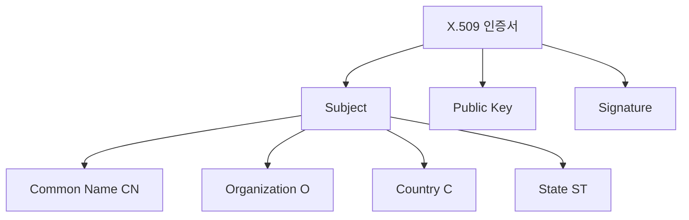
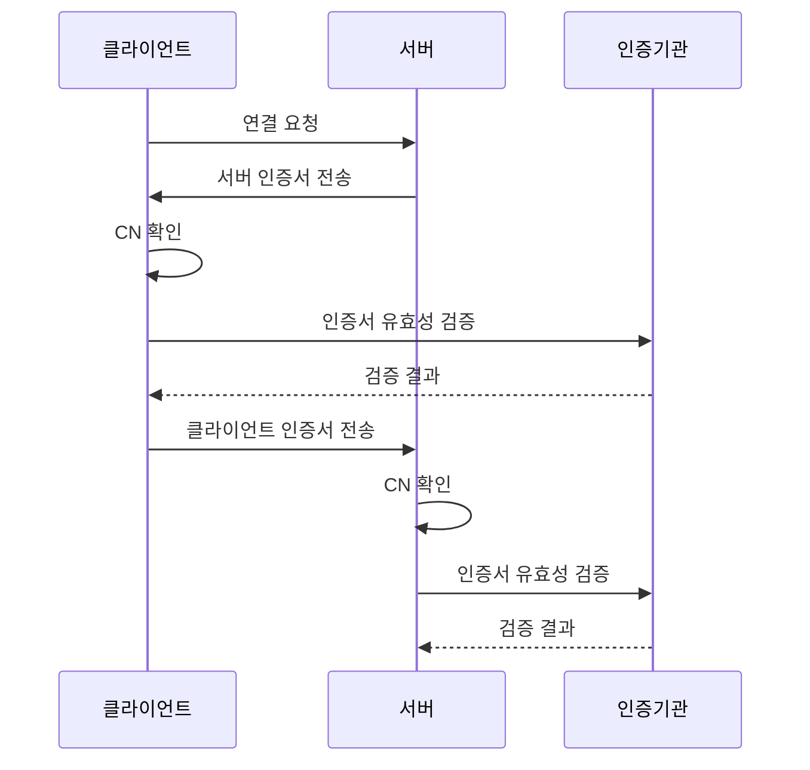

```table-of-contents
title: # 목차
style: nestedList # TOC style (nestedList|nestedOrderedList|inlineFirstLevel)
minLevel: 0 # Include headings from the specified level
maxLevel: 0 # Include headings up to the specified level
includeLinks: true # Make headings clickable
hideWhenEmpty: false # Hide TOC if no headings are found
debugInConsole: false # Print debug info in Obsidian console
```
# Common Name의 개념

## 기본 개념
Common Name은 인증서(Certificate)에서 사용되는 식별자로, 마치 주민등록증의 이름과 같은 역할을 한다. SSL/TLS 인증서에서는 주로 도메인 이름이나 서비스를 식별하는 이름으로 사용되며, 클라이언트 인증서에서는 사용자나 시스템을 식별하는 이름으로 사용된다.

## X.509 인증서 구조 내의 Common Name


# 동작 방식

## Common Name의 사용 사례
1. SSL/TLS 서버 인증서
   - 웹 서버의 도메인 이름
   - 예: www.example.com

2. 클라이언트 인증서
   - VPN 사용자 식별자
   - 이메일 인증서의 사용자 주소

3. 내부 시스템 식별
   - 서버 호스트네임
   - 서비스 식별자

## 실제 사용 예시

### 1. OpenSSL을 이용한 인증서 생성
```bash
#!/bin/bash
# 잘못된 예시 - Common Name 검증 없음
openssl req -new -x509 -nodes -out cert.pem -keyout key.pem

# 올바른 예시 - Common Name 지정과 검증
openssl req -new -x509 -nodes \
    -subj "/C=KR/ST=Seoul/O=Example Corp/CN=www.example.com" \
    -addext "subjectAltName = DNS:www.example.com,DNS:example.com" \
    -out cert.pem \
    -keyout key.pem
```

### 2. Apache 웹 서버 설정
```apache
# 잘못된 예시 - CN 검증 없음
<VirtualHost *:443>
    ServerName example.com
    SSLEngine on
    SSLCertificateFile /path/to/cert.pem
</VirtualHost>

# 올바른 예시 - CN 검증 포함
<VirtualHost *:443>
    ServerName example.com
    SSLEngine on
    SSLCertificateFile /path/to/cert.pem
    SSLVerifyClient require
    SSLVerifyDepth 1
    SSLOptions +StdEnvVars
</VirtualHost>
```

### 3. OpenVPN 설정
```bash
# 클라이언트 인증서 생성
export COMMON_NAME="user1"
openssl req -new -nodes \
    -subj "/C=KR/ST=Seoul/O=Company/CN=$COMMON_NAME" \
    -keyout user1.key -out user1.csr

# OpenVPN 서버 설정
verify-cn-name "user1"
```

# Common Name 관련 시스템 구조


# 고급 활용법

## 1. 와일드카드 CN 사용
```bash
# 여러 서브도메인 지원
CN=*.example.com
```

## 2. Subject Alternative Name (SAN) 활용
```bash
# 여러 도메인 지원
openssl req -new -x509 \
    -subj "/CN=example.com" \
    -addext "subjectAltName = DNS:www.example.com,DNS:api.example.com"
```

# 주의사항

## 보안 고려사항
1. CN 검증
   - 항상 CN을 검증한다
   - 와일드카드 사용 시 주의한다
   - 대소문자를 구분한다

2. 인증서 관리
   - 주기적으로 갱신한다
   - 안전하게 저장한다
   - 권한 설정을 적절히 한다

## 성능 고려사항
1. 인증서 체인 길이
2. 검증 프로세스 최적화
3. 캐시 활용

# 문제 해결

## 일반적인 문제
1. CN 불일치
   ```bash
   # 문제 확인
   openssl x509 -in cert.pem -text | grep "Subject:"
   
   # 인증서 정보 상세 확인
   openssl x509 -in cert.pem -text -noout
   ```

2. 인증서 체인 문제
   ```bash
   # 체인 검증
   openssl verify -CAfile chain.pem cert.pem
   ```

# 결론
Common Name은 Linux/Unix 환경에서 인증서 기반 인증의 핵심 요소이다. 특히 웹 서버, VPN, 이메일 서버 등 보안이 중요한 서비스에서 필수적으로 사용된다. 올바른 CN 설정과 검증은 시스템 보안의 기본이 되므로, 신중한 설정과 관리가 필요하다.