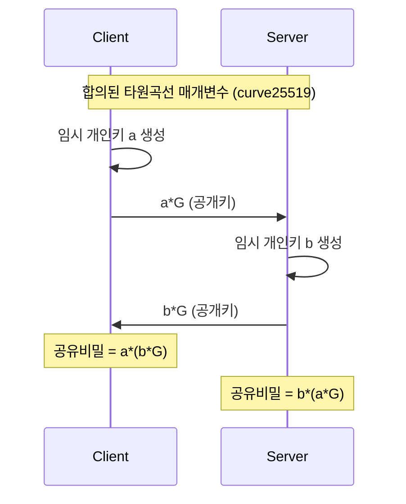
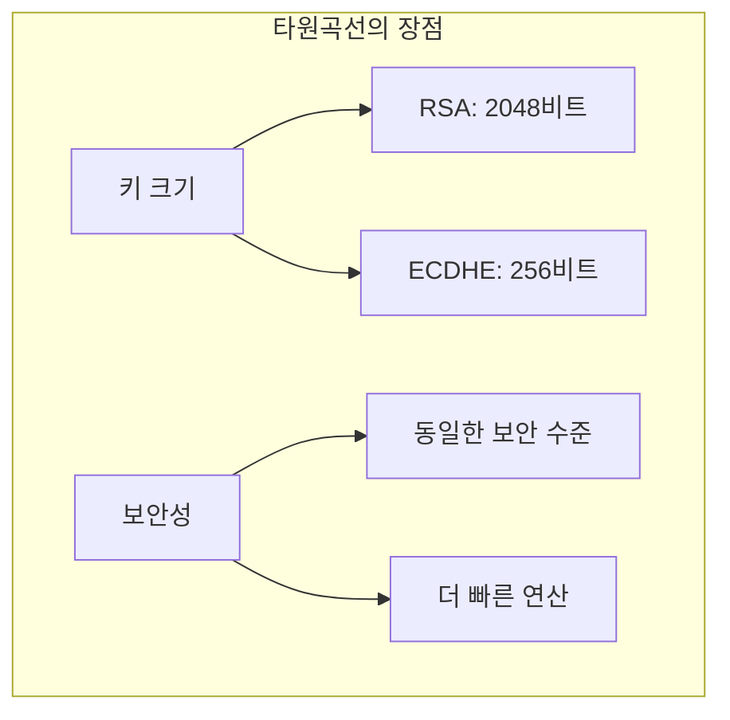
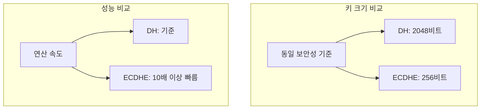
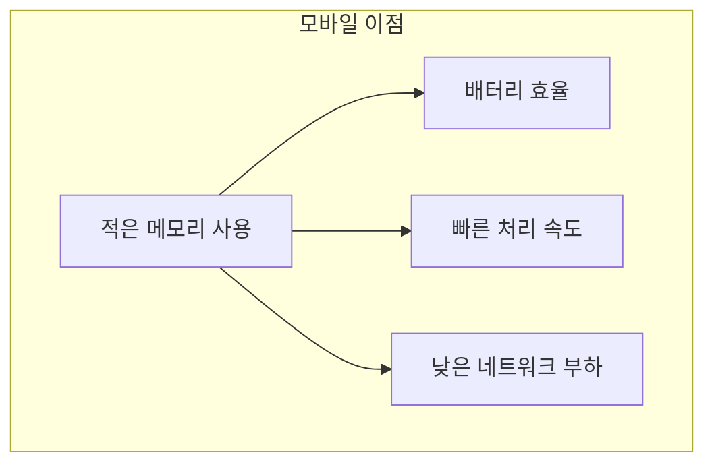

# 개념 이해

## ECDHE란?
ECDHE는 타원곡선 암호화를 사용하는 임시(Ephemeral) 키 교환 방식이다. 기존 DH보다 더 작은 키로 동일한 보안 수준을 제공한다.

## 실생활 비유
미술관에서의 색상 혼합과 유사하다:
- 일반 DH: 직선적인 색상 혼합
- ECDHE: 곡선 상의 특별한 점을 이용한 색상 혼합
- 더 적은 물감으로 동일한 색상 표현 가능

# 동작 방식

## 기본 프로토콜


## 타원곡선의 특성


# 실제 구현

## OpenSSL 사용 예시
```python
from cryptography.hazmat.primitives.asymmetric import ec
from cryptography.hazmat.primitives import serialization

def generate_ecdhe_keys():
    """ECDHE 키 쌍 생성"""
    # 개인키 생성
    private_key = ec.generate_private_key(
        ec.SECP256R1()  # curve25519도 많이 사용
    )
    
    # 공개키 도출
    public_key = private_key.public_key()
    
    return private_key, public_key

def compute_shared_secret(private_key, peer_public_key):
    """공유 비밀 계산"""
    shared_key = private_key.exchange(
        ec.ECDH(),
        peer_public_key
    )
    return shared_key
```

## TLS 설정 예시
```nginx
# Nginx 설정
ssl_protocols TLSv1.2 TLSv1.3;
ssl_ciphers ECDHE-ECDSA-AES128-GCM-SHA256:ECDHE-RSA-AES128-GCM-SHA256;
ssl_prefer_server_ciphers off;
```

# 성능 비교

## DH vs ECDHE


# 보안 고려사항

## 권장 설정
```python
# 안전한 곡선 선택
recommended_curves = [
    'curve25519',  # 가장 권장
    'secp256r1',   # NIST P-256
    'secp384r1'    # NIST P-384
]

# 취약한 곡선 (사용 금지)
weak_curves = [
    'secp192r1',  # 키 길이 불충분
    'secp224r1'   # 키 길이 불충분
]
```

## 임시(Ephemeral) 특성


# 모바일 환경에서의 장점

## 리소스 효율성


## 구체적 이점
1. 배터리 사용량 감소
2. 메모리 사용량 감소
3. 처리 속도 향상
4. 네트워크 대역폭 절약

# 문제 해결 가이드

## 일반적인 문제

### 1. 호환성 문제
```bash
# OpenSSL로 지원 확인
openssl ciphers -v | grep ECDHE
```

### 2. 성능 모니터링
```python
def benchmark_ecdhe():
    start = time.time()
    priv, pub = generate_ecdhe_keys()
    end = time.time()
    return end - start
```

# 결론

## ECDHE의 장점
1. 높은 보안성
2. 적은 리소스 사용
3. 빠른 연산 속도
4. Perfect Forward Secrecy

## 실무 권장사항
1. 안전한 곡선 선택
2. 최신 TLS 버전 사용
3. 임시키 특성 활용
4. 정기적인 보안 업데이트