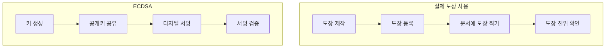
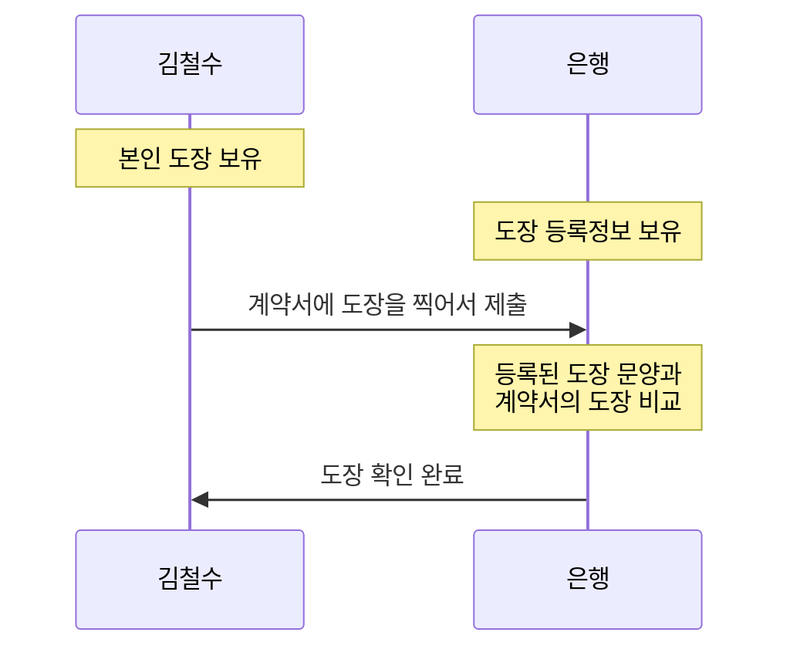
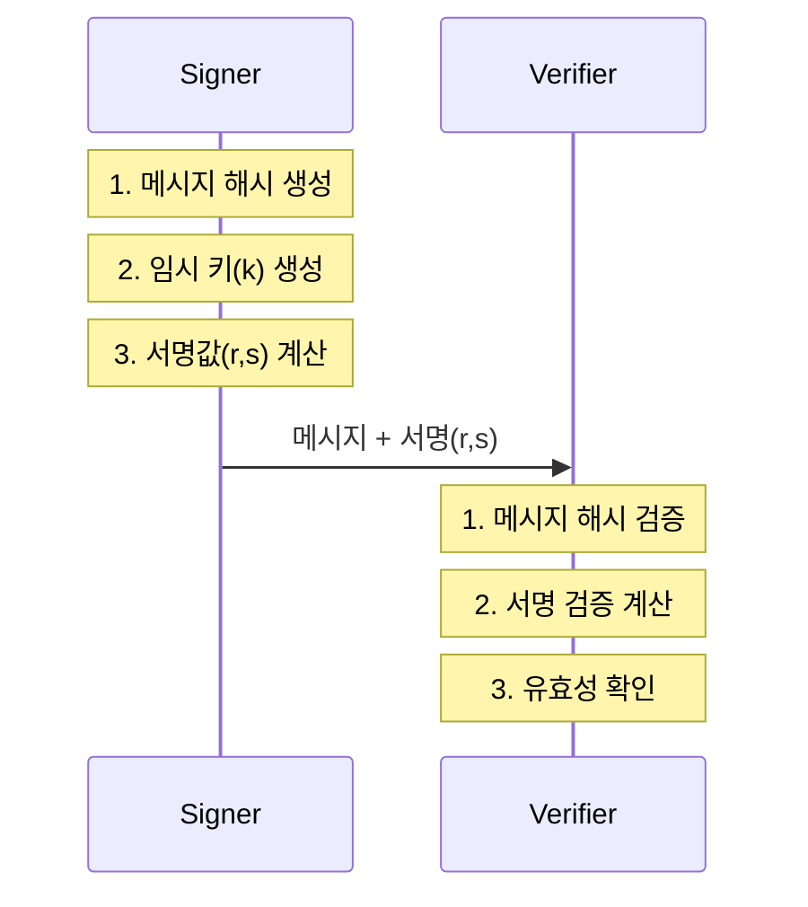
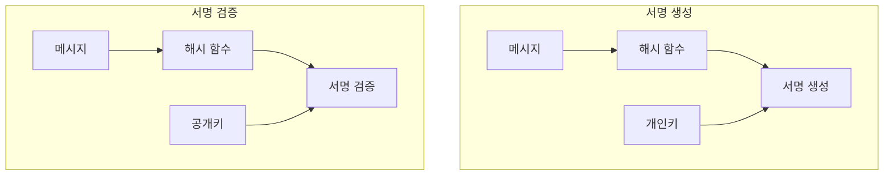
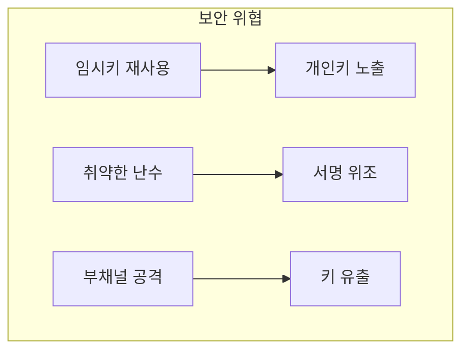

# 개념 이해

## ECDSA란?
ECDSA는 타원곡선 암호화를 사용하는 디지털 서명 알고리즘이다. RSA보다 짧은 키 길이로 동등한 보안성을 제공한다.

## 실생활 비유
도장을 찍는 과정과 유사하다:
- 도장(개인키)은 본인만 가지고 있다
- 도장 이미지(공개키)는 모두가 알 수 있다
- 실제 도장 문양(서명)으로 진위여부를 확인한다



구체적인 비유:

1. 주민센터에서 도장 등록하기
- 도장 만들기 = 개인키 생성
- 도장 등록하기 = 공개키 공유
- 도장 문양 = 공개키
- 실제 도장 = 개인키

2. 계약서에 도장 찍기


3. 실제 예시:
- 개인키(실제 도장) = 절대 남에게 보여주면 안 됨
- 공개키(도장 문양) = 누구나 볼 수 있음
- 서명(찍힌 도장) = 진짜 본인이 찍었는지 확인 가능

이렇게 이해하시면 좀 더 쉬울까요?

# 동작 방식

## ECDSA 처리 과정


## 시스템 구조


# 구현 예시

## 기본 구현
```python
from cryptography.hazmat.primitives import hashes
from cryptography.hazmat.primitives.asymmetric import ec
from cryptography.exceptions import InvalidSignature

class ECDSASigner:
    """
    ECDSA를 이용한 디지털 서명 생성 및 검증
    """
    def __init__(self):
        # SECP256K1 곡선 사용 (Bitcoin에서도 사용)
        self.private_key = ec.generate_private_key(ec.SECP256K1())
        self.public_key = self.private_key.public_key()

    def sign_message(self, message: bytes) -> bytes:
        """
        메시지에 대한 서명을 생성한다
        
        Args:
            message: 서명할 메시지
            
        Returns:
            bytes: 생성된 서명
        """
        return self.private_key.sign(
            message,
            ec.ECDSA(hashes.SHA256())
        )

    def verify_signature(self, message: bytes, signature: bytes) -> bool:
        """
        서명의 유효성을 검증한다
        
        Args:
            message: 원본 메시지
            signature: 검증할 서명
            
        Returns:
            bool: 검증 결과
        """
        try:
            self.public_key.verify(
                signature,
                message,
                ec.ECDSA(hashes.SHA256())
            )
            return True
        except InvalidSignature:
            return False
```

## 잘못된 구현과 올바른 구현

### 잘못된 예시
```python
# 취약한 구현 - 사용하지 말 것
class InsecureSigner:
    def __init__(self):
        # 고정된 키 사용 (취약점)
        self.k = 123456  
        
    def sign(self, message):
        # 예측 가능한 임시값 사용
        return self.k * hash(message)
```

### 올바른 구현
```python
# 안전한 구현
import secrets

class SecureSigner:
    def __init__(self):
        self.private_key = ec.generate_private_key(ec.SECP256K1())
    
    def sign(self, message):
        # 암호학적으로 안전한 난수 생성
        k = secrets.randbits(256)
        return self.private_key.sign(
            message,
            ec.ECDSA(hashes.SHA256())
        )
```

# 성능 최적화

## 배치 처리
```python
class BatchSigner:
    """
    여러 서명을 효율적으로 처리하는 클래스
    """
    def batch_sign(self, messages):
        """
        여러 메시지를 한번에 서명한다
        """
        return [
            self.private_key.sign(
                msg, 
                ec.ECDSA(hashes.SHA256())
            )
            for msg in messages
        ]
    
    def batch_verify(self, messages, signatures):
        """
        여러 서명을 한번에 검증한다
        """
        try:
            for msg, sig in zip(messages, signatures):
                self.public_key.verify(
                    sig, 
                    msg,
                    ec.ECDSA(hashes.SHA256())
                )
            return True
        except InvalidSignature:
            return False
```

# 보안 고려사항

## 주요 위협


## 대응 방안
1. 임시키(k) 관리
   - 매 서명마다 새로운 난수 사용
   - 암호학적으로 안전한 난수 생성기 사용
   
2. 키 보호
   - 안전한 키 저장소 사용
   - 정기적인 키 갱신

# 실제 활용 사례

## 1. 블록체인
- Bitcoin 트랜잭션 서명
- 스마트 컨트랙트 서명

## 2. TLS 인증서
- 서버 인증
- 클라이언트 인증

## 3. 코드 서명
- 소프트웨어 패키지 서명
- 모바일 앱 서명

# 결론

## ECDSA의 장점
1. RSA보다 짧은 키 길이로 동등한 보안성 제공한다
2. 모바일 환경에 적합하다
3. 국제 표준으로 인정받는다

## 주의사항
1. 안전한 난수 생성이 필수적이다
2. 임시키 관리에 주의해야 한다
3. 적절한 곡선을 선택해야 한다