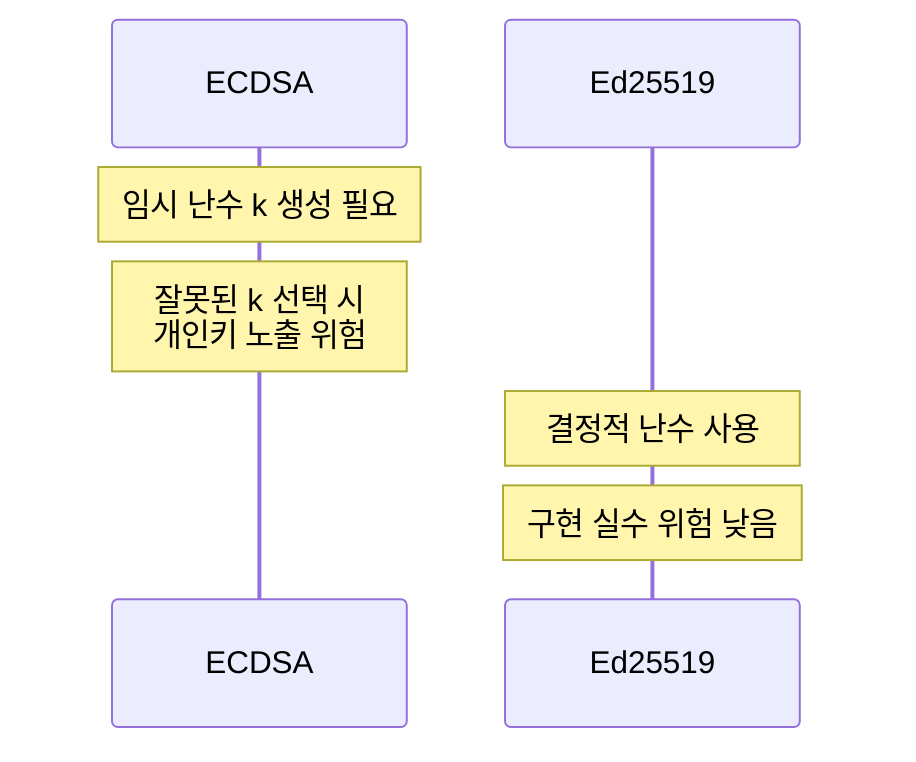
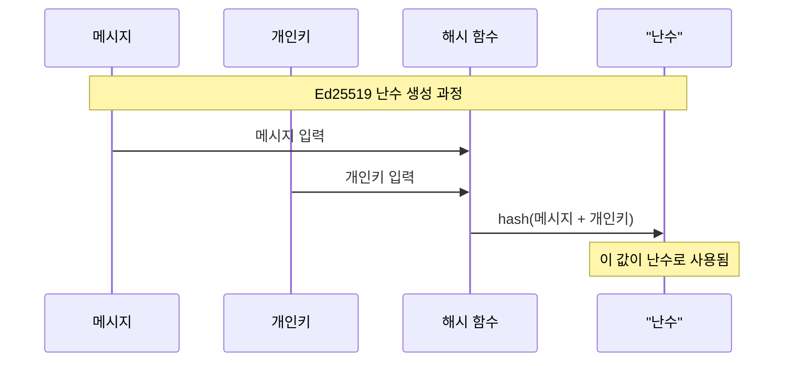
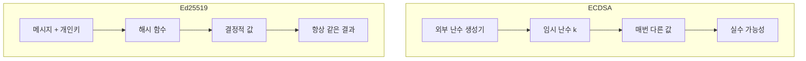
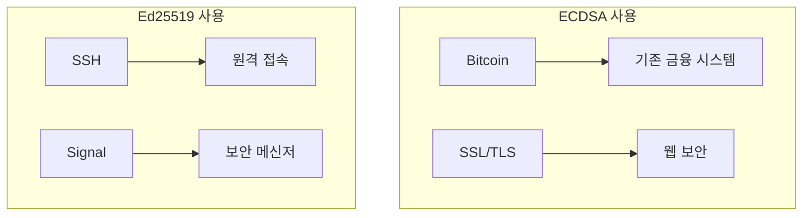

# 개념 이해

## 기본 개념
[[ECDSA(Elliptic Curve Digital Signature Algorithm)|ECDSA]]와 [[Ed25519 - 디지털 서명 알고리즘|Ed25519]]는 모두 타원곡선을 이용한 디지털 서명 알고리즘이다. 두 알고리즘은 같은 목적을 가지지만 구현 방식과 특성에서 차이가 있다.

## 실생활 비유
은행의 도장 시스템 변화와 유사하다:
- ECDSA: 전통적인 도장 시스템 (도장 찍을 때마다 잉크 선택)
- Ed25519: 현대적인 전자 도장 (항상 일정한 품질의 결과물)

# 주요 차이점

## 구조적 차이


## 안전성 비교


- Ed25519에서 말하는 "결정적 난수"는 실제로는 메시지와 개인키를 이용해 생성되는 값이다



차이점 비교:


즉:
1. ECDSA: 외부에서 난수 생성 (위험!)
2. Ed25519: 메시지와 키로 계산 (안전!)

같은 메시지를 서명하면:
- ECDSA: 매번 다른 서명 생성
- Ed25519: 항상 동일한 서명 생성

이것이 오히려 더 안전한 이유:
1. 구현 실수 가능성 없음
2. 예측 불가능성은 여전히 유지
3. 재현 가능한 결과
# 구현 예시

## 기본 구현 비교
```python
from cryptography.hazmat.primitives import hashes
from cryptography.hazmat.primitives.asymmetric import ec, ed25519

class SignatureComparison:
    """
    ECDSA와 Ed25519 서명 비교 구현
    """
    def __init__(self):
        # ECDSA 키 생성
        self.ecdsa_private = ec.generate_private_key(ec.SECP256K1())
        self.ecdsa_public = self.ecdsa_private.public_key()
        
        # Ed25519 키 생성
        self.ed25519_private = ed25519.Ed25519PrivateKey.generate()
        self.ed25519_public = self.ed25519_private.public_key()
    
    def ecdsa_sign(self, message: bytes) -> bytes:
        """
        ECDSA로 메시지 서명
        - 임시 난수 k를 사용한다
        - 구현이 복잡하다
        """
        return self.ecdsa_private.sign(
            message,
            ec.ECDSA(hashes.SHA256())
        )
    
    def ed25519_sign(self, message: bytes) -> bytes:
        """
        Ed25519로 메시지 서명
        - 결정적 난수를 사용한다
        - 구현이 단순하다
        """
        return self.ed25519_private.sign(message)
```

## 잘못된 구현과 올바른 구현

### 잘못된 ECDSA 구현
```python
# 취약한 ECDSA 구현
class InsecureECDSA:
    def __init__(self):
        self.k = 123456  # 고정된 k 사용 - 절대 하면 안 됨!
    
    def sign(self, message):
        # 동일한 k로 서명 - 개인키 노출 위험
        return sign_with_k(message, self.k)
```

### 올바른 구현
```python
# 안전한 구현
import secrets

class SecureSignature:
    def ecdsa_sign(self, message):
        # ECDSA: 암호학적으로 안전한 난수 생성
        return self.ecdsa_private.sign(
            message,
            ec.ECDSA(hashes.SHA256())
        )
    
    def ed25519_sign(self, message):
        # Ed25519: 별도의 난수 필요 없음
        return self.ed25519_private.sign(message)
```

# 성능 측정

## 벤치마크 코드
```python
import time

def benchmark_signatures():
    """
    서명 알고리즘 성능 비교
    """
    msg = b"Hello, World!"
    iterations = 1000
    
    # ECDSA 성능 측정
    ecdsa_times = []
    for _ in range(iterations):
        start = time.time()
        ecdsa_sign(msg)
        ecdsa_times.append(time.time() - start)
    
    # Ed25519 성능 측정
    ed25519_times = []
    for _ in range(iterations):
        start = time.time()
        ed25519_sign(msg)
        ed25519_times.append(time.time() - start)
        
    return {
        'ecdsa_avg': sum(ecdsa_times) / len(ecdsa_times),
        'ed25519_avg': sum(ed25519_times) / len(ed25519_times)
    }
```

# 실제 사용 사례

## 적용 분야


# 보안 고려사항

## 위험 요소


# 선택 가이드

## 상황별 권장사항
1. 새로운 프로젝트
   - Ed25519를 사용한다
   - 구현이 단순하다
   - 성능이 우수하다

2. 기존 시스템
   - ECDSA를 유지한다
   - 호환성을 보장한다
   - 점진적 마이그레이션을 계획한다

# 결론

## 핵심 정리
1. Ed25519가 더 현대적이다
2. ECDSA도 여전히 널리 사용된다
3. 상황에 맞는 선택이 중요하다

## 주의사항
1. ECDSA 사용 시 난수 생성에 주의한다
2. Ed25519 선택 시 호환성을 검토한다
3. 보안 업데이트를 주기적으로 확인한다