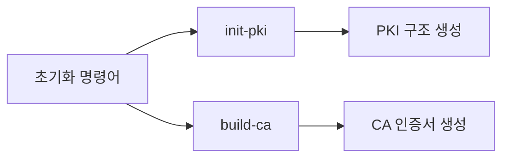
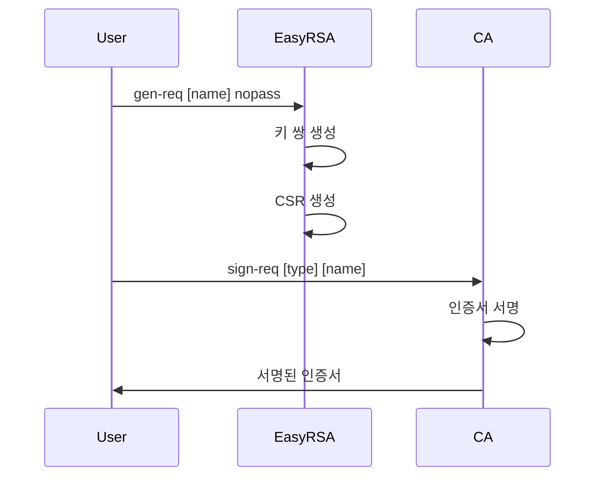
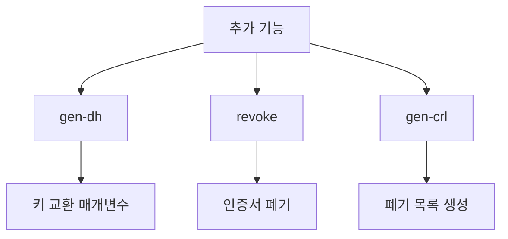
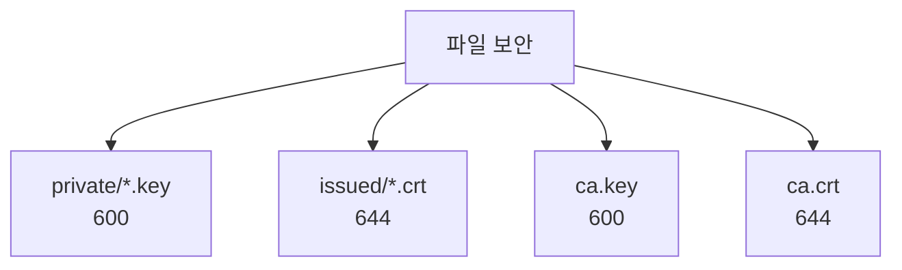

EasyRSA 명령어 완벽 가이드

# 기본 명령어

## PKI 초기화 관련


### 1. `init-pki`
- 목적: PKI 환경을 초기화한다
- 생성되는 구조:
  - private/: 개인키 저장
  - issued/: 발급된 인증서
  - reqs/: 인증서 요청
  - revoked/: 폐기된 인증서

### 2. `build-ca [nopass]`
- 목적: 인증 기관(CA) 생성
- 옵션:
  - nopass: 비밀번호 없이 생성
- 생성 파일:
  - ca.crt: CA 인증서
  - ca.key: CA 개인키

# 인증서 생성 명령어

## 서버/클라이언트 인증서


### 1. `gen-req [이름] [nopass]`
- 목적: 인증서 요청(CSR) 생성
- 매개변수:
  - 이름: 인증서 식별자
  - nopass: 비밀번호 없이 생성
- 생성 파일:
  - private/\[이름].key: 개인키
  - reqs/\[이름].req: CSR

### 2. `sign-req [타입] [이름]`
- 목적: CSR에 서명하여 인증서 발급
- 매개변수:
  - 타입: server 또는 client
  - 이름: 인증서 식별자
- 생성 파일:
  - issued/\[이름].crt: 서명된 인증서

# 추가 기능 명령어

## Diffie-Hellman 및 관리


### 1. `gen-dh`
- 목적: Diffie-Hellman 매개변수 생성
- 생성 파일:
  - dh.pem: DH 매개변수 파일
- 용도: 안전한 키 교환을 위해 사용
- [[OpenVPN에서의 Diffie-Hellman 매개변수]]

### 2. `revoke [이름]`
- 목적: 발급된 인증서 폐기
- 매개변수:
  - 이름: 폐기할 인증서 식별자
- 영향:
  - 인증서를 revoked/ 디렉토리로 이동
  - CRL 업데이트 필요

### 3. `gen-crl`
- 목적: 인증서 폐기 목록(CRL) 생성
- 생성 파일:
  - crl.pem: 폐기된 인증서 목록
- 용도: 폐기된 인증서 관리

# 실무 활용 예시

## 서버 설정 시나리오
```bash
# 전체 PKI 초기화 및 서버 설정
./easyrsa init-pki
./easyrsa build-ca nopass
./easyrsa gen-req server nopass
./easyrsa sign-req server server
./easyrsa gen-dh
```

## 클라이언트 추가 시나리오
```bash
# 새 클라이언트 추가
./easyrsa gen-req client1 nopass
./easyrsa sign-req client client1

# 클라이언트 폐기
./easyrsa revoke client1
./easyrsa gen-crl
```

# 보안 고려사항

## 권한 설정
```bash
# 개인키 보호
chmod 600 pki/private/*.key
chmod 600 pki/ca.key

# 인증서 권한
chmod 644 pki/issued/*.crt
chmod 644 pki/ca.crt
```

## 파일 관리


# 결론

## 핵심 명령어 요약
1. PKI 초기화: init-pki, build-ca
2. 인증서 생성: gen-req, sign-req
3. 추가 기능: gen-dh, revoke, gen-crl

## 운영 시 주의사항
1. 개인키 파일 보안
2. 정기적인 인증서 갱신
3. CRL 주기적 업데이트
4. 백업 관리 철저