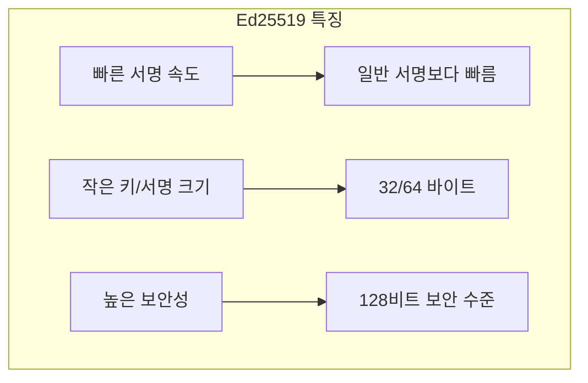
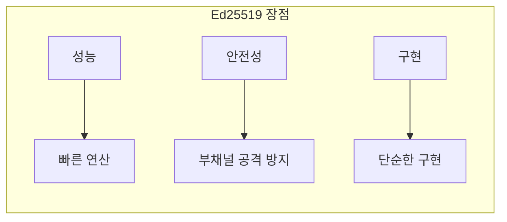
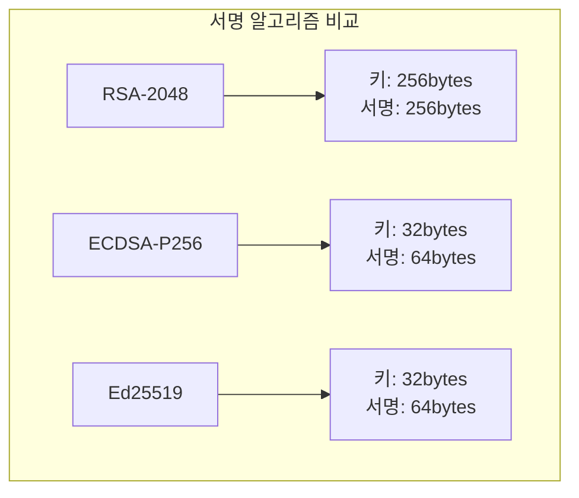
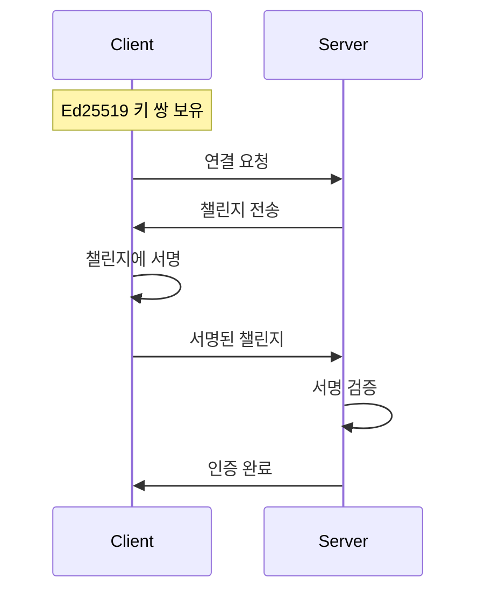
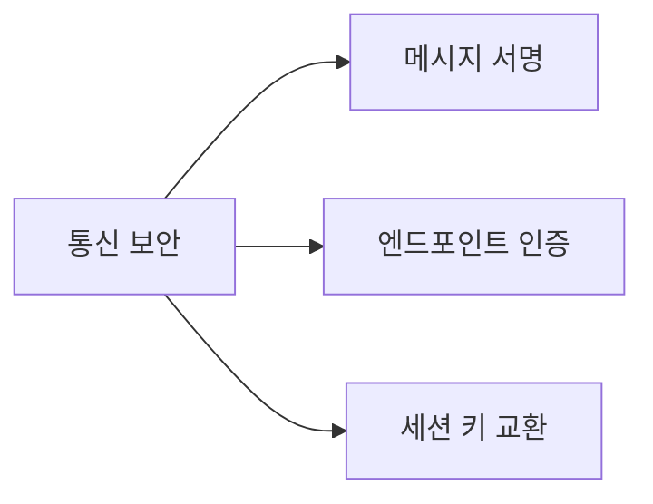

# 개념 이해

## Ed25519란?
Ed25519는 Edwards-curve Digital Signature Algorithm(EdDSA)의 구현체이다. Curve25519를 기반으로 하는 현대적인 디지털 서명 알고리즘이다.

## 기본 특징


# 기술적 특징

## 구조적 장점


## 타 알고리즘과 비교


# 구현 예시

## 키 생성 및 서명
```python
from cryptography.hazmat.primitives import serialization
from cryptography.hazmat.primitives.asymmetric import ed25519

def generate_ed25519_keypair():
    """Ed25519 키 쌍 생성"""
    private_key = ed25519.Ed25519PrivateKey.generate()
    public_key = private_key.public_key()
    return private_key, public_key

def sign_message(private_key, message):
    """메시지 서명"""
    signature = private_key.sign(message)
    return signature

def verify_signature(public_key, message, signature):
    """서명 검증"""
    try:
        public_key.verify(signature, message)
        return True
    except:
        return False

# 사용 예시
priv_key, pub_key = generate_ed25519_keypair()
message = b"Hello, Ed25519!"
signature = sign_message(priv_key, message)
is_valid = verify_signature(pub_key, message, signature)
```

## SSH 키 생성 예시
```bash
# Ed25519 SSH 키 생성
ssh-keygen -t ed25519 -C "your_email@example.com"

# 생성된 키 확인
cat ~/.ssh/id_ed25519.pub
```

# 실제 활용 사례

## SSH 인증


## 성능 측정
```python
import time

def benchmark_ed25519():
    """Ed25519 성능 측정"""
    start_time = time.time()
    
    # 키 생성
    private_key, public_key = generate_ed25519_keypair()
    
    # 서명 및 검증
    message = b"Test message"
    signature = private_key.sign(message)
    valid = public_key.verify(signature, message)
    
    end_time = time.time()
    return end_time - start_time
```

# 보안 고려사항

## 키 관리


## 구현 시 주의사항
```python
class Ed25519KeyManager:
    def __init__(self):
        self._private_key = None
        
    def generate_key(self):
        """안전한 키 생성"""
        self._private_key = ed25519.Ed25519PrivateKey.generate()
        return self._private_key.public_key()
    
    def secure_sign(self, message):
        """안전한 서명 생성"""
        if not self._private_key:
            raise SecurityError("Private key not initialized")
        
        try:
            return self._private_key.sign(message)
        finally:
            # 메모리 사용 후 정리
            # 실제 구현에서는 더 안전한 방식 필요
            pass
```

# 일반적인 사용 사례

## 1. SSH 인증
- 서버 접근 인증
- Git 저장소 인증
- 자동화 스크립트 인증

## 2. 문서 서명
- 코드 서명
- 문서 무결성 검증
- 배포 파일 검증

## 3. 통신 보안


# 성능 최적화

## 배치 처리
```python
def batch_sign(private_key, messages):
    """여러 메시지 일괄 서명"""
    return [private_key.sign(msg) for msg in messages]

def batch_verify(public_key, messages, signatures):
    """여러 서명 일괄 검증"""
    return all(
        verify_signature(public_key, msg, sig)
        for msg, sig in zip(messages, signatures)
    )
```

# 결론

## Ed25519의 강점
1. 빠른 성능
2. 높은 보안성
3. 작은 키 크기
4. 단순한 구현

## 권장 사항
1. SSH 키로 Ed25519 사용
2. 안전한 키 관리 정책 수립
3. 정기적인 키 갱신
4. 보안 업데이트 유지