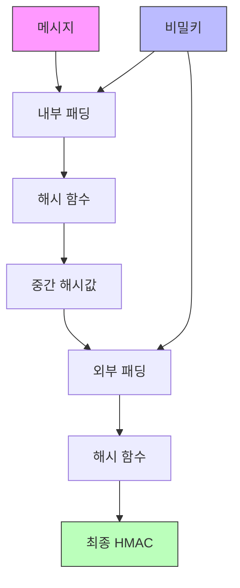

```table-of-contents
title: 
style: nestedList # TOC style (nestedList|nestedOrderedList|inlineFirstLevel)
minLevel: 0 # Include headings from the specified level
maxLevel: 0 # Include headings up to the specified level
includeLinks: true # Make headings clickable
hideWhenEmpty: false # Hide TOC if no headings are found
debugInConsole: false # Print debug info in Obsidian console
```
# 개념 설명
## HMAC이란?
HMAC은 메시지의 무결성과 신뢰성을 검증하기 위한 암호화 기법이다. 마치 편지에 서명을 하고 봉인하는 것처럼, 메시지에 고유한 디지털 서명을 추가하는 방식이다.

## 실생활 비유
집 열쇠를 예로 들면:
- 메시지는 집이다
- 비밀키는 열쇠이다
- HMAC은 열쇠로 잠그는 행위이다
- 검증은 올바른 열쇠로 열리는지 확인하는 것이다

# 기본 동작 방식
## HMAC 계산 과정



## 구현 예시
```python
import hmac
import hashlib

def create_hmac(message, key):
    """
    메시지와 키를 사용하여 HMAC을 생성한다.
    
    Args:
        message (str): 원본 메시지
        key (str): 비밀키
    
    Returns:
        str: 생성된 HMAC (16진수 문자열)
    """
    # 문자열을 바이트로 변환
    message_bytes = message.encode('utf-8')
    key_bytes = key.encode('utf-8')
    
    # HMAC 객체 생성 (SHA256 사용)
    hmac_obj = hmac.new(key_bytes, message_bytes, hashlib.sha256)
    
    # 16진수 문자열로 변환하여 반환
    return hmac_obj.hexdigest()

def verify_hmac(message, key, received_hmac):
    """
    받은 메시지와 HMAC이 유효한지 검증한다.
    
    Args:
        message (str): 검증할 메시지
        key (str): 비밀키
        received_hmac (str): 수신한 HMAC
    
    Returns:
        bool: 검증 결과
    """
    calculated_hmac = create_hmac(message, key)
    return hmac.compare_digest(calculated_hmac, received_hmac)

# 사용 예시
message = "안녕하세요"
secret_key = "my_secret_key"

# HMAC 생성
generated_hmac = create_hmac(message, secret_key)
print(f"생성된 HMAC: {generated_hmac}")

# HMAC 검증
is_valid = verify_hmac(message, secret_key, generated_hmac)
print(f"검증 결과: {is_valid}")
```

# 고급 활용법
## 1. 단계별 보안 강화
```python
# 더 강력한 해시 알고리즘 사용
hmac_sha512 = hmac.new(key_bytes, message_bytes, hashlib.sha512)

# 키 길이 검증 추가
if len(key_bytes) < 32:  # 256비트 미만의 키는 거부
    raise ValueError("키가 너무 짧습니다")
```

## 2. 실시간 데이터 검증
```python
def verify_stream(stream, key, chunk_size=1024):
    """
    스트리밍 데이터의 HMAC을 실시간으로 검증한다.
    """
    hmac_obj = hmac.new(key, None, hashlib.sha256)
    while True:
        chunk = stream.read(chunk_size)
        if not chunk:
            break
        hmac_obj.update(chunk)
    return hmac_obj.hexdigest()
```

# 보안 고려사항
## 주의해야 할 점
1. 키 관리
   - 충분히 긴 키 사용 (최소 256비트)
   - 안전한 키 저장소 사용
   - 정기적인 키 교체

2. 해시 알고리즘 선택
   - SHA-1 사용 지양
   - SHA-256 이상 권장
   - 향후 양자 내성 고려

## 일반적인 취약점
```python
# 잘못된 구현 예시
def bad_verify(message, key, hmac):
    # 직접 문자열 비교는 타이밍 공격에 취약
    return create_hmac(message, key) == hmac  # 사용 금지!

# 올바른 구현
def good_verify(message, key, hmac):
    # hmac.compare_digest는 타이밍 공격에 안전
    return hmac.compare_digest(create_hmac(message, key), hmac)
```

# 실제 사용 사례
1. API 인증
```python
def verify_api_request(payload, timestamp, received_hmac):
    """API 요청의 무결성을 검증한다"""
    message = f"{payload}{timestamp}"
    return verify_hmac(message, API_KEY, received_hmac)
```

2. 파일 무결성 검증
```python
def verify_file(filepath, expected_hmac):
    """파일의 무결성을 검증한다"""
    with open(filepath, 'rb') as f:
        hmac_obj = hmac.new(KEY, None, hashlib.sha256)
        while chunk := f.read(8192):
            hmac_obj.update(chunk)
    return hmac.compare_digest(hmac_obj.hexdigest(), expected_hmac)
```

# 성능 고려사항
- 큰 파일 처리 시 청크 단위 처리
- 메모리 사용량 관리
- 병렬 처리 고려

# 결론
HMAC은 메시지 무결성과 인증을 보장하는 필수적인 보안 도구이다. 올바른 구현과 주의사항을 준수하면 안전한 통신과 데이터 검증이 가능하다.

# 참고 자료
- FIPS PUB 198-1 - The Keyed-Hash Message Authentication Code (HMAC)
- RFC 2104 - HMAC: Keyed-Hashing for Message Authentication
- NIST SP 800-107 - Recommendation for Applications Using Approved Hash Algorithms