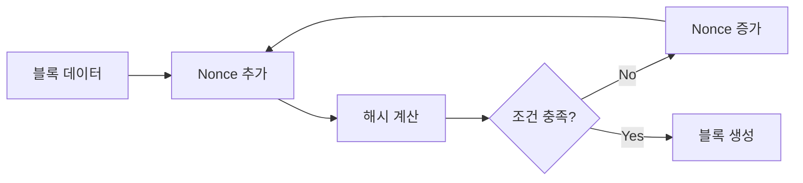
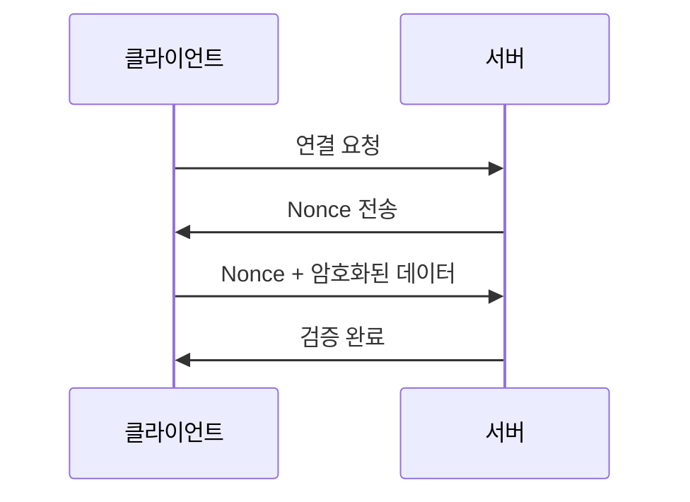

```table-of-contents
title: 
style: nestedList # TOC style (nestedList|nestedOrderedList|inlineFirstLevel)
minLevel: 0 # Include headings from the specified level
maxLevel: 0 # Include headings up to the specified level
includeLinks: true # Make headings clickable
hideWhenEmpty: false # Hide TOC if no headings are found
debugInConsole: false # Print debug info in Obsidian console
```

# Nonce란?
 Nonce는 'Number used ONCE'의 줄임말로, 한 번만 사용되는 임의의 숫자를 의미한다. 마치 일회용 비밀번호와 같이, 특정 목적을 위해 한 번만 사용되고 폐기되는 값이다.

# 실생활 비유
## 은행 OTP와의 비교
- OTP(One Time Password)는 은행 거래 시 사용되는 일회용 비밀번호이다
- Nonce도 이와 유사하게 한 번만 사용되는 값으로 보안을 강화한다

## 식당 대기표와의 비교
- 식당에서 받는 대기번호는 그 날 한 번만 사용된다
- 다음 날이 되면 같은 번호라도 다른 손님에게 배정된다

# Nonce의 주요 활용 분야
## 1. 블록체인에서의 활용


## 2. 암호화 통신에서의 활용


# 실제 구현 예시
## 1. 블록체인 마이닝에서의 Nonce 활용
```python
import hashlib

def mine_block(block_data, difficulty):
    """
    주어진 난이도에 맞는 Nonce를 찾는 함수
    
    Args:
        block_data (str): 블록 데이터
        difficulty (int): 필요한 앞자리 0의 개수
    
    Returns:
        tuple: (성공한 nonce 값, 최종 해시값)
    """
    nonce = 0
    target = '0' * difficulty
    
    while True:
        # 블록 데이터와 nonce를 결합
        data_with_nonce = f"{block_data}{nonce}"
        # SHA-256 해시 계산
        hash_result = hashlib.sha256(data_with_nonce.encode()).hexdigest()
        
        # 목표 난이도 충족 여부 확인
        if hash_result.startswith(target):
            return nonce, hash_result
            
        nonce += 1

# 사용 예시
block_data = "Hello, Blockchain!"
difficulty = 4
found_nonce, final_hash = mine_block(block_data, difficulty)
print(f"Found Nonce: {found_nonce}")
print(f"Final Hash: {final_hash}")
```

## 2. 인증 프로토콜에서의 Nonce 활용
```python
import secrets
import time

class AuthenticationServer:
    def __init__(self):
        self.used_nonces = set()
        self.nonce_timeout = 300  # 5분
        
    def generate_nonce(self):
        """새로운 nonce를 생성한다"""
        nonce = secrets.token_hex(16)  # 32자리 16진수 생성
        timestamp = time.time()
        self.used_nonces.add((nonce, timestamp))
        return nonce
        
    def verify_nonce(self, nonce):
        """
        nonce의 유효성을 검증한다
        - 이미 사용된 nonce인지 확인
        - timeout이 지났는지 확인
        """
        current_time = time.time()
        
        # 모든 저장된 nonce 확인
        for stored_nonce, timestamp in self.used_nonces.copy():
            # timeout 된 nonce 제거
            if current_time - timestamp > self.nonce_timeout:
                self.used_nonces.remove((stored_nonce, timestamp))
                continue
                
            # 이미 사용된 nonce인지 확인
            if stored_nonce == nonce:
                return False
                
        return True
```

# Nonce 관련 주의사항
## 1. 안전한 생성 방법
- 암호학적으로 안전한 난수 생성기 사용
- 충분한 길이의 Nonce 값 사용
- 예측 가능한 패턴 회피

## 2. 일반적인 실수
- 순차적인 Nonce 사용
- 재사용 가능한 Nonce 허용
- 불충분한 엔트로피

# 성능 고려사항
## 1. 저장 공간
- 사용된 Nonce 기록 관리
- 만료된 Nonce 정리
- 메모리 사용량 최적화

## 2. 처리 속도
- Nonce 생성 시간
- 검증 프로세스 최적화
- 동시성 처리

# 보안 고려사항
## 1. 재사용 공격 방지
- Nonce 값의 유일성 보장
- 적절한 만료 시간 설정
- 사용된 Nonce 추적

## 2. 예측 공격 방지
- 충분한 무작위성 보장
- 시간 기반 제약 추가
- 암호학적 난수 생성기 사용

# 결론
Nonce는 현대 암호화 시스템과 블록체인에서 필수적인 보안 요소이다. 적절한 구현과 관리를 통해 시스템의 안전성을 크게 향상시킬 수 있다. 특히 블록체인의 작업증명(PoW) 시스템에서는 핵심적인 역할을 수행하며, 네트워크의 신뢰성과 안전성을 보장하는 중요한 메커니즘으로 자리잡았다.