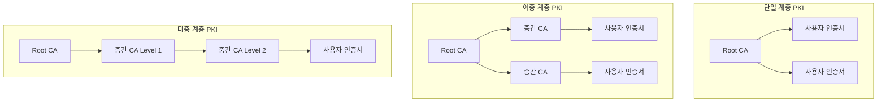
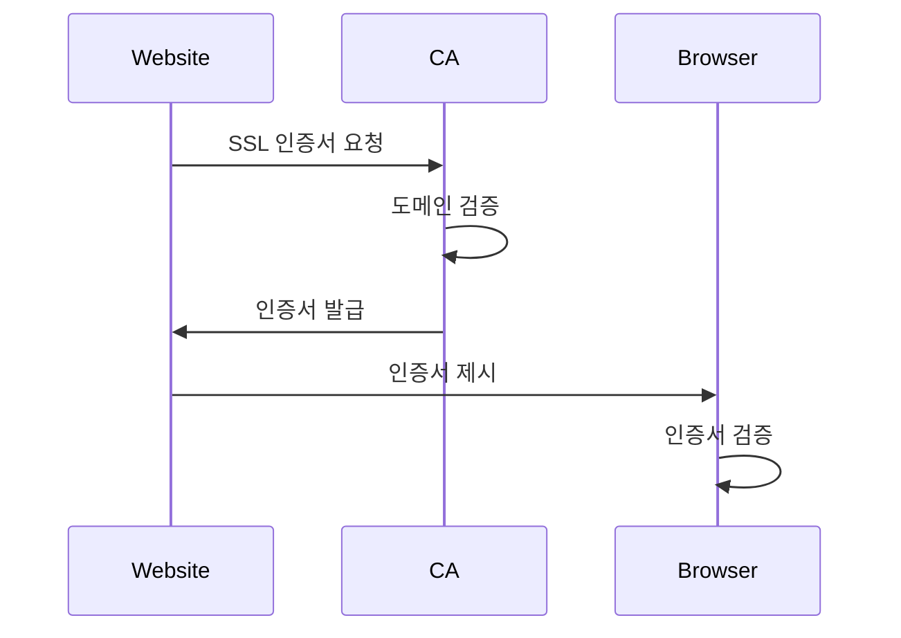
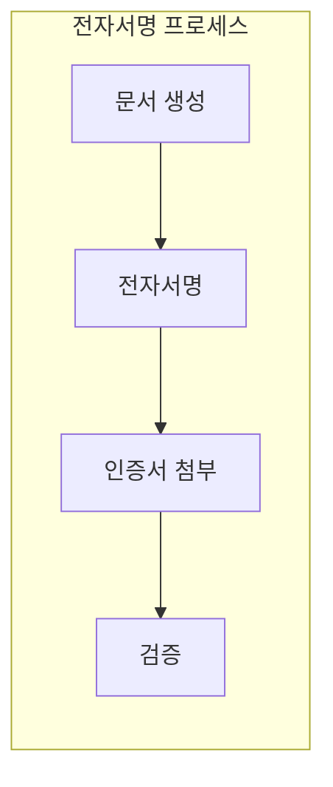
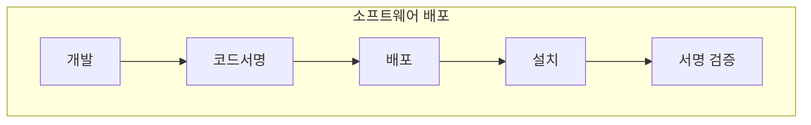
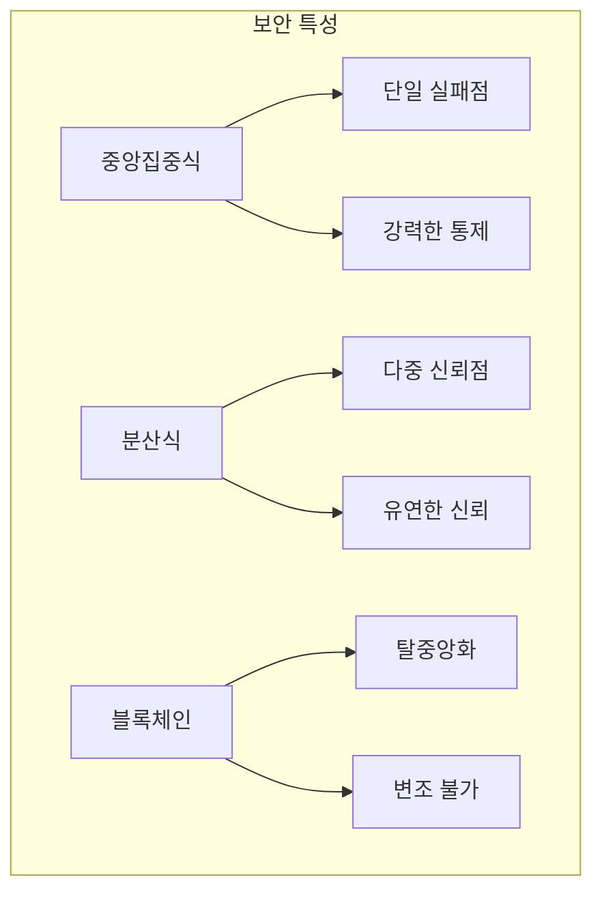
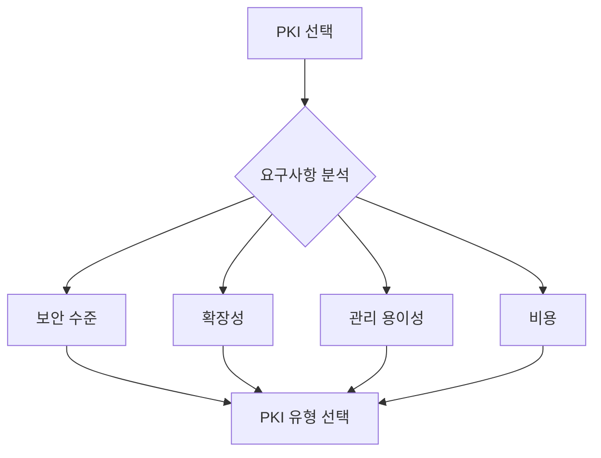

PKI 구조와 종류: 용도별 특성과 활용

# 개념 이해

## PKI 구조의 분류
PKI(Public Key Infrastructure)는 구현 방식, 용도, 계층 구조에 따라 다양한 형태로 존재한다. 각각의 PKI는 특정 목적과 환경에 최적화되어 있다.

## 실생활 비유
정부 조직 체계와 유사하다:
- 중앙집중식: 중앙정부가 모든 권한 보유
- 분산식: 지방정부가 권한 분산
- 계층식: 중앙-지방-기초 단위 구조화

# PKI 구조별 특징

## 계층 구조


# 용도별 PKI 구분

## 1. 웹 PKI


## 2. 전자서명 PKI


## 3. 코드서명 PKI


# 구현 방식별 특징

## 1. 전통적 PKI (중앙집중식)
```python
class TraditionalPKI:
    """
    중앙집중식 PKI 구현
    """
    def __init__(self, ca_cert_path: str, ca_key_path: str):
        self.ca_cert = self._load_ca_cert(ca_cert_path)
        self.ca_key = self._load_ca_key(ca_key_path)
    
    def issue_certificate(self, csr: bytes) -> bytes:
        """
        인증서 발급
        """
        cert = x509.CertificateBuilder()
        # 인증서 설정
        cert = cert.subject_name(csr.subject)
        cert = cert.issuer_name(self.ca_cert.subject)
        cert = cert.public_key(csr.public_key())
        
        # CA 개인키로 서명
        return cert.sign(self.ca_key, hashes.SHA256())
```

## 2. 웹 오브 트러스트 (분산식)
```python
class WebOfTrust:
    """
    분산식 신뢰 모델 구현
    """
    def __init__(self):
        self.trust_graph = {}
    
    def add_trust_relationship(self, user1: str, user2: str, trust_level: int):
        """
        사용자 간 신뢰 관계 설정
        """
        if user1 not in self.trust_graph:
            self.trust_graph[user1] = {}
        self.trust_graph[user1][user2] = trust_level
    
    def verify_trust_path(self, source: str, target: str, min_trust: int) -> bool:
        """
        신뢰 경로 검증
        """
        # 신뢰 경로 탐색 알고리즘 구현
        pass
```

## 3. 블록체인 PKI
```python
class BlockchainPKI:
    """
    블록체인 기반 PKI 구현
    """
    def __init__(self):
        self.chain = []
        self.pending_certificates = []
    
    def add_certificate(self, certificate: bytes):
        """
        인증서를 블록체인에 추가
        """
        self.pending_certificates.append(certificate)
        
    def create_block(self):
        """
        새로운 블록 생성
        """
        # 합의 알고리즘 구현
        block = {
            'certificates': self.pending_certificates,
            'previous_hash': self.chain[-1]['hash'] if self.chain else None,
            'timestamp': time.time()
        }
        self.pending_certificates = []
        return block
```

# 보안 고려사항

## 구조별 보안 특성


## 위험 요소 관리
1. 중앙집중식:
   - Root CA 보안 강화
   - 백업 및 재해 복구

2. 분산식:
   - 신뢰 네트워크 관리
   - 평판 시스템 구축

3. 블록체인:
   - 합의 알고리즘 보안
   - 스마트 컨트랙트 검증

# 구현 가이드

## 선택 기준


## 구현 단계
1. 요구사항 분석
2. PKI 유형 선택
3. 인프라 구축
4. 정책 수립
5. 운영 및 관리

# 결론

## 각 PKI 유형별 적합한 용도
1. 중앙집중식: 기업 내부, 정부 시스템
2. 분산식: 커뮤니티, P2P 네트워크
3. 블록체인: 탈중앙화 응용프로그램

## 선택 시 고려사항
1. 보안 요구사항
2. 확장성 필요
3. 관리 리소스
4. 사용자 편의성