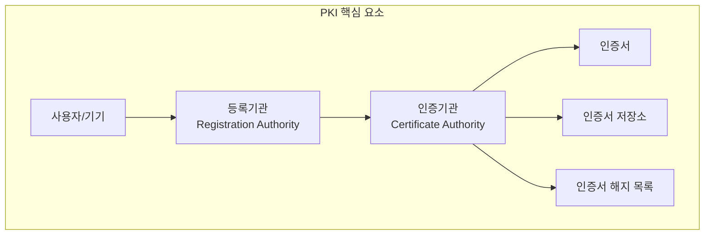
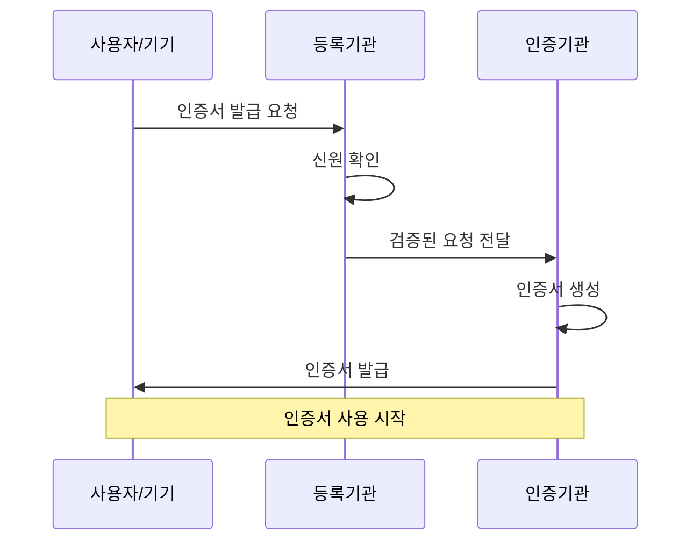
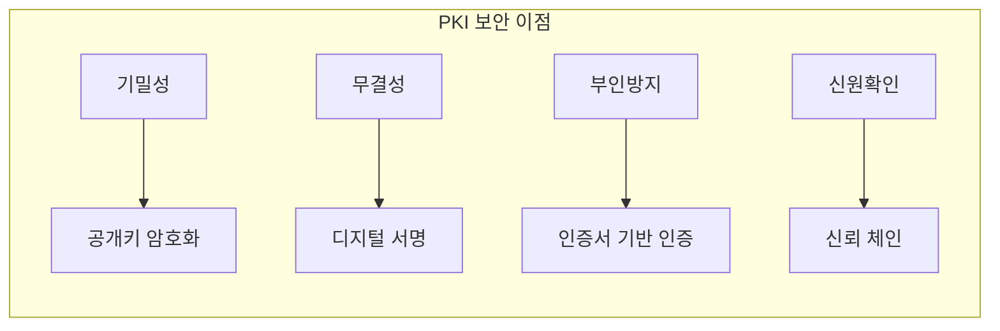
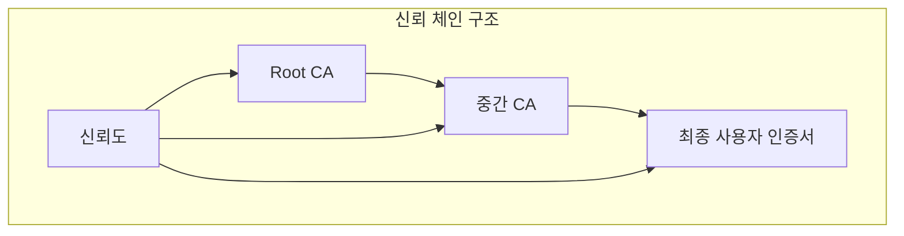
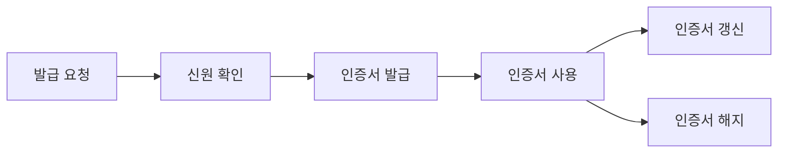

# 개념 이해

## PKI란?
PKI는 디지털 인증서를 생성, 관리, 배포, 저장, 해지하는 전체 시스템과 정책을 의미한다. 공개키 암호화 방식을 기반으로 한 보안 인프라이다.

## 실생활 비유
여권 발급 시스템과 유사하다:
- 정부(CA)가 신분증(인증서) 발급
- 여권에 개인정보(공개키) 포함
- 발급 기관의 직인(디지털 서명)
- 전 세계가 신뢰(신뢰 체인)

# PKI 구성 요소

## 기본 구조


## 작동 프로세스


# PKI 기반 시스템의 장점

## 보안 특성


## 신뢰 모델


# 실제 구현 예시

## OpenVPN PKI 설정
```bash
# 1. PKI 초기화
export EASYRSA_PKI="$PWD/pki"
./easyrsa init-pki

# 2. CA 생성
./easyrsa build-ca nopass

# 3. 서버 인증서 생성
./easyrsa build-server-full server nopass

# 4. 클라이언트 인증서 생성
./easyrsa build-client-full client1 nopass

# 5. Diffie-Hellman 매개변수 생성
./easyrsa gen-dh
```

## 잘못된 구현과 올바른 구현

### 잘못된 예시
```bash
# 취약한 구현 - 사용하지 말 것
# 인증서 검증 없이 연결
openvpn --client --dev tun --proto udp \
  --remote server.example.com 1194 \
  --nobind --persist-key --persist-tun \
  --verify-client-cert none
```

### 올바른 예시
```bash
# 안전한 구현
# 엄격한 인증서 검증
openvpn --client --dev tun --proto udp \
  --remote server.example.com 1194 \
  --nobind --persist-key --persist-tun \
  --ca ca.crt --cert client.crt --key client.key \
  --verify-x509-name server name
```

# PKI 관리 및 운영

## 인증서 수명주기


## 키 관리
```python
from cryptography import x509
from cryptography.hazmat.primitives import serialization
from cryptography.hazmat.primitives.asymmetric import rsa

class PKIKeyManager:
    """
    PKI 키 관리를 위한 클래스
    """
    def __init__(self):
        self.private_key = None
        self.public_key = None
    
    def generate_key_pair(self):
        """
        새로운 키 쌍을 생성한다.
        """
        self.private_key = rsa.generate_private_key(
            public_exponent=65537,
            key_size=2048
        )
        self.public_key = self.private_key.public_key()
    
    def save_private_key(self, path: str, password: bytes = None):
        """
        개인키를 안전하게 저장한다.
        """
        encryption = serialization.BestAvailableEncryption(password) if password \
            else serialization.NoEncryption()
        
        with open(path, 'wb') as f:
            f.write(self.private_key.private_bytes(
                encoding=serialization.Encoding.PEM,
                format=serialization.PrivateFormat.PKCS8,
                encryption_algorithm=encryption
            ))
```

# 보안 고려사항

## 주요 보안 요소
1. 안전한 키 생성 및 저장
2. 인증서 해지 관리
3. 신뢰 체인 유지
4. 접근 권한 관리

## 모니터링 및 감사
```python
def audit_certificate(cert_path: str) -> dict:
    """
    인증서 상태를 감사한다.
    """
    with open(cert_path, 'rb') as f:
        cert = x509.load_pem_x509_certificate(f.read())
    
    return {
        'subject': cert.subject,
        'issuer': cert.issuer,
        'not_valid_before': cert.not_valid_before,
        'not_valid_after': cert.not_valid_after,
        'serial_number': cert.serial_number,
        'signature_algorithm': cert.signature_algorithm_oid
    }
```

# 결론

## PKI의 중요성
1. 디지털 신원 보장
2. 안전한 통신 기반
3. 신뢰할 수 있는 인증 체계
4. 확장성 있는 보안 인프라

## 모범 사례
1. 강력한 암호화 알고리즘 사용
2. 정기적인 인증서 갱신
3. 철저한 키 관리
4. 보안 정책 수립 및 준수