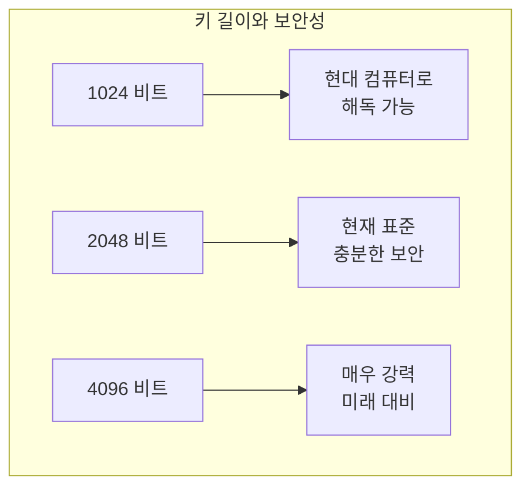
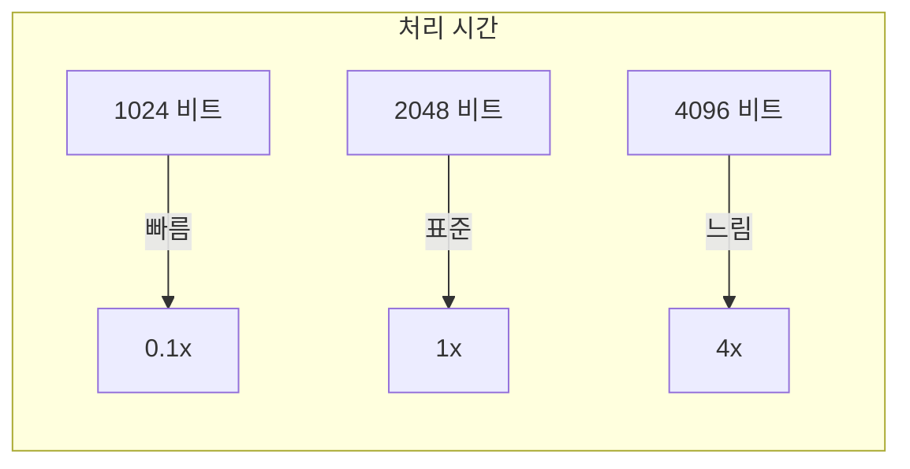
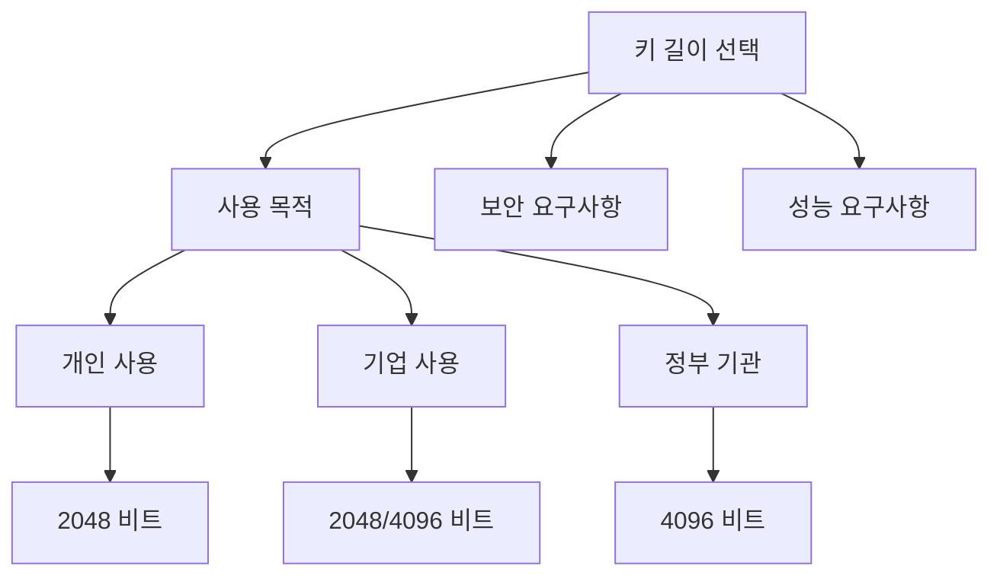
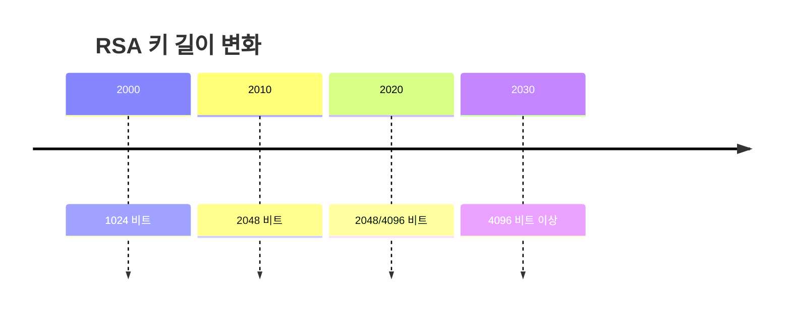

# 개념 이해

## RSA 키 길이란?
RSA 키 길이는 암호화에 사용되는 키의 비트 수를 의미한다. 이는 보안 강도를 결정하는 핵심 요소이다.

## 실생활 비유
자물쇠의 핀 개수와 유사하다:
- 핀이 적으면: 열기 쉽지만 보안성 낮음
- 핀이 많으면: 열기 어렵지만 사용이 불편
- 적절한 핀 개수: 보안과 사용성의 균형

# 키 길이별 특징

## 보안 강도 비교


## 성능 영향


# 구현 예시

## OpenSSL을 사용한 키 생성
```bash
# 1024비트 키 생성 (권장하지 않음)
openssl genrsa -out weak.key 1024

# 2048비트 키 생성 (권장)
openssl genrsa -out standard.key 2048

# 4096비트 키 생성 (높은 보안)
openssl genrsa -out strong.key 4096
```

## 키 정보 확인
```bash
# 키 정보 확인
openssl rsa -in standard.key -text -noout

# 공개키 추출 및 확인
openssl rsa -in standard.key -pubout -out public.key
openssl rsa -pubin -in public.key -text -noout
```

# 성능 테스트

## 벤치마크 테스트
```bash
# RSA 키 생성 성능 테스트
openssl speed rsa1024 rsa2048 rsa4096

# 서명 성능 테스트
openssl speed -elapsed -evp sha256 -sign
```

## 부하 테스트 예시 코드
```python
import time
from cryptography.hazmat.primitives import serialization
from cryptography.hazmat.primitives.asymmetric import rsa
from cryptography.hazmat.backends import default_backend

def measure_key_generation(size):
    start = time.time()
    private_key = rsa.generate_private_key(
        public_exponent=65537,
        key_size=size,
        backend=default_backend()
    )
    end = time.time()
    return end - start

# 다양한 키 길이 테스트
sizes = [1024, 2048, 4096]
for size in sizes:
    time_taken = measure_key_generation(size)
    print(f"{size} 비트 키 생성 시간: {time_taken:.2f}초")
```

# 보안 고려사항

## 키 길이 선택 기준


## 시간에 따른 권장 길이


# 실제 사용 사례

## 1. 웹 서버 SSL/TLS
```nginx
# Nginx SSL 설정 예시
ssl_certificate /etc/ssl/certs/certificate.crt;  # 2048비트 권장
ssl_certificate_key /etc/ssl/private/private.key;
```

## 2. SSH 키
```bash
# SSH 키 생성
ssh-keygen -t rsa -b 2048 -f ~/.ssh/id_rsa
```

## 3. 코드 서명
```bash
# 코드 서명용 키 생성
openssl genrsa -out codesign.key 4096  # 높은 보안성 필요
```

# 문제 해결 가이드

## 일반적인 문제

### 1. 성능 문제
```bash
# 성능 모니터링
openssl speed rsa2048

# 시스템 부하 확인
top -b -n 1
```

### 2. 호환성 문제
```bash
# 최소 키 길이 확인
openssl s_client -connect example.com:443 2>/dev/null | grep "Server public key"
```

# 모니터링 및 관리

## 키 관리 스크립트
```bash
#!/bin/bash

# 키 정보 확인 스크립트
check_key_strength() {
    local key_file=$1
    local bits=$(openssl rsa -in "$key_file" -text -noout | grep "Private-Key:" | grep -o "[0-9]*")
    
    if [ "$bits" -lt 2048 ]; then
        echo "경고: $key_file 은 보안에 취약한 $bits 비트 키입니다."
    else
        echo "정상: $key_file 은 안전한 $bits 비트 키입니다."
    fi
}

# 사용 예
check_key_strength private.key
```

# 결론

## 키 길이 선택 권장사항
1. 일반적인 용도: 2048비트
2. 높은 보안 요구: 4096비트
3. 레거시 시스템: 2048비트 이상으로 업그레이드

## 주의사항
1. 1024비트 이하 사용 금지
2. 시스템 성능 고려
3. 정기적인 키 교체
4. 적절한 키 관리 정책 수립


