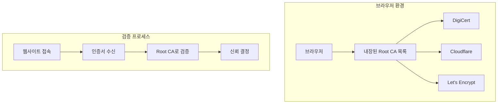
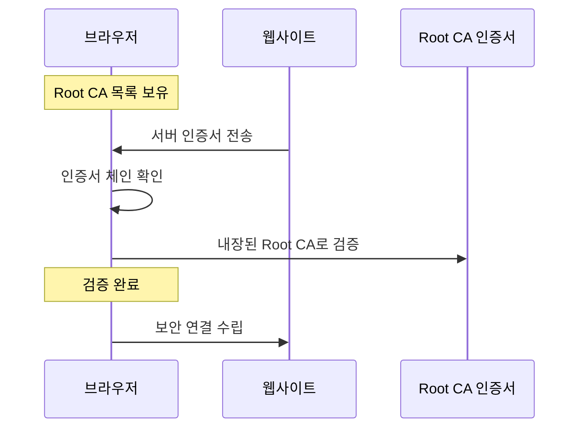
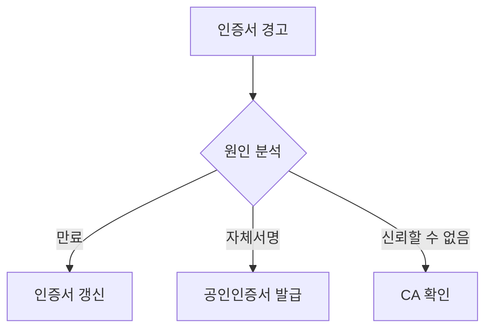

# 개념 이해

## Root CA 인증서란?
Root CA 인증서는 브라우저에 미리 내장된 신뢰할 수 있는 인증기관들의 인증서이다. 이를 통해 방문하는 웹사이트의 신원을 즉시 검증할 수 있다.

## 실생활 비유
여권 확인 시스템과 유사하다:
- 각 국가의 여권 발급 기관 목록을 가지고 있음
- 여권의 진위를 즉시 확인 가능
- 별도의 발급기관 연락 불필요

# 동작 방식

## 기본 구조


## 인증서 체인 검증


# 실제 구현 예시

## 브라우저의 Root CA 확인
```python
import ssl
import certifi

def print_root_cas():
    """
    시스템에 설치된 Root CA 목록을 출력한다.
    """
    cert_file = certifi.where()
    with open(cert_file, 'r', encoding='utf-8') as f:
        for line in f:
            if "O =" in line:  # 기관명 찾기
                print(f"인증기관: {line.strip()}")

def verify_certificate(hostname: str) -> bool:
    """
    웹사이트 인증서를 검증한다.
    """
    context = ssl.create_default_context()
    try:
        with context.wrap_socket(
            socket.socket(socket.AF_INET),
            server_hostname=hostname
        ) as sock:
            sock.connect((hostname, 443))
            cert = sock.getpeercert()
            print(f"인증서 발급자: {cert['issuer']}")
            return True
    except ssl.SSLCertVerificationError:
        print("인증서 검증 실패")
        return False
```

## 잘못된 구현과 올바른 구현

### 잘못된 예시 (하지 말 것)
```python
# 위험: 인증서 검증 비활성화
context = ssl.create_default_context()
context.check_hostname = False
context.verify_mode = ssl.CERT_NONE
```

### 올바른 예시
```python
# 권장: 엄격한 인증서 검증
context = ssl.create_default_context()
context.verify_mode = ssl.CERT_REQUIRED
context.check_hostname = True
```

# 보안 고려사항

## 신뢰 체인 검증


## 주의사항
1. 항상 최신 브라우저를 사용한다
2. 인증서 경고를 무시하지 않는다
3. 개발 환경에서도 적절한 인증서를 사용한다

# 문제 해결 가이드

## 일반적인 문제

### 1. 인증서 오류 해결
```bash
# 인증서 체인 확인
openssl s_client -connect example.com:443 -showcerts

# 만료일 확인
openssl x509 -enddate -noout -in certificate.pem
```

### 2. 브라우저 경고 대응


# 성능 최적화

## 캐시 활용
```python
class CertificateCache:
    """
    인증서 검증 결과를 캐시하여 성능을 향상시킨다.
    """
    def __init__(self):
        self.cache = {}
        self.cache_duration = 3600  # 1시간
        
    def get_verification(self, hostname: str) -> Optional[bool]:
        if hostname in self.cache:
            timestamp, result = self.cache[hostname]
            if time.time() - timestamp < self.cache_duration:
                return result
        return None
```

# 결론

## 핵심 요약
1. 브라우저는 자체적으로 인증서를 검증한다
2. Root CA 목록이 브라우저에 내장되어 있다
3. 별도의 CA 서버 통신이 필요하지 않다

## 모범 사례
1. 공인된 CA의 인증서를 사용한다
2. 인증서 체인을 올바르게 구성한다
3. 정기적으로 인증서를 갱신한다
4. 보안 경고를 신중히 처리한다