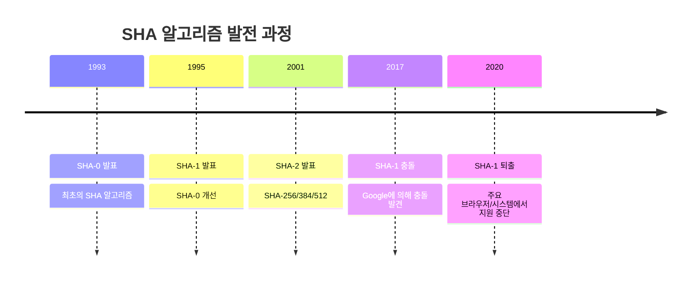
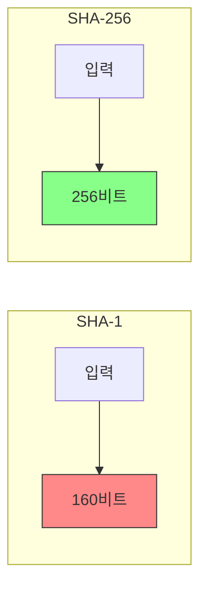
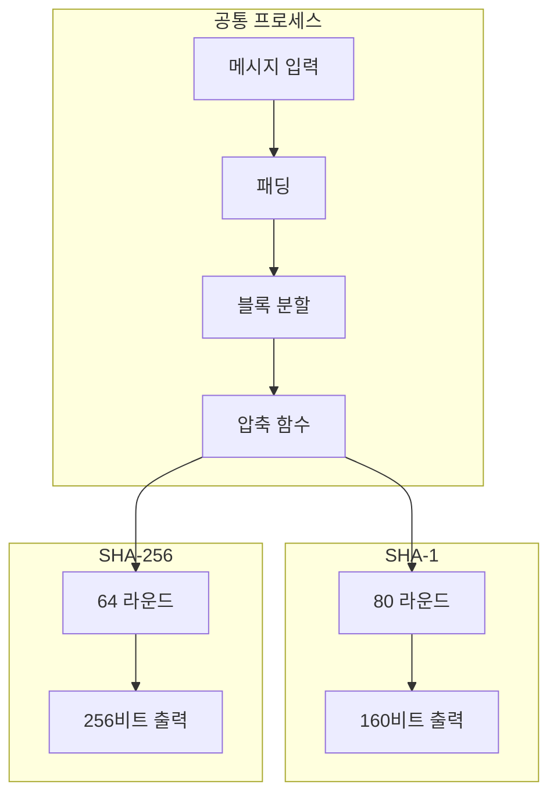

```table-of-contents
title: 
style: nestedList # TOC style (nestedList|nestedOrderedList|inlineFirstLevel)
minLevel: 0 # Include headings from the specified level
maxLevel: 0 # Include headings up to the specified level
includeLinks: true # Make headings clickable
hideWhenEmpty: false # Hide TOC if no headings are found
debugInConsole: false # Print debug info in Obsidian console
```
# SHA 알고리즘 개요
## SHA 제품군의 발전 과정
1. 첫 세대: SHA-0 (1993년)
   - NIST에서 최초 발표
   - 심각한 취약점 발견으로 폐기

2. 두 번째 세대: SHA-1 (1995년)
   - 160비트 해시값 생성
   - SHA-0의 취약점 보완
   - 현재는 보안상 취약하다고 판단됨

3. 세 번째 세대: SHA-2 (2001년)
   - SHA-256, SHA-384, SHA-512 포함
   - 더 긴 해시값과 향상된 보안성
   - 현재 표준으로 사용됨



# SHA-1과 SHA-256 비교
## 주요 차이점



1. 출력 길이
   - SHA-1: 160비트 (40자리 16진수)
   - SHA-256: 256비트 (64자리 16진수)

2. 보안 강도
   - SHA-1: 2^80 operations 필요
   - SHA-256: 2^128 operations 필요

## 구현 예시
```python
import hashlib

def compare_sha_algorithms(message):
    """
    SHA-1과 SHA-256의 해시값을 비교한다
    """
    # 메시지를 바이트로 인코딩
    message_bytes = message.encode('utf-8')
    
    # SHA-1 해시 생성
    sha1_hash = hashlib.sha1(message_bytes).hexdigest()
    
    # SHA-256 해시 생성
    sha256_hash = hashlib.sha256(message_bytes).hexdigest()
    
    print(f"원본 메시지: {message}")
    print(f"SHA-1   (160비트): {sha1_hash}")
    print(f"SHA-256 (256비트): {sha256_hash}")
    
# 예시 실행
message = "Hello, World!"
compare_sha_algorithms(message)
```

# 내부 동작 방식
## SHA-1 동작 과정
1. 메시지 패딩
2. 512비트 블록으로 분할
3. 80 라운드의 압축 함수 실행
4. 160비트 해시값 생성

## SHA-256 동작 과정
1. 메시지 패딩
2. 512비트 블록으로 분할
3. 64 라운드의 압축 함수 실행
4. 256비트 해시값 생성



# 실제 사용 사례와 권장 사항
## SHA-1 사용 사례 (비권장)
```python
# 더 이상 사용하지 말아야 할 SHA-1 구현
def deprecated_sha1_hash(password):
    """
    SHA-1은 더 이상 보안용도로 사용하지 않아야 한다
    """
    return hashlib.sha1(password.encode()).hexdigest()
```

## SHA-256 권장 사용법
```python
import os

def secure_hash_with_salt(password):
    """
    SHA-256과 솔트를 사용한 안전한 해시 구현
    """
    # 32바이트(256비트) 랜덤 솔트 생성
    salt = os.urandom(32)
    
    # 해시 생성
    hash_obj = hashlib.sha256()
    hash_obj.update(salt)
    hash_obj.update(password.encode())
    
    return {
        'salt': salt.hex(),
        'hash': hash_obj.hexdigest()
    }
```

# 보안 고려사항
## SHA-1의 취약점
1. 충돌 공격 가능
   - 2017년 Google이 첫 번째 충돌 사례 발표
   - PDF 파일로 실제 충돌 입증

2. 실제 위험
   - 디지털 서명 위조 가능
   - 인증서 위조 가능성

## SHA-256의 강점
1. 높은 충돌 저항성
   - 2^128의 복잡도
   - 현재 기술로 충돌 공격 불가능

2. 광범위한 검증
   - 많은 보안 검토 완료
   - 글로벌 표준으로 채택

# 마이그레이션 가이드
## SHA-1에서 SHA-256으로 전환
```python
def migrate_hash(old_hash):
    """
    SHA-1 해시를 SHA-256으로 마이그레이션
    """
    # 이전 해시를 임시로 저장
    temp_value = old_hash
    
    # SHA-256으로 새로운 해시 생성
    new_hash = hashlib.sha256(
        temp_value.encode()
    ).hexdigest()
    
    return {
        'old_hash': temp_value,
        'new_hash': new_hash,
        'algorithm': 'SHA-256'
    }
```

# 결론
SHA-1은 더 이상 보안이 중요한 용도로 사용해서는 안 되며, SHA-256이 현재 표준으로 사용되고 있다. 기존 SHA-1 사용 시스템은 가능한 빨리 SHA-256으로 마이그레이션해야 한다.

# 참고 자료
- NIST FIPS 180-4: Secure Hash Standard
- RFC 6234: US Secure Hash Algorithms
- Google SHAttered Attack Research Paper