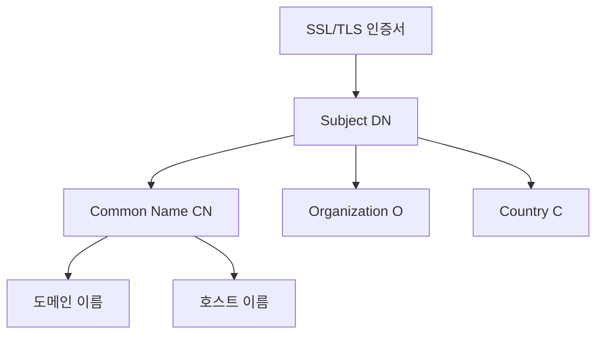
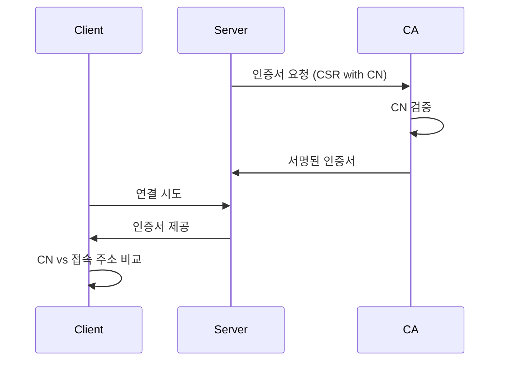

# Common Name의 개념

Common Name(CN)은 SSL/TLS 인증서에서 해당 인증서가 보호하는 도메인이나 주체를 식별하는 중요한 필드다. 이는 X.509 인증서 표준의 일부로 정의되어 있다.

실생활에 비유하자면, CN은 여권에 기재된 이름과 같은 역할을 한다. 여권 소지자를 식별하는 것처럼, CN은 인증서가 발급된 대상을 식별한다.



# Common Name의 기본 동작 방식

## 웹 서버 인증서의 경우
```text
CN=www.example.com
```
브라우저는 접속하는 도메인이 인증서의 CN과 일치하는지 확인한다.

## 클라이언트 인증서의 경우
```text
CN=John Doe
```
서버는 클라이언트를 식별하기 위해 이 이름을 사용한다.

# Common Name의 종류와 사용

## 도메인 인증서
```text
# 단일 도메인
CN=example.com

# 와일드카드 인증서
CN=*.example.com
```

## 개인/조직 인증서
```text
# 개인용
CN=John Doe

# 조직용
CN=Example Corporation
```

# CN 검증 과정



# 실제 활용 사례

## 웹 서버 설정 (Apache)
```apache
<VirtualHost *:443>
    ServerName www.example.com
    SSLEngine on
    SSLCertificateFile "/path/to/certificate.crt"
    SSLCertificateKeyFile "/path/to/private.key"
</VirtualHost>
```

## OpenSSL을 사용한 인증서 생성
```bash
# CSR 생성
openssl req -new -newkey rsa:2048 -nodes \
    -keyout private.key \
    -out server.csr \
    -subj "/CN=www.example.com"

# 자체 서명 인증서 생성
openssl x509 -req -days 365 \
    -in server.csr \
    -signkey private.key \
    -out server.crt
```

# 현대의 변화와 주의사항

## SAN(Subject Alternative Name) 확장
```text
# 현대적인 인증서 구조
Subject: CN=example.com
Subject Alternative Name:
    DNS:example.com
    DNS:www.example.com
    DNS:api.example.com
```

## CN의 제한사항
1. 단일 도메인만 지정 가능
2. 와일드카드는 한 레벨만 지원
3. 최신 브라우저는 SAN을 우선 확인

# 보안 고려사항

1. CN 불일치
```text
# 잘못된 예시
접속 주소: secure.example.com
인증서 CN: www.example.com
```

2. 와일드카드 사용 주의
```text
# 과도하게 넓은 범위
CN=*.com  # 절대 사용하면 안 됨
```

3. 명명 규칙
```text
# 권장되는 형식
CN=example.com  # 루트 도메인
CN=*.example.com  # 서브도메인용
```

# 인증서 확인 도구

## OpenSSL 명령어
```bash
# 인증서 정보 확인
openssl x509 -in certificate.crt -text -noout

# 원격 서버 인증서 확인
openssl s_client -connect example.com:443 </dev/null | openssl x509 -text
```

## 온라인 도구
- SSL Labs Server Test
- Certificate Checker
- SSL Shopper

# Common Name 관련 문제 해결

## 일반적인 문제
1. 인증서 오류
```text
ERROR: Certificate name mismatch
EXPECTED: example.com
GOT: www.example.com
```

2. 해결 방법
- SAN 확장 사용
- 올바른 도메인 지정
- 와일드카드 인증서 고려

# 결론

Common Name은 SSL/TLS 인증서에서 중요한 역할을 한다. 하지만 현대의 웹 환경에서는:
- SAN이 더 선호된다
- 다중 도메인 지원이 필요하다
- 보안 요구사항이 더욱 엄격해졌다

따라서 CN만으로는 부족하며, 현대적인 인증서 관리에는 SAN과 같은 확장 기능의 활용이 필수적이다.