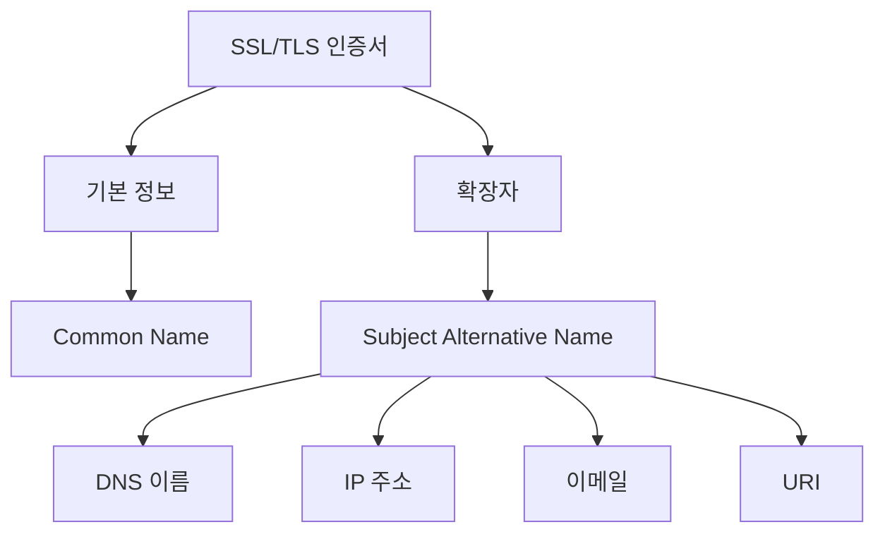
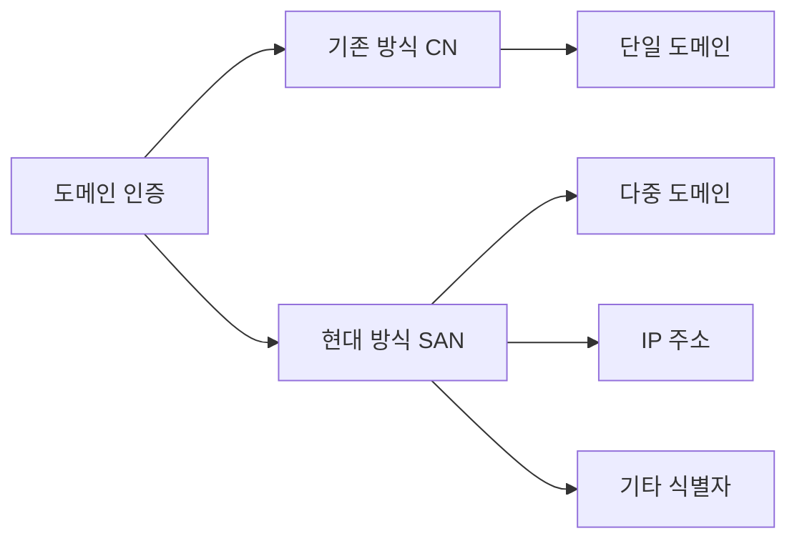
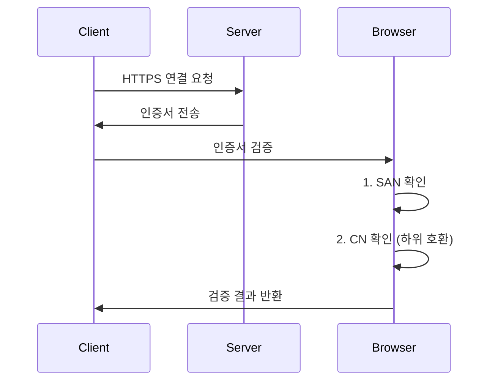

# SAN의 개념

Subject Alternative Name(SAN)은 하나의 SSL/TLS 인증서로 여러 도메인을 보호할 수 있게 해주는 X.509 v3 확장자다. 기존 Common Name(CN)의 한계를 극복하기 위해 도입되었다.

실생활에 비유하자면, 여러 사업장을 가진 회사의 통합 사업자 등록증과 같다. 하나의 인증서로 여러 관련 도메인을 인증할 수 있다.



# SAN의 기본 동작 방식

## SAN 항목 유형
```text
# 일반적인 SAN 구조
SubjectAltName = {
    DNS:example.com
    DNS:www.example.com
    DNS:mail.example.com
    IP:192.168.1.1
    email:admin@example.com
    URI:http://example.com/resource
}
```

# 실제 구성 예시

## OpenSSL 설정 파일 (openssl.cnf)
```ini
[req]
req_extensions = v3_req
distinguished_name = req_distinguished_name

[v3_req]
basicConstraints = CA:FALSE
keyUsage = nonRepudiation, digitalSignature, keyEncipherment
subjectAltName = @alt_names

[alt_names]
DNS.1 = example.com
DNS.2 = www.example.com
DNS.3 = mail.example.com
IP.1 = 192.168.1.1
```

## CSR 생성 명령어
```bash
# SAN이 포함된 CSR 생성
openssl req -new -newkey rsa:2048 -nodes \
    -keyout private.key \
    -out server.csr \
    -config openssl.cnf \
    -subj "/CN=example.com"
```

# SAN의 활용 사례

## 멀티 도메인 인증서
```text
# 단일 회사의 여러 서비스
DNS:example.com
DNS:shop.example.com
DNS:blog.example.com
DNS:api.example.com
```

## 개발 환경 설정
```text
# 로컬 개발용 인증서
DNS:localhost
DNS:*.local
IP:127.0.0.1
IP:::1
```

# SAN vs CN 비교



# 인증서 검증 과정



# 실무 적용 가이드

## 1. 인증서 요청 준비
```bash
# SAN 목록 작성
cat > domains.txt << EOF
example.com
www.example.com
api.example.com
EOF
```

## 2. CSR 생성
```bash
# 동적 openssl.cnf 생성
cat > openssl.cnf << EOF
[req]
default_bits = 2048
prompt = no
default_md = sha256
req_extensions = req_ext
distinguished_name = dn

[dn]
CN = example.com

[req_ext]
subjectAltName = @alt_names

[alt_names]
EOF

# domains.txt의 내용을 openssl.cnf에 추가
awk '{print "DNS." NR "=" $0}' domains.txt >> openssl.cnf
```

## 3. 인증서 검증
```bash
# 인증서의 SAN 항목 확인
openssl x509 -in certificate.crt -text -noout | grep -A1 "Subject Alternative Name"
```

# 보안 고려사항

## 1. 와일드카드 사용
```text
# 권장되는 방식
DNS:*.example.com
DNS:example.com

# 피해야 할 방식
DNS:*  # 전체 와일드카드
DNS:*.com  # 최상위 도메인 와일드카드
```

## 2. 도메인 범위 제한
```text
# 잘못된 예시
DNS:example.com
DNS:malicious.com  # 연관성 없는 도메인 포함

# 올바른 예시
DNS:example.com
DNS:*.example.com
DNS:service.example.com
```

# 문제 해결 가이드

## 일반적인 문제
1. 인증서 불일치 오류
```text
Error: Certificate does not match domain
Requested: sub.example.com
Available: example.com, www.example.com
```

2. SAN 누락 문제
```bash
# SAN 항목 확인
openssl x509 -in cert.pem -text -noout | grep -A1 "Subject Alternative Name"

# 결과가 없다면 SAN이 누락된 것
```

## 해결 방법
1. 모든 필요 도메인을 SAN에 포함
2. 와일드카드 사용 검토
3. 인증서 재발급 고려

# 모범 사례

1. 계획 단계
   - 모든 필요 도메인 식별
   - 향후 확장 고려
   - 보안 요구사항 검토

2. 구현 단계
   - 표준 준수
   - 적절한 키 길이 사용
   - 모든 필요 도메인 포함

3. 유지보수 단계
   - 정기적인 감사
   - 만료일 모니터링
   - 도메인 변경 관리

# 결론

SAN은 현대 웹의 복잡한 도메인 구조를 지원하는 필수적인 인증서 확장자다. 다음과 같은 이점을 제공한다:
- 다중 도메인 지원
- 유연한 인증서 관리
- 향상된 보안성

SAN의 올바른 구성과 관리는 안전한 웹 서비스 운영의 핵심 요소다.