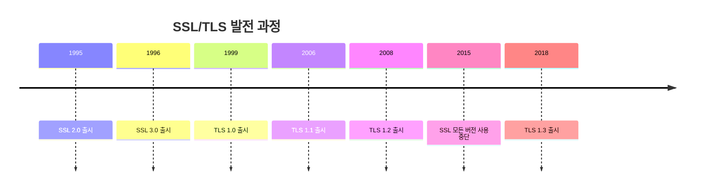
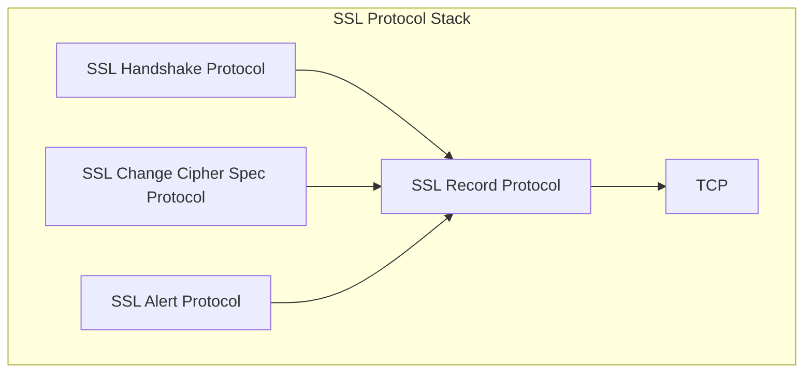
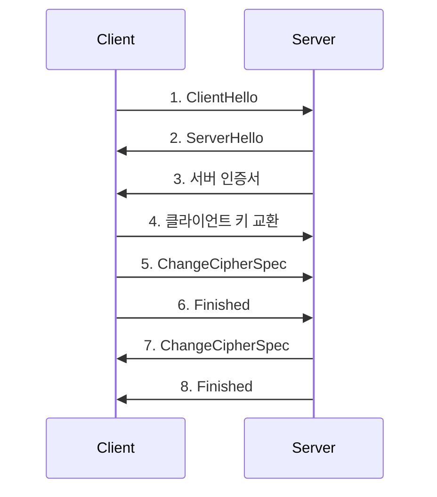
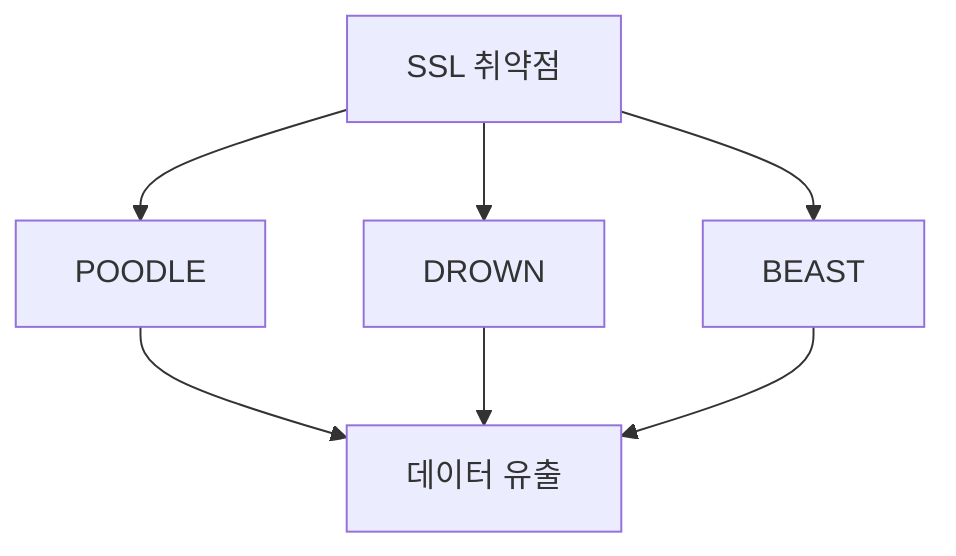
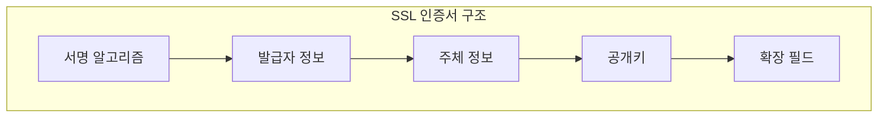

# 개념 이해

## SSL이란?
SSL은 Netscape가 1995년에 개발한 최초의 웹 보안 프로토콜이다. 현재는 [[TLS(Transport Layer Security)|TLS]]로 대체되었으나, 많은 사람들이 여전히 TLS를 'SSL'이라고 부른다.

## 역사적 발전 과정


# SSL의 기본 구조

## 프로토콜 스택


## 기본 동작 원리


# SSL vs TLS

## 주요 차이점 비교

| 특징 | SSL 3.0 | TLS 1.0 | TLS 1.2 | TLS 1.3 |
|------|---------|---------|----------|----------|
| 출시연도 | 1996 | 1999 | 2008 | 2018 |
| 보안성 | 취약 | 취약 | 안전 | 매우 안전 |
| 속도 | 느림 | 느림 | 보통 | 빠름 |
| 상태 | 사용중단 | 사용중단 | 사용중 | 권장 |

# 취약점과 보안 문제

## 1. POODLE 취약점
- SSL 3.0의 CBC 모드 취약점
- 중간자 공격 가능
- 2014년 발견

## 2. DROWN 취약점
- SSL 2.0 프로토콜의 취약점
- RSA 키 복호화 가능
- 2016년 발견

## 보안 사고 사례


# SSL 인증서 이해

## 인증서 종류
1. DV (Domain Validation)
2. OV (Organization Validation)
3. EV (Extended Validation)

## 인증서 구조


# 마이그레이션 가이드

## SSL에서 TLS로 전환

### 1. 웹 서버 설정 (Apache)
```apache
# 이전 설정 (사용하지 말 것)
SSLProtocol all -SSLv2

# 새로운 설정
SSLProtocol all -SSLv2 -SSLv3 -TLSv1 -TLSv1.1
```

### 2. 웹 서버 설정 (Nginx)
```nginx
# 이전 설정 (사용하지 말 것)
ssl_protocols SSLv3 TLSv1 TLSv1.1 TLSv1.2;

# 새로운 설정
ssl_protocols TLSv1.2 TLSv1.3;
```

# 보안 강화 방안

## 1. 프로토콜 설정
```bash
# OpenSSL 설정 확인
openssl ciphers -v | awk '{print $2}' | sort | uniq

# 프로토콜 지원 확인
nmap --script ssl-enum-ciphers -p 443 example.com
```

## 2. 암호화 스위트 설정
```nginx
ssl_ciphers ECDHE-ECDSA-AES128-GCM-SHA256:ECDHE-RSA-AES128-GCM-SHA256;
ssl_prefer_server_ciphers off;
```

# 문제 해결 가이드

## 일반적인 문제

### 1. 인증서 문제
```bash
# SSL 연결 테스트
openssl s_client -connect example.com:443

# 인증서 체인 확인
openssl s_client -connect example.com:443 -showcerts
```

### 2. 호환성 문제
```bash
# TLS 버전별 테스트
openssl s_client -connect example.com:443 -tls1_2
openssl s_client -connect example.com:443 -tls1_3
```

# Security Best Practices

## 1. 구성 점검 항목
- 최신 보안 패치 적용
- 취약한 프로토콜 비활성화
- 강력한 암호화 스위트 사용

## 2. 모니터링
- 인증서 만료 모니터링
- 보안 취약점 모니터링
- 트래픽 모니터링

# 결론

## 요약
- SSL은 현재 사용이 중단되었다
- TLS가 SSL을 완전히 대체했다
- 보안을 위해 TLS 1.2 이상을 사용해야 한다

## 권장사항
1. 모든 SSL 버전 비활성화
2. TLS 1.2 이상으로 업그레이드
3. 정기적인 보안 감사 수행
4. 인증서 수명 주기 관리