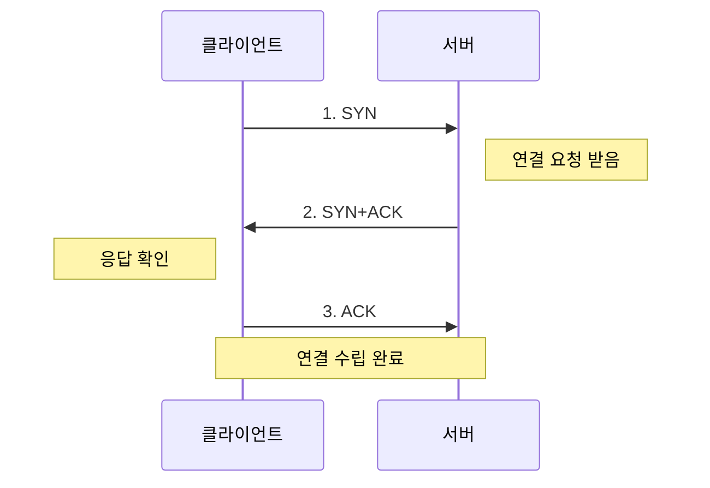
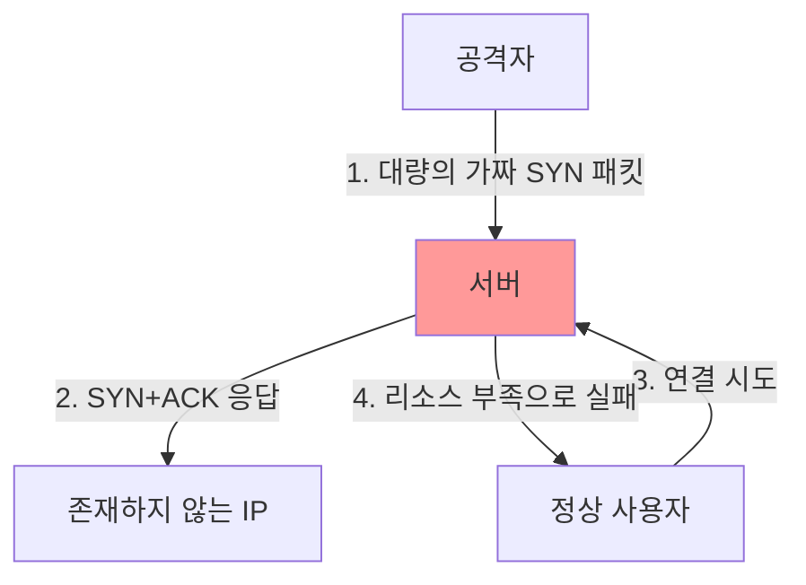
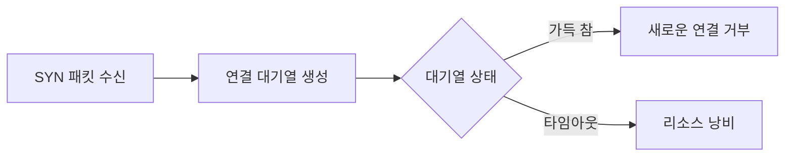
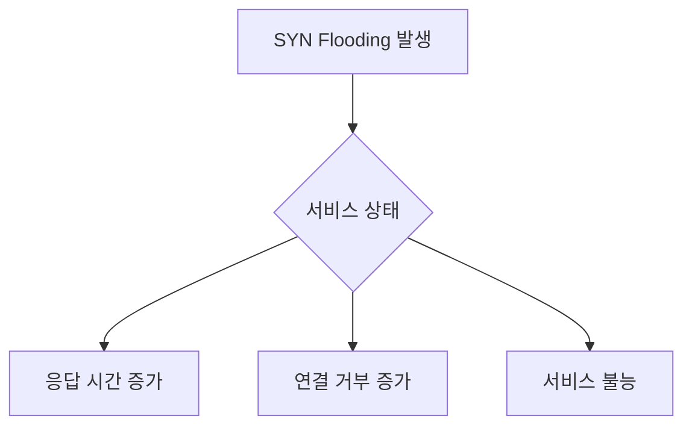
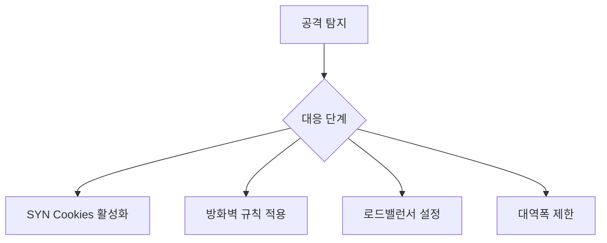

```table-of-contents
title: # 목차
style: nestedList # TOC style (nestedList|nestedOrderedList|inlineFirstLevel)
minLevel: 0 # Include headings from the specified level
maxLevel: 0 # Include headings up to the specified level
includeLinks: true # Make headings clickable
hideWhenEmpty: false # Hide TOC if no headings are found
debugInConsole: false # Print debug info in Obsidian console
```

# SYN Flooding이란?

## 기본 개념
SYN Flooding은 TCP의 3-way handshake 과정의 취약점을 이용한 DoS(서비스 거부) 공격이다. 마치 식당에 수많은 가짜 예약을 해서 진짜 손님이 자리를 잡지 못하게 만드는 것과 같다.

## 정상적인 TCP 연결 과정


## 공격 시나리오


# 공격의 작동 방식

## 1. 공격자의 행동
- 대량의 SYN 패킷 전송
- 존재하지 않는 IP 주소 사용
- 서버의 연결 대기열 소진

## 2. 서버에 미치는 영향


# 공격의 영향

## 1. 시스템 리소스 소진
- 메모리 사용량 증가
- CPU 부하 상승
- 네트워크 대역폭 포화

## 2. 서비스 영향


# 대응 방안

## 1. TCP SYN Cookies
```bash
# SYN Cookies 활성화
net.ipv4.tcp_syncookies = 1

# 백로그 큐 크기 조정
net.ipv4.tcp_max_syn_backlog = 2048
```

## 2. 방화벽 설정
```bash
# iptables를 이용한 SYN 패킷 제한
iptables -A INPUT -p tcp --syn -m limit --limit 1/s --limit-burst 3 -j ACCEPT
iptables -A INPUT -p tcp --syn -j DROP
```

## 3. 시스템 튜닝
```bash
# SYN-ACK 재시도 횟수 감소
net.ipv4.tcp_synack_retries = 2

# TCP 타임아웃 감소
net.ipv4.tcp_fin_timeout = 30
```

# 모니터링과 탐지

## 1. 실시간 모니터링
```bash
# SYN_RECV 상태 연결 수 확인
watch -n1 'netstat -tun | grep SYN_RECV | wc -l'

# 특정 IP의 연결 상태 확인
netstat -nap | grep SYN_RECV | grep [IP주소]
```

## 2. 네트워크 트래픽 분석
```bash
# SYN 패킷 모니터링
tcpdump -nn 'tcp[tcpflags] & (tcp-syn) != 0'

# 연결 통계 확인
netstat -s | grep -i syn
```

# 방어 전략

## 1. 즉각적인 대응


## 2. 장기적인 대책
1. 인프라 구성
   - 로드밸런서 배치
   - DDoS 방어 서비스 사용
   - CDN 활용

2. 모니터링 체계
   - 트래픽 모니터링
   - 알림 시스템 구축
   - 로그 분석

# 실제 방어 구성 예시

## 1. 기본 보안 설정
```bash
# /etc/sysctl.conf 설정
# SYN Flood 방어 설정
net.ipv4.tcp_syncookies = 1
net.ipv4.tcp_max_syn_backlog = 2048
net.ipv4.tcp_synack_retries = 2
net.ipv4.tcp_fin_timeout = 30

# 백로그 큐 설정
net.core.somaxconn = 4096
```

## 2. 고급 방화벽 설정
```bash
# SYN Flood 방어 iptables 규칙
# 초당 10개로 SYN 패킷 제한
iptables -A INPUT -p tcp --syn -m limit --limit 10/s --limit-burst 20 -j ACCEPT
iptables -A INPUT -p tcp --syn -j DROP

# 특정 IP 대역 차단
iptables -A INPUT -s [악성IP대역] -j DROP
```

# 문제 해결 가이드

## 1. 공격 진행 중 조치
```bash
# 1. 현재 상태 확인
netstat -tun | grep SYN_RECV

# 2. 공격 IP 식별
netstat -nap | grep SYN_RECV | awk '{print $5}' | cut -d: -f1 | sort | uniq -c | sort -n

# 3. 즉각 차단
iptables -I INPUT -s [공격IP] -j DROP
```

## 2. 사후 분석
- 로그 파일 분석
- 트래픽 패턴 분석
- 방어 체계 개선점 도출

# 결론
SYN Flooding은 심각한 서비스 중단을 초래할 수 있는 DoS 공격이다. 하지만 TCP SYN Cookies, 적절한 시스템 튜닝, 방화벽 설정 등을 통해 효과적으로 방어할 수 있다. 지속적인 모니터링과 적절한 대응 체계 구축이 중요하다.