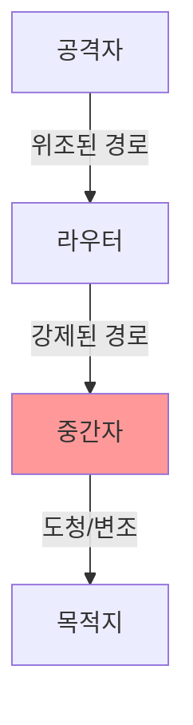

```table-of-contents
title: # 목차
style: nestedList # TOC style (nestedList|nestedOrderedList|inlineFirstLevel)
minLevel: 0 # Include headings from the specified level
maxLevel: 0 # Include headings up to the specified level
includeLinks: true # Make headings clickable
hideWhenEmpty: false # Hide TOC if no headings are found
debugInConsole: false # Print debug info in Obsidian console
```
# Source Routing이란?

## 기본 개념
Source Routing(Source Routing)은 패킷 발신자가 패킷이 네트워크에서 이동할 경로를 직접 지정할 수 있는 기능이다. 이는 마치 택배를 보낼 때 송장에 "A창고 -> B창고 -> C창고 -> 최종목적지" 처럼 경유지를 직접 지정하는 것과 같다.

## 작동 방식


# Source Routing이 위험한 이유

## 1. 보안 위험


### 위험 시나리오:
1. 공격자가 패킷의 경로를 조작
2. 악의적인 중간 경유지를 지정
3. 트래픽 스니핑이나 변조 가능

## 2. 트래픽 우회
- 정상적인 보안 장비 우회 가능
- 네트워크 정책 우회 가능
- 트래픽 모니터링 회피 가능

# accept_source_route 설정

## 설정 값의 의미
```bash
# 0 = Source Routing 비활성화 (권장)
# 1 = Source Routing 활성화
net.ipv4.conf.default.accept_source_route = 0
net.ipv4.conf.all.accept_source_route = 0
```

## 설정 확인 방법
```bash
# 현재 설정 확인
sysctl net.ipv4.conf.all.accept_source_route
sysctl net.ipv4.conf.default.accept_source_route

# 특정 인터페이스 설정 확인
sysctl net.ipv4.conf.eth0.accept_source_route
```

# 보안 설정 예시

## 1. 전체 시스템 설정
```bash
# /etc/sysctl.conf 파일에 추가
# 모든 인터페이스에서 소스 라우팅 비활성화
net.ipv4.conf.all.accept_source_route = 0
net.ipv4.conf.default.accept_source_route = 0

# 설정 적용
sysctl -p
```

## 2. 특정 인터페이스 설정
```bash
# eth0 인터페이스에 대해 소스 라우팅 비활성화
echo 0 > /proc/sys/net/ipv4/conf/eth0/accept_source_route
```

# 보안 강화 설정

## 1. 기본 보안 설정
```bash
# 소스 라우팅 비활성화와 함께 사용할 추가 보안 설정
# ICMP 리다이렉트 비활성화
net.ipv4.conf.all.accept_redirects = 0
net.ipv4.conf.default.accept_redirects = 0

# 역경로 필터링 활성화
net.ipv4.conf.all.rp_filter = 1
net.ipv4.conf.default.rp_filter = 1
```

## 2. 로깅 설정
```bash
# 소스 라우팅 시도 로깅
iptables -A INPUT -m rpfilter --invert -j LOG --log-prefix "SOURCE_ROUTE:"
```

# 일반적인 사용 사례와 대안

## 1. 디버깅과 테스트
소스 라우팅이 필요한 경우:
- 네트워크 문제 진단
- 경로 테스트
- 특수한 라우팅 요구사항

대안:
```bash
# traceroute 사용
traceroute example.com

# mtr 사용
mtr example.com
```

## 2. 특수한 라우팅 요구사항
대안:
- 정책 기반 라우팅(Policy-based Routing) 사용
- 고정 라우트 설정
- MPLS 등의 대체 기술 사용

# 모니터링과 감사

## 1. 소스 라우팅 시도 감지
```bash
# 로그 모니터링
grep "SOURCE_ROUTE" /var/log/messages

# 네트워크 패킷 분석
tcpdump -nn 'ip[20] >= 128'
```

## 2. 정기적인 설정 감사
```bash
# 모든 인터페이스 설정 확인 스크립트
for i in $(ls /proc/sys/net/ipv4/conf/); do
    echo "Interface $i:"
    cat /proc/sys/net/ipv4/conf/$i/accept_source_route
done
```

# 결론
소스 라우팅은 심각한 보안 위험을 초래할 수 있는 기능이다. 대부분의 경우 이 기능을 비활성화(0)하는 것이 보안상 안전하다. 특별히 필요한 경우가 아니라면, accept_source_route를 0으로 설정하여 소스 라우팅을 비활성화하는 것을 강력히 권장한다.