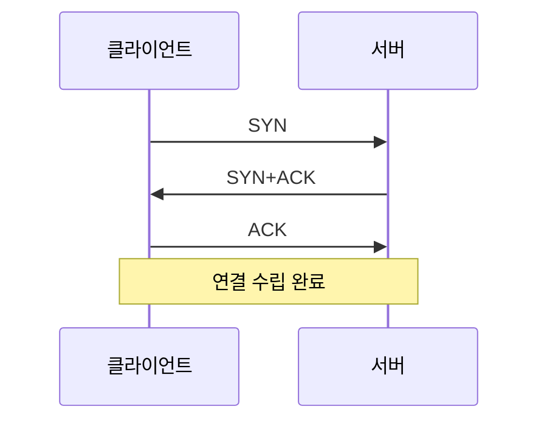
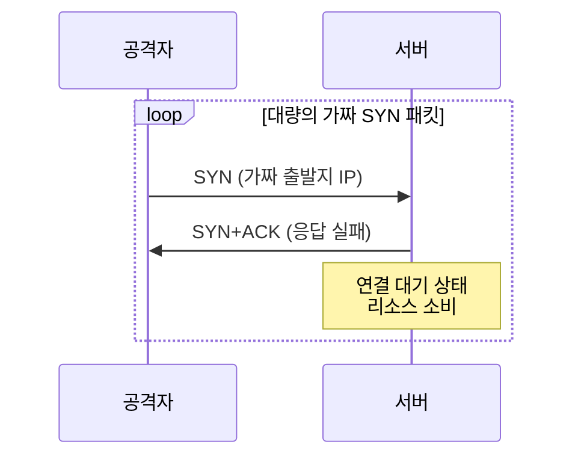
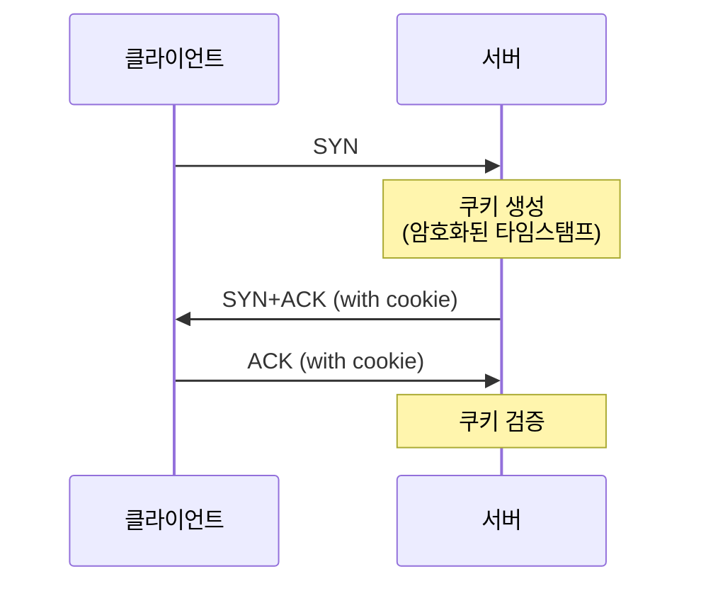
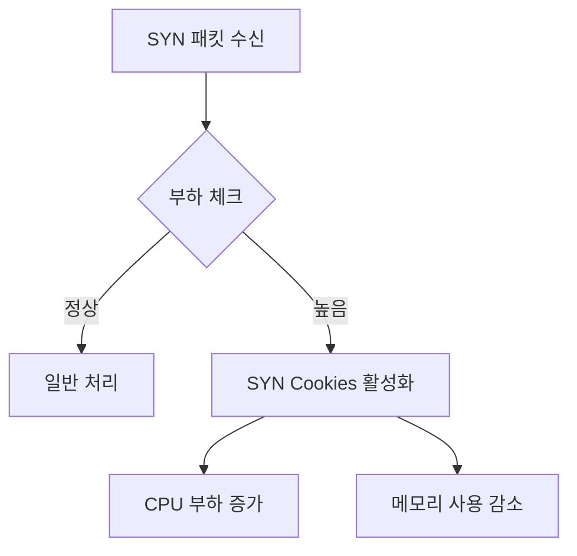

```table-of-contents
title: # 목차
style: nestedList # TOC style (nestedList|nestedOrderedList|inlineFirstLevel)
minLevel: 0 # Include headings from the specified level
maxLevel: 0 # Include headings up to the specified level
includeLinks: true # Make headings clickable
hideWhenEmpty: false # Hide TOC if no headings are found
debugInConsole: false # Print debug info in Obsidian console
```
# TCP SYN Cookies란?

## 기본 개념
TCP SYN Cookies는 SYN Flooding 공격을 방어하기 위한 보안 메커니즘이다. 마치 식당에서 진짜 손님과 가짜 손님을 구분하기 위해 예약번호를 확인하는 것처럼, 정상적인 TCP 연결 요청과 공격성 요청을 구분한다.

이 문서를 이해하기 위해 필요한 사전 지식:
- TCP 3-way handshake의 기본 개념
- [[SYN Flooding 공격과 대응 방안]]
- 네트워크 기본 용어

# TCP 연결 수립 과정

## 정상적인 TCP 3-way Handshake


## SYN Flooding 공격 시나리오


## SYN Cookies 작동 방식


# SYN Cookies 설정

## 기본 설정
```bash
# TCP SYN Cookies 활성화 (권장)
net.ipv4.tcp_syncookies = 1

# 설정값 의미
# 0 = 비활성화
# 1 = 활성화
# 2 = 항상 사용 (일부 커널 버전에서 지원)
```

## 관련 설정들
```bash
# SYN 백로그 큐 크기
net.ipv4.tcp_max_syn_backlog = 2048

# SYN-ACK 재시도 횟수
net.ipv4.tcp_synack_retries = 2

# TCP 타임아웃 설정
net.ipv4.tcp_fin_timeout = 30
```

# 보안 구성 예시

## 1. 기본 보안 설정
```bash
# /etc/sysctl.conf 권장 설정
net.ipv4.tcp_syncookies = 1
net.ipv4.tcp_max_syn_backlog = 2048
net.ipv4.tcp_synack_retries = 2
```

## 2. 높은 부하 환경 설정
```bash
# 대용량 트래픽 처리를 위한 설정
net.ipv4.tcp_syncookies = 1
net.ipv4.tcp_max_syn_backlog = 4096
net.ipv4.tcp_synack_retries = 1
net.core.somaxconn = 4096
```

# SYN Flooding 감지와 대응

## 1. 공격 징후 모니터링
```bash
# netstat로 SYN_RECV 상태 확인
netstat -nta | grep SYN_RECV | wc -l

# SYN 패킷 모니터링
tcpdump -nn 'tcp[tcpflags] & (tcp-syn) != 0'
```

## 2. 시스템 로그 확인
```bash
# SYN Cookies 사용 로그 확인
grep "TCP: TCP SYN cookie" /var/log/syslog
```

# 성능과 호환성

## 1. 성능 영향


## 2. 호환성 고려사항
- TCP 윈도우 스케일링 제한
- TCP 타임스탬프 옵션 필요
- 일부 TCP 옵션 손실 가능

# 문제 해결

## 1. 연결 문제 진단
```bash
# 연결 상태 확인
netstat -s | grep -i syncookie

# TCP 상태 모니터링
ss -n state syn-recv
```

## 2. 성능 튜닝
```bash
# 백로그 큐 조정
sysctl -w net.ipv4.tcp_max_syn_backlog=4096

# 메모리 튜닝
sysctl -w net.core.rmem_max=16777216
sysctl -w net.core.wmem_max=16777216
```

# 권장 설정

## 1. 일반 서버
```bash
net.ipv4.tcp_syncookies = 1
net.ipv4.tcp_max_syn_backlog = 2048
net.ipv4.tcp_synack_retries = 2
```

## 2. 웹 서버
```bash
net.ipv4.tcp_syncookies = 1
net.ipv4.tcp_max_syn_backlog = 4096
net.core.somaxconn = 4096
net.ipv4.tcp_fin_timeout = 30
```

# 결론
TCP SYN Cookies는 SYN Flooding 공격에 대한 효과적인 방어 메커니즘이다. 특히 공개된 서버나 높은 트래픽이 예상되는 환경에서는 반드시 활성화해야 한다. 다만, 일부 TCP 옵션의 제한이 있을 수 있으므로, 시스템의 요구사항과 특성을 고려하여 적절히 설정해야 한다.