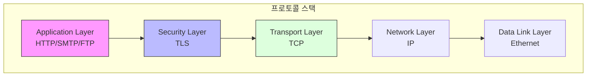
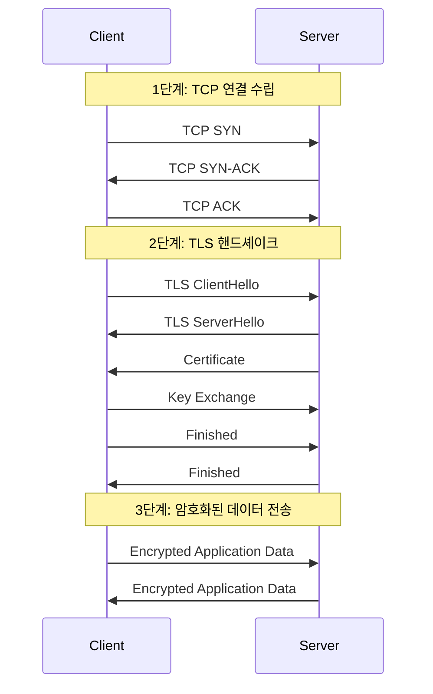
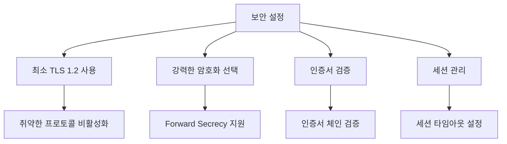

# 개념 이해

## 계층 구조의 이해


## 실생활 비유
택배 시스템으로 비유하면:
- [[TCP(Transmission Control Protocol)]]: 택배 배송 시스템 (배송 추적, 서명 확인)
- [[TLS(Transport Layer Security)]]: 보안 포장 서비스 (봉인, 보안 테이프)
- 함께 사용: 안전하고 신뢰할 수 있는 배송

# 동작 방식

## 전체 연결 과정


# 구현 예시

## TLS over TCP 서버 구현 (Python)
```python
import socket
import ssl

def create_secure_server(host='localhost', port=443):
    # TCP 소켓 생성
    tcp_socket = socket.socket(socket.AF_INET, socket.SOCK_STREAM)
    tcp_socket.setsockopt(socket.SOL_SOCKET, socket.SO_REUSEADDR, 1)
    tcp_socket.bind((host, port))
    tcp_socket.listen(5)
    
    # SSL 컨텍스트 설정
    context = ssl.create_default_context(ssl.Purpose.CLIENT_AUTH)
    context.load_cert_chain(certfile='server.crt', keyfile='server.key')
    
    print(f"서버가 {host}:{port}에서 대기 중입니다.")
    
    while True:
        tcp_conn, addr = tcp_socket.accept()
        try:
            # TCP 연결을 TLS 연결로 래핑
            ssl_conn = context.wrap_socket(tcp_conn, server_side=True)
            print(f"보안 연결 수립: {addr}")
            
            # 데이터 수신 및 전송
            data = ssl_conn.recv(1024)
            if data:
                print(f"수신된 데이터: {data.decode()}")
                ssl_conn.send("안전하게 데이터를 수신했습니다.".encode())
        except ssl.SSLError as e:
            print(f"SSL 오류: {e}")
        finally:
            tcp_conn.close()

if __name__ == "__main__":
    create_secure_server()
```

## 잘못된 구현과 올바른 구현

### 잘못된 예시 (보안에 취약)
```python
# 잘못된 구현 - 사용하지 말 것
context = ssl.SSLContext(ssl.PROTOCOL_TLS)
context.check_hostname = False
context.verify_mode = ssl.CERT_NONE
```

### 올바른 예시 (보안 강화)
```python
# 권장되는 구현
context = ssl.create_default_context(ssl.Purpose.CLIENT_AUTH)
context.minimum_version = ssl.TLSVersion.TLSv1_3
context.verify_mode = ssl.CERT_REQUIRED
context.check_hostname = True
```

# 성능 최적화

## 1. TCP 최적화
```bash
# TCP 튜닝 설정
sysctl -w net.ipv4.tcp_fastopen=3
sysctl -w net.ipv4.tcp_slow_start_after_idle=0
```

## 2. TLS 세션 재사용
```python
# TLS 세션 캐시 설정
context.session_cache_mode = ssl.SESS_CACHE_BOTH
context.set_session_cache_size(20480)
```

# 문제 해결 가이드

## 일반적인 문제

### 1. 연결 문제 분석
```bash
# TCP 연결 확인
netstat -an | grep ESTABLISHED

# TLS 핸드셰이크 분석
openssl s_client -connect hostname:port -debug
```

### 2. 성능 문제 해결
```bash
# TCP 연결 상태 모니터링
ss -i '( sport = :443 )'

# TLS 세션 정보 확인
openssl s_client -connect hostname:port -status
```

# 보안 고려사항

## 보안 체크리스트


# 모니터링 방안

## 핵심 지표
1. TCP 연결 상태
2. TLS 핸드셰이크 시간
3. 세션 재사용률
4. 암호화 성능

## 모니터링 예시
```bash
# TCP 연결 모니터링
tcpdump -i any 'tcp port 443'

# TLS 핸드셰이크 분석
openssl s_client -connect host:port -tls1_3 -sess_out session.pem
```

# 결론

## 핵심 포인트
1. TCP는 신뢰성 있는 전송을 제공한다
2. TLS는 TCP 위에서 보안을 추가한다
3. 두 프로토콜의 조화가 안전한 통신을 보장한다

## Best Practices
1. 최신 버전 사용 (TLS 1.3)
2. 적절한 성능 튜닝
3. 보안 설정 강화
4. 정기적인 모니터링

## 향후 발전 방향
1. QUIC 프로토콜 도입
2. TCP Fast Open 확대
3. TLS 1.3 전면 적용