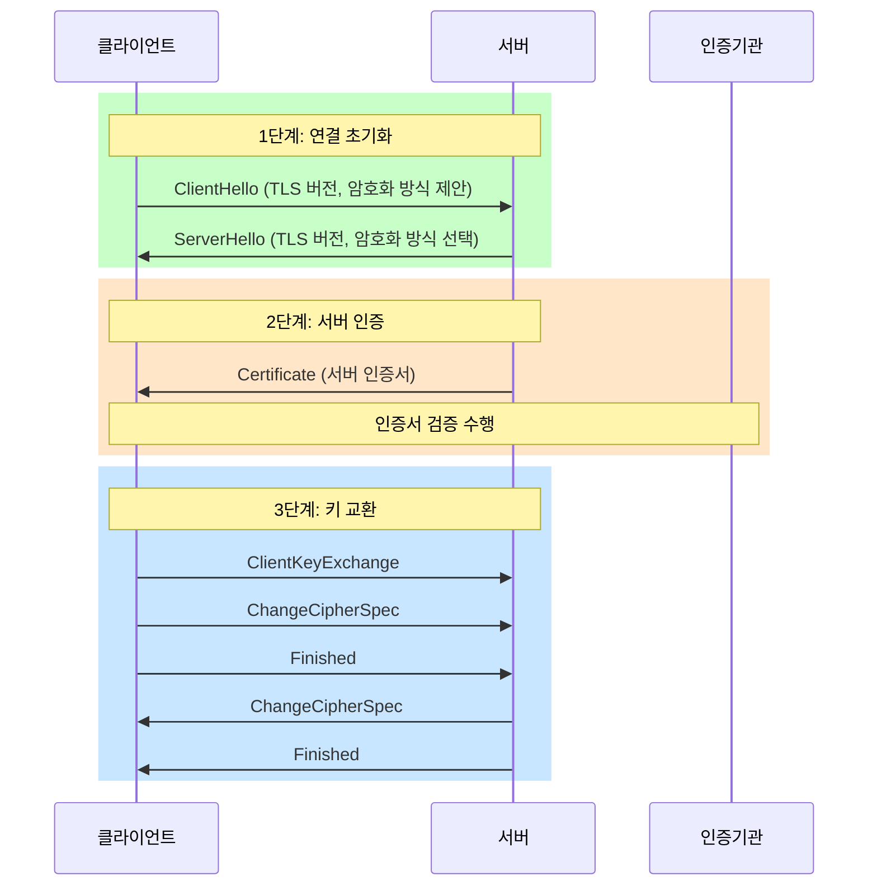
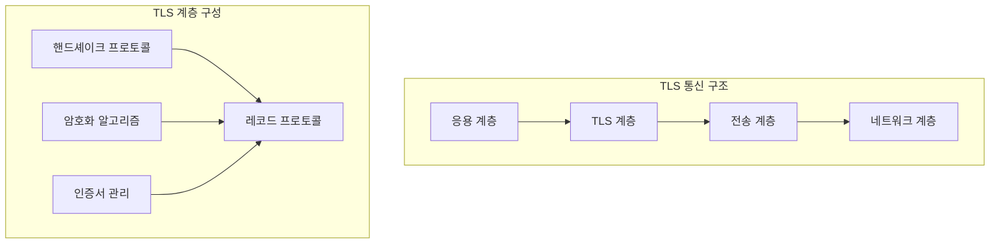
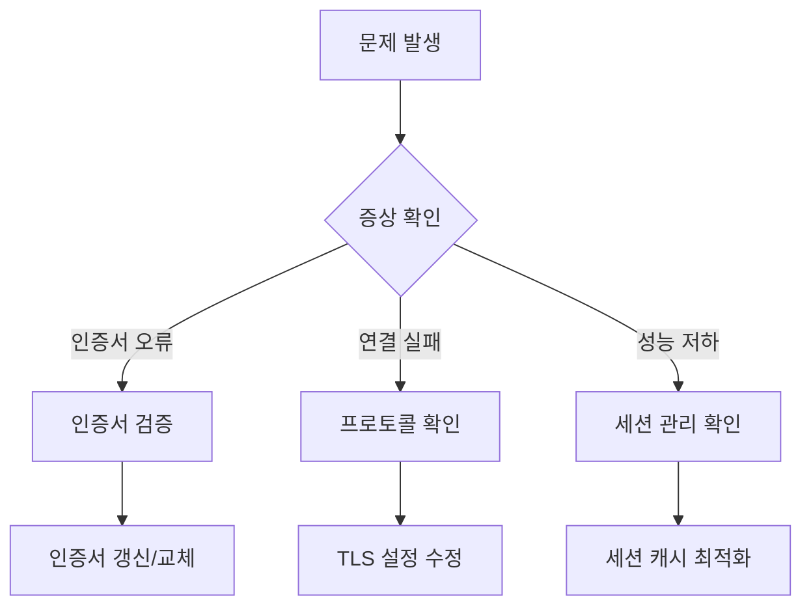

# 개념 이해

## 기본 개념
Transport Layer Security(TLS) 핸드셰이크는 웹 브라우저와 서버 간의 안전한 통신을 수립하는 과정이다. 이 과정에서 Digital Certificate(인증서)는 서버의 신원을 보장하는 디지털 신분증 역할을 한다.

## 실생활 비유
은행 거래와 유사하다:
- 신분증 제시 = 서버가 인증서 제시
- 신분증 진위 확인 = 인증서 검증
- 금고 키 교환 = 암호화 키 교환
- 안전한 거래 시작 = 암호화된 통신 시작

# 핸드셰이크 단계별 과정

## 기본 흐름도


## 시스템 아키텍처


# 구현 가이드

## 환경 설정
```python
# TLS 설정 클래스
class TLSConfig:
    """
    TLS 연결 설정을 관리하는 클래스
    """
    def __init__(self):
        self.context = ssl.create_default_context()
        # 최신 TLS 버전만 사용
        self.context.minimum_version = ssl.TLSVersion.TLS1_2
        # 인증서 검증 필수
        self.context.verify_mode = ssl.CERT_REQUIRED
        # 호스트명 검증 활성화
        self.context.check_hostname = True

    def create_connection(self, host: str, port: int) -> ssl.SSLSocket:
        """
        안전한 TLS 연결을 생성한다.
        """
        sock = socket.create_connection((host, port))
        return self.context.wrap_socket(sock, server_hostname=host)
```

## 인증서 검증 구현
```python
class CertificateValidator:
    """
    인증서 검증을 수행하는 클래스
    """
    def __init__(self, cert_path: str):
        self.cert_path = cert_path
        self.cert = self._load_certificate()

    def _load_certificate(self) -> x509.Certificate:
        """
        인증서를 로드한다.
        """
        with open(self.cert_path, 'rb') as f:
            return x509.load_pem_x509_certificate(f.read())

    def validate(self) -> bool:
        """
        인증서의 유효성을 검증한다.
        """
        try:
            # 만료일 검증
            if self.cert.not_valid_after < datetime.now():
                raise ValueError("인증서가 만료되었다")

            # 서명 알고리즘 검증
            if self.cert.signature_algorithm_oid in WEAK_ALGORITHMS:
                raise ValueError("취약한 서명 알고리즘이 사용되었다")

            # 키 길이 검증
            public_key = self.cert.public_key()
            if isinstance(public_key, rsa.RSAPublicKey):
                if public_key.key_size < 2048:
                    raise ValueError("RSA 키 길이가 불충분하다")

            return True

        except Exception as e:
            print(f"인증서 검증 실패: {e}")
            return False
```

# 성능 최적화

## 세션 재사용
```python
class TLSSessionManager:
    """
    TLS 세션을 관리하여 성능을 향상시키는 클래스
    """
    def __init__(self):
        self.session_cache = {}
    
    def save_session(self, host: str, session: bytes) -> None:
        """
        TLS 세션을 캐시에 저장한다.
        """
        self.session_cache[host] = (session, time.time())
    
    def get_session(self, host: str) -> Optional[bytes]:
        """
        캐시된 TLS 세션을 조회한다.
        """
        if host in self.session_cache:
            session, timestamp = self.session_cache[host]
            if time.time() - timestamp < 3600:  # 1시간 유효
                return session
        return None
```

# 보안 강화 방안

## 인증서 신뢰성 검증
```python
def verify_certificate_chain(cert_path: str, trusted_certs_path: str) -> bool:
    """
    인증서 체인의 신뢰성을 검증한다.
    """
    try:
        trusted_certs = load_trusted_certs(trusted_certs_path)
        cert_store = cryptography.x509.X509Store()
        
        # 신뢰할 수 있는 인증서 추가
        for trusted_cert in trusted_certs:
            cert_store.add_cert(trusted_cert)
            
        # 체인 검증
        store_ctx = cryptography.x509.X509StoreContext(cert_store, cert)
        store_ctx.verify_certificate()
        return True
        
    except Exception as e:
        print(f"인증서 체인 검증 실패: {e}")
        return False
```

# 문제 해결 가이드

## 일반적인 문제 상황
1. 인증서 만료
2. 잘못된 도메인 이름
3. 신뢰할 수 없는 발급기관
4. 프로토콜 버전 불일치

## 문제 해결 절차


# 결론

## 핵심 요약
1. TLS 핸드셰이크는 안전한 통신의 기초가 된다
2. 인증서는 서버의 신원을 보장한다
3. 적절한 구현과 관리가 보안의 핵심이다

## 권장 사항
1. 최신 TLS 버전을 사용한다
2. 인증서를 정기적으로 갱신한다
3. 보안 설정을 주기적으로 검토한다
4. 성능 최적화를 고려한다