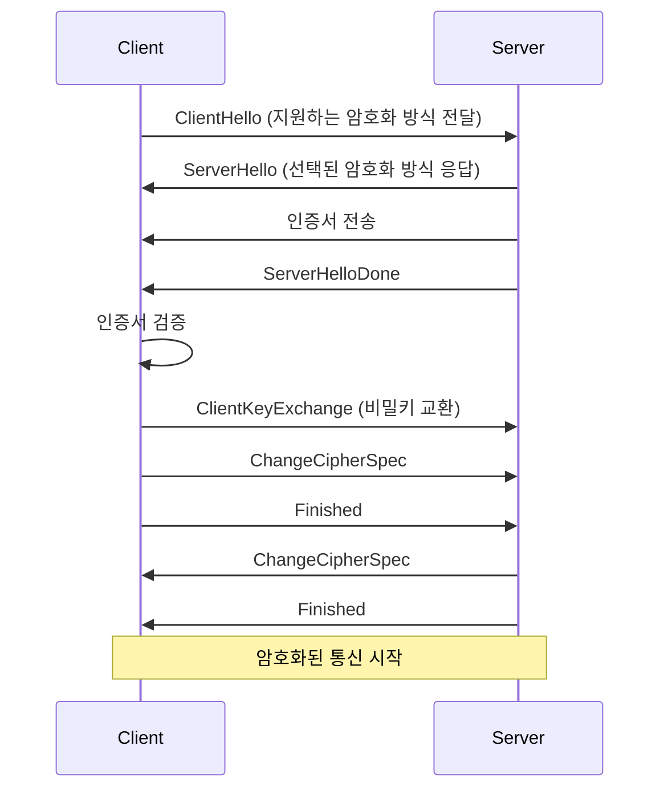
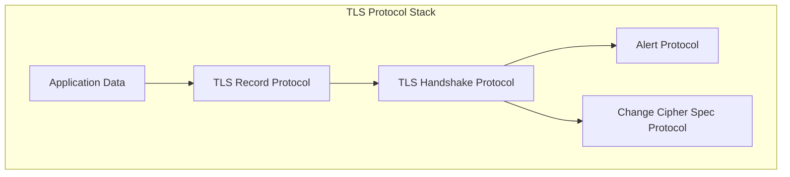
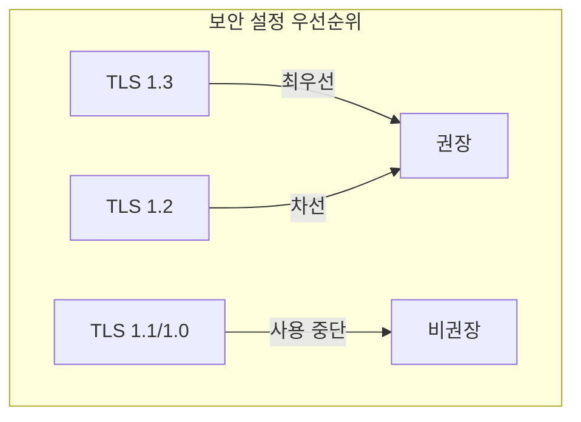

# 개념 이해

## TLS란?
TLS는 네트워크 통신의 개인정보 보호와 데이터 무결성을 제공하는 보안 프로토콜이다. SSL(Secure Sockets Layer)의 후속 버전이다.

## 보안 목표
1. 기밀성: 데이터를 암호화하여 도청 방지
2. 무결성: 데이터 변조 감지
3. 인증: 통신 상대방의 신원 확인

# 동작 방식

## TLS 핸드셰이크 과정


> [!info]
> [[TLS 핸드셰이크와 인증서의 역할]]

## 프로토콜 스택


# 암호화 구성요소

## 1. 키 교환 알고리즘
- RSA
- Diffie-Hellman
- Elliptic Curve Diffie-Hellman (ECDH)

## 2. 대칭키 암호화
- AES-GCM
- ChaCha20-Poly1305

## 3. 해시 함수
- SHA-256
- SHA-384

# 구현 가이드

## OpenSSL을 사용한 구현 예시

### 1. 인증서 생성
```bash
# 개인키 생성
openssl genpkey -algorithm RSA -out private.key -pkeyopt rsa_keygen_bits:2048

# CSR 생성
openssl req -new -key private.key -out request.csr

# 자체 서명된 인증서 생성
openssl x509 -req -days 365 -in request.csr -signkey private.key -out certificate.crt
```

### 2. TLS 설정 예시 (nginx)
```nginx
server {
    listen 443 ssl;
    server_name example.com;

    # 인증서 설정
    ssl_certificate /path/to/certificate.crt;
    ssl_certificate_key /path/to/private.key;

    # 프로토콜 설정
    ssl_protocols TLSv1.2 TLSv1.3;

    # 암호화 스위트 설정
    ssl_ciphers ECDHE-ECDSA-AES128-GCM-SHA256:ECDHE-RSA-AES128-GCM-SHA256;
    
    # HSTS 설정
    add_header Strict-Transport-Security "max-age=31536000";
}
```
> [!info] 암호화 스위트란?
> [[암호화 스위트(Cipher Suite)]]
## 잘못된 설정과 올바른 설정

### 잘못된 예시
```nginx
# 취약한 설정
ssl_protocols TLSv1 TLSv1.1 TLSv1.2;
ssl_ciphers ALL:!NULL;
```

### 올바른 예시
```nginx
# 안전한 설정
ssl_protocols TLSv1.2 TLSv1.3;
ssl_ciphers ECDHE-ECDSA-AES128-GCM-SHA256:ECDHE-RSA-AES128-GCM-SHA256;
ssl_prefer_server_ciphers off;
```

# 버전별 특징

## TLS 버전 비교
| 버전 | 출시연도 | 주요 특징 | 지원 상태 |
|------|----------|------------|------------|
| TLS 1.0 | 1999 | SSL 3.0 기반 | 사용 중단 |
| TLS 1.1 | 2006 | IV 처리 개선 | 사용 중단 |
| TLS 1.2 | 2008 | 암호화 개선 | 널리 사용 |
| TLS 1.3 | 2018 | 성능/보안 강화 | 권장 |

# 보안 고려사항

## 1. 인증서 관리
- 유효기간 관리
- 키 길이 선택
- 안전한 저장소 사용

## 2. 프로토콜 설정


## 3. 암호화 스위트 선택
- Forward Secrecy 지원
- 강력한 키 교환
- 안전한 암호화 알고리즘

# 성능 최적화

## 1. 세션 재사용
```nginx
# 세션 캐시 설정
ssl_session_cache shared:SSL:10m;
ssl_session_timeout 10m;
```

## 2. OCSP Stapling
```nginx
# OCSP Stapling 설정
ssl_stapling on;
ssl_stapling_verify on;
resolver 8.8.8.8 8.8.4.4 valid=300s;
```

# 문제 해결 가이드

## 일반적인 문제

### 1. 인증서 문제
```bash
# 인증서 검증
openssl verify -CAfile ca.crt certificate.crt

# 인증서 정보 확인
openssl x509 -in certificate.crt -text -noout
```

### 2. 연결 문제
```bash
# TLS 연결 테스트
openssl s_client -connect example.com:443 -tls1_2
```

# 모니터링

## 상태 확인
```bash
# 인증서 만료 확인
openssl x509 -enddate -noout -in certificate.crt

# TLS 연결 상태 확인
openssl s_client -connect example.com:443 -status
```

# 결론
TLS는 현대 인터넷 보안의 기반이 되는 프로토콜이다. 올바른 설정과 관리를 통해 안전한 통신을 보장할 수 있다.

## 권장사항
1. TLS 1.2 이상 사용
2. 강력한 암호화 스위트 선택
3. 정기적인 인증서 갱신
4. 보안 업데이트 적용