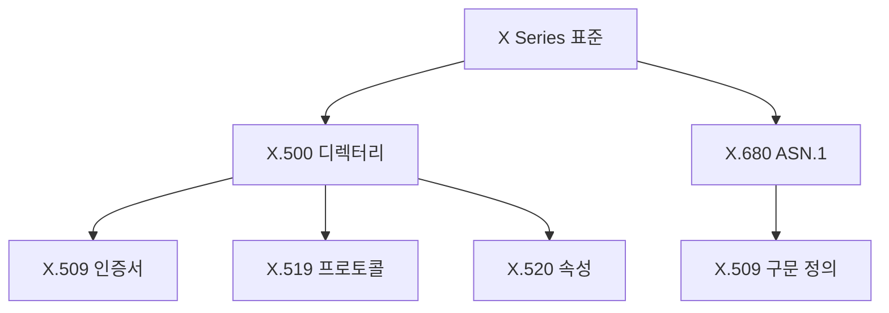

# X.509의 탄생 배경

ITU-T(국제전기통신연합 전기통신표준화부문)는 전기통신 관련 표준을 책임지는 국제기구다. ITU-T의 X Series는 데이터 네트워크와 보안 관련 표준을 담당한다.

X Series 주요 표준의 관계:


## X Series 내 X.509의 위치
- X.500: 전자 디렉터리 서비스의 기반이 되는 표준이다
- X.509: X.500의 인증 프레임워크를 정의한다
- X.519: 디렉터리 접근 프로토콜을 규정한다
- X.520: 디렉터리 속성 타입을 정의한다
- X.680: 인증서 구문을 정의하는 ASN.1 명세를 제공한다

> [!note]
> [[ASN.1(Abstract Syntax Notation One) - 데이터 구조 정의의 표준]]

# X.509 인증서의 구조

## 기본 필드 구조
```text
Certificate
  |-- Version (v1, v2, or v3)
  |-- Serial Number
  |-- Signature Algorithm
  |-- Issuer
  |-- Validity Period
  |-- Subject
  |-- Subject Public Key Info
  |-- Issuer Unique ID (v2 이상)
  |-- Subject Unique ID (v2 이상)
  |-- Extensions (v3)
```

## ASN.1 정의
```asn1
Certificate ::= SEQUENCE {
    tbsCertificate       TBSCertificate,
    signatureAlgorithm   AlgorithmIdentifier,
    signature            BIT STRING
}

TBSCertificate ::= SEQUENCE {
    version         [0]  Version DEFAULT v1,
    serialNumber         CertificateSerialNumber,
    signature           AlgorithmIdentifier,
    issuer              Name,
    validity            Validity,
    subject             Name,
    subjectPublicKeyInfo SubjectPublicKeyInfo,
    issuerUniqueID  [1]  IMPLICIT UniqueIdentifier OPTIONAL,
    subjectUniqueID [2]  IMPLICIT UniqueIdentifier OPTIONAL,
    extensions      [3]  Extensions OPTIONAL
}
```

# 버전별 발전 과정

## 버전 1 (1988)
- 기본적인 인증서 필드만 포함
- 유연성이 부족한 구조
- 현대적 용도로는 부적합

```text
# v1 인증서 구조
- Serial Number
- Signature Algorithm ID
- Issuer Name
- Validity Period
- Subject Name
- Subject Public Key Info
```

## 버전 2 (1993)
- Unique Identifier 필드 추가
- 하위 호환성 유지
- 널리 채택되지 않음

```text
# v2에서 추가된 필드
- Issuer Unique Identifier
- Subject Unique Identifier
```

## 버전 3 (1996)
- 확장 필드 도입
- 현재 표준으로 사용
- 유연한 확장성 제공

```text
# v3 주요 확장 필드
- Key Usage
- Extended Key Usage
- Subject Alternative Name
- Basic Constraints
- Certificate Policies
```

# 실제 구현 예시

## 인증서 생성
```bash
# 개인키 생성
openssl genrsa -out private.key 2048

# CSR 생성 (v3 확장자 포함)
cat > openssl.cnf << EOF
[req]
distinguished_name = req_distinguished_name
req_extensions = v3_req

[req_distinguished_name]
countryName = Country Name (2 letter code)
countryName_default = KR
organizationName = Organization Name
organizationName_default = Example Corp
commonName = Common Name
commonName_default = example.com

[v3_req]
basicConstraints = CA:FALSE
keyUsage = nonRepudiation, digitalSignature, keyEncipherment
subjectAltName = @alt_names

[alt_names]
DNS.1 = example.com
DNS.2 = www.example.com
EOF

openssl req -new -key private.key -out request.csr -config openssl.cnf
```

## 인증서 검증
```bash
# 인증서 정보 확인
openssl x509 -in certificate.crt -text -noout

# 체인 검증
openssl verify -CAfile chain.pem certificate.crt
```

# 실무 적용 시나리오

## 웹 서버 설정 (Nginx)
```nginx
server {
    listen 443 ssl;
    server_name example.com;
    
    ssl_certificate /path/to/certificate.crt;
    ssl_certificate_key /path/to/private.key;
    
    # 최신 보안 설정
    ssl_protocols TLSv1.2 TLSv1.3;
    ssl_ciphers ECDHE-ECDSA-AES128-GCM-SHA256:ECDHE-RSA-AES128-GCM-SHA256;
    ssl_prefer_server_ciphers off;
    
    # OCSP Stapling
    ssl_stapling on;
    ssl_stapling_verify on;
    ssl_trusted_certificate /path/to/chain.pem;
}
```

## 클라이언트 인증서 설정
```apache
<Directory "/secure">
    SSLVerifyClient require
    SSLVerifyDepth 2
    SSLOptions +ExportCertData
    SSLCACertificateFile /path/to/ca-chain.pem
</Directory>
```

# 보안 고려사항

## 키 관리
1. 개인키 보호
```bash
# 개인키 권한 설정
chmod 600 private.key
chown root:root private.key

# 개인키 암호화
openssl rsa -aes256 -in private.key -out encrypted.key
```

2. 인증서 갱신 자동화
```bash
# 인증서 만료 모니터링 스크립트
#!/bin/bash
expiry=$(openssl x509 -in certificate.crt -noout -enddate | cut -d= -f2)
expiry_epoch=$(date -d "$expiry" +%s)
now_epoch=$(date +%s)
days_left=$(( ($expiry_epoch - $now_epoch) / 86400 ))

if [ $days_left -lt 30 ]; then
    echo "Certificate will expire in $days_left days"
    # 갱신 프로세스 시작
fi
```

## 보안 감사
```bash
# 인증서 보안 점검 스크립트
#!/bin/bash
# 키 길이 확인
key_size=$(openssl x509 -in certificate.crt -noout -text | grep "Public-Key:" | grep -o "[0-9]*")
if [ $key_size -lt 2048 ]; then
    echo "Warning: Key size less than 2048 bits"
fi

# 서명 알고리즘 확인
sig_alg=$(openssl x509 -in certificate.crt -noout -text | grep "Signature Algorithm" | head -1)
if [[ $sig_alg == *"SHA1"* ]]; then
    echo "Warning: Weak signature algorithm (SHA1) detected"
fi
```

# 문제 해결 가이드

## 일반적인 문제 해결
1. 인증서 체인 문제
```bash
# 체인 순서 확인
openssl crl2pkcs7 -nocrl -certfile certificate.crt | openssl pkcs7 -print_certs -noout

# 누락된 중간 인증서 찾기
openssl verify -verbose certificate.crt
```

2. 키 쌍 불일치
```bash
# 인증서와 키 쌍 검증
cert_mod=$(openssl x509 -noout -modulus -in certificate.crt | openssl md5)
key_mod=$(openssl rsa -noout -modulus -in private.key | openssl md5)
if [ "$cert_mod" = "$key_mod" ]; then
    echo "Certificate and key match"
else
    echo "Certificate and key do NOT match"
fi
```

# 성능 최적화

## OCSP Stapling 구현
```nginx
# Nginx 설정
ssl_stapling on;
ssl_stapling_verify on;
ssl_trusted_certificate /path/to/chain.pem;
resolver 8.8.8.8 8.8.4.4 valid=300s;
resolver_timeout 5s;
```

## 세션 캐싱
```nginx
ssl_session_cache shared:SSL:10m;
ssl_session_timeout 10m;
ssl_session_tickets off;
```

# 미래 전망

현재 X.509는 다음과 같은 방향으로 발전하고 있다:

1. 양자 내성 암호화(Post-Quantum Cryptography) 지원
2. 블록체인 기반 인증서 관리 시스템과의 통합
3. 자동화된 인증서 수명주기 관리
4. 제로 트러스트 아키텍처에서의 역할 강화

# 결론

X.509는 단순한 표준 번호를 넘어 현대 인터넷 보안의 근간이 되는 중요한 표준이다. X Series의 다른 표준들과 함께 작동하면서 PKI의 핵심 구성 요소로 자리잡았다. 지속적인 발전과 확장을 통해 미래의 보안 요구사항도 충족시킬 것으로 기대된다.