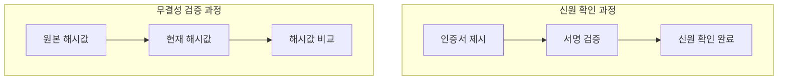
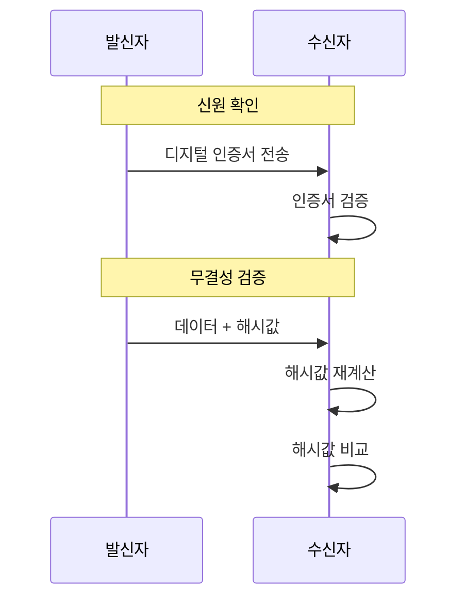
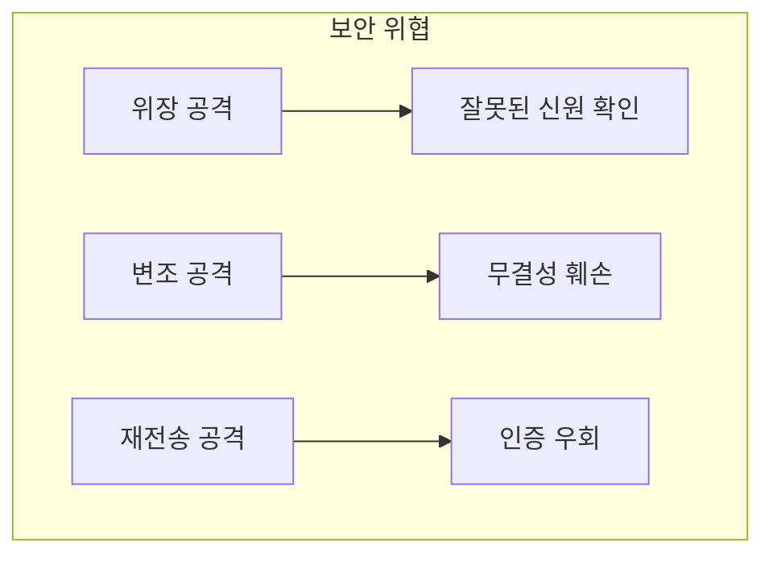
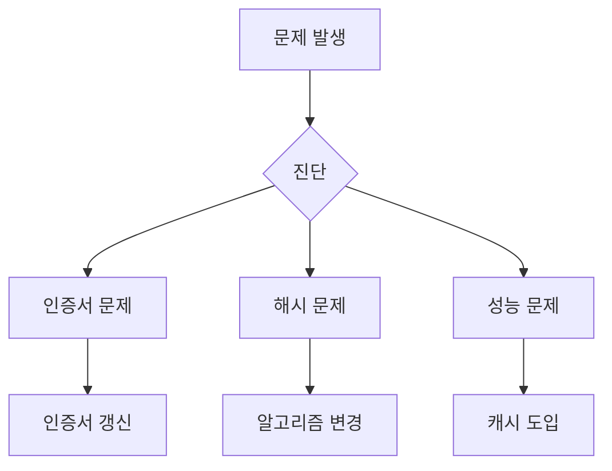

# 개념 이해

## 기본 개념
- 신원 확인(Identity Verification)은 통신 주체가 주장하는 대상이 맞는지 확인하는 과정이다
- 무결성 검증(Integrity Verification)은 데이터가 전송 과정에서 변조되지 않았음을 확인하는 과정이다

## 실생활 비유
신원 확인과 무결성 검증은 다음과 같은 실생활 상황과 유사하다:
- 신원 확인: 여권으로 본인 확인을 하는 과정
- 무결성 검증: 봉인된 택배가 뜯기지 않았는지 확인하는 과정

# 동작 방식

## 프로세스 흐름


## 검증 단계


# 구현 예시

## 기본 구현
```python
import hashlib
from cryptography.hazmat.primitives import hashes
from cryptography.hazmat.primitives.asymmetric import padding, rsa

class SecurityVerifier:
    """
    신원 확인과 무결성 검증을 수행하는 클래스
    """
    def __init__(self):
        # RSA 키 쌍 생성
        self.private_key = rsa.generate_private_key(
            public_exponent=65537,
            key_size=2048
        )
        self.public_key = self.private_key.public_key()

    def verify_identity(self, signature, message):
        """
        신원 확인을 수행한다
        
        Args:
            signature: 전자서명
            message: 원본 메시지
            
        Returns:
            bool: 신원 확인 결과
        """
        try:
            self.public_key.verify(
                signature,
                message,
                padding.PSS(
                    mgf=padding.MGF1(hashes.SHA256()),
                    salt_length=padding.PSS.MAX_LENGTH
                ),
                hashes.SHA256()
            )
            return True
        except Exception:
            return False

    def verify_integrity(self, message, original_hash):
        """
        무결성 검증을 수행한다
        
        Args:
            message: 검증할 메시지
            original_hash: 원본 해시값
            
        Returns:
            bool: 무결성 검증 결과
        """
        current_hash = hashlib.sha256(message).hexdigest()
        return current_hash == original_hash
```

## 올바른 구현과 잘못된 구현

### 잘못된 구현
```python
# 잘못된 구현 - 보안에 취약
class InsecureVerifier:
    def verify_identity(self, token):
        # 단순 토큰 비교는 위험하다
        return token == "secret_token"
    
    def verify_integrity(self, data):
        # 단순 길이 확인은 무결성을 보장하지 않는다
        return len(data) == 100
```

### 올바른 구현
```python
# 안전한 구현
class SecureVerifier:
    def verify_identity(self, cert, signature, message):
        # 인증서 검증
        if not self.verify_certificate(cert):
            return False
        # 서명 검증
        return self.verify_signature(cert.public_key, signature, message)
    
    def verify_integrity(self, message, signature, public_key):
        # 전자서명을 통한 무결성 검증
        try:
            public_key.verify(
                signature,
                message,
                padding.PSS(
                    mgf=padding.MGF1(hashes.SHA256()),
                    salt_length=padding.PSS.MAX_LENGTH
                ),
                hashes.SHA256()
            )
            return True
        except Exception:
            return False
```

# 성능 최적화

## 캐싱 전략
```python
class CachedVerifier:
    def __init__(self):
        self.hash_cache = {}
        self.cert_cache = {}
    
    def verify_with_cache(self, message, hash_value):
        """
        캐시를 활용한 빠른 검증을 수행한다
        """
        if message in self.hash_cache:
            return self.hash_cache[message] == hash_value
            
        result = self._verify_and_cache(message, hash_value)
        return result
```

# 보안 고려사항

## 주요 위협


## 대응 방안
1. 신원 확인
   - 강력한 인증서 사용
   - 다중 인증 적용
   
2. 무결성 검증
   - 강력한 해시 알고리즘 사용
   - 타임스탬프 포함

# 문제 해결 가이드

## 일반적인 문제
1. 인증서 만료
2. 해시 충돌
3. 성능 저하

## 해결 방안


# 결론

## 핵심 차이점
1. 신원 확인은 '누구인가'를 검증한다
2. 무결성 검증은 '변경되지 않았음'을 검증한다
3. 두 가지 모두 보안에 필수적이다

## 적용 시 고려사항
1. 적절한 알고리즘 선택
2. 정기적인 키 갱신
3. 성능과 보안의 균형