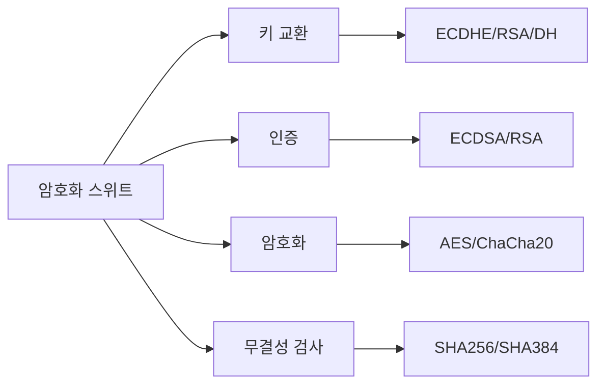
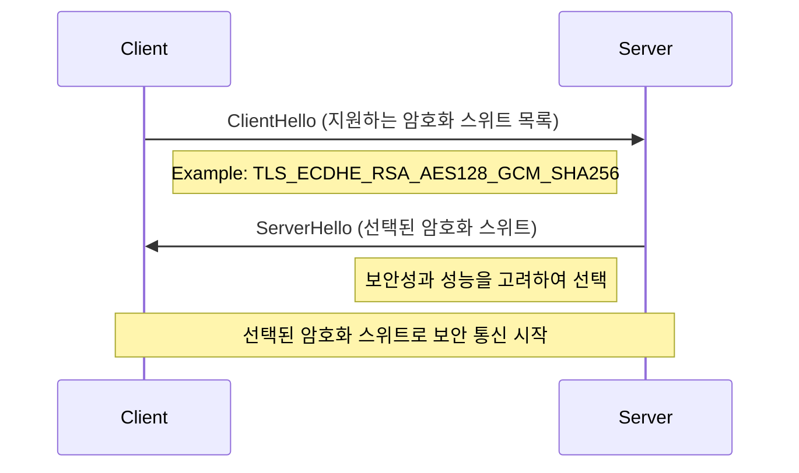
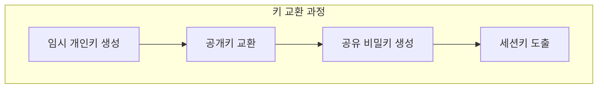
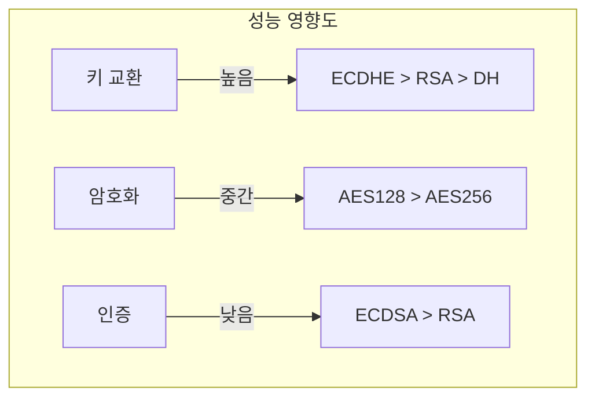

# 개념 이해

## 암호화 스위트란?
암호화 스위트는 보안 통신에 사용되는 암호화 알고리즘들의 모음이다. SSL/TLS 통신에서 사용되는 다양한 암호화 메커니즘을 정의한다.

## 구성 요소


# 동작 방식

## 암호화 스위트 선택 과정


# 암호화 스위트 구성 요소 상세

## 1. 키 교환 알고리즘
- ECDHE (Elliptic Curve Diffie-Hellman Ephemeral)
- RSA (Rivest-Shamir-Adleman)
- DHE (Diffie-Hellman Ephemeral)



## 2. 인증 알고리즘
- ECDSA (Elliptic Curve Digital Signature Algorithm)
- RSA (인증용)

## 3. 대칭키 암호화
- AES-GCM (Advanced Encryption Standard - Galois/Counter Mode)
- ChaCha20-Poly1305

## 4. 무결성 검사
- SHA256 (Secure Hash Algorithm 256-bit)
- SHA384 (Secure Hash Algorithm 384-bit)

# 구현 예시

## Nginx 설정
```nginx
# 권장되는 암호화 스위트 설정
ssl_protocols TLSv1.2 TLSv1.3;
ssl_ciphers ECDHE-ECDSA-AES128-GCM-SHA256:ECDHE-RSA-AES128-GCM-SHA256:ECDHE-ECDSA-AES256-GCM-SHA384:ECDHE-RSA-AES256-GCM-SHA384;
ssl_prefer_server_ciphers off;
```

## Apache 설정
```apache
# Apache 서버 설정
SSLProtocol all -SSLv3 -TLSv1 -TLSv1.1
SSLCipherSuite ECDHE-ECDSA-AES128-GCM-SHA256:ECDHE-RSA-AES128-GCM-SHA256:ECDHE-ECDSA-AES256-GCM-SHA384:ECDHE-RSA-AES256-GCM-SHA384
SSLHonorCipherOrder off
```

# 보안 강도별 설정

## 1. 최고 수준의 보안
```nginx
ssl_ciphers ECDHE-ECDSA-AES256-GCM-SHA384:ECDHE-RSA-AES256-GCM-SHA384;
```

## 2. 성능 중시 설정
```nginx
ssl_ciphers ECDHE-ECDSA-AES128-GCM-SHA256:ECDHE-RSA-AES128-GCM-SHA256;
```

## 3. 호환성 중시 설정
```nginx
ssl_ciphers ECDHE-ECDSA-AES128-GCM-SHA256:ECDHE-RSA-AES128-GCM-SHA256:ECDHE-ECDSA-AES256-GCM-SHA384:ECDHE-RSA-AES256-GCM-SHA384:ECDHE-ECDSA-CHACHA20-POLY1305:ECDHE-RSA-CHACHA20-POLY1305;
```

# 성능 고려사항

## 암호화 알고리즘별 성능 비교


# 문제 해결 가이드

## 일반적인 문제

### 1. 호환성 문제
```bash
# OpenSSL로 지원 암호화 스위트 확인
openssl ciphers -v 'ECDHE-ECDSA-AES128-GCM-SHA256:ECDHE-RSA-AES128-GCM-SHA256'

# 서버 연결 테스트
openssl s_client -connect example.com:443 -tls1_2
```

### 2. 성능 문제
```bash
# 암호화 성능 테스트
openssl speed ecdh
openssl speed aes-128-gcm
```

# 보안 Best Practices

## 1. 권장 설정
- TLS 1.2 이상 사용
- 강력한 암호화 스위트 선택
- Perfect Forward Secrecy 지원

## 2. 피해야 할 설정
- 취약한 암호화 알고리즘 (DES, RC4 등)
- 안전하지 않은 해시 함수 (MD5, SHA1)
- 약한 키 교환 방식 (RSA 키 교환)

# 모니터링과 유지보수

## 보안 감사
```bash
# SSL/TLS 설정 검사
sslyze --regular example.com

# 암호화 스위트 확인
nmap --script ssl-enum-ciphers -p 443 example.com
```

# 결론
암호화 스위트의 올바른 선택과 설정은 보안 통신의 핵심이다. 보안성, 성능, 호환성을 고려하여 적절한 조합을 선택해야 한다.

## 핵심 포인트
1. 최신 암호화 알고리즘 사용
2. Perfect Forward Secrecy 보장
3. 적절한 키 길이 선택
4. 정기적인 설정 검토와 업데이트
