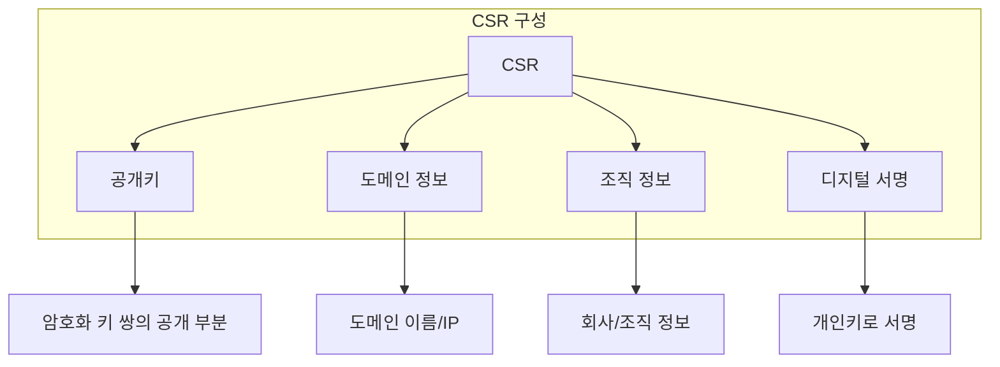
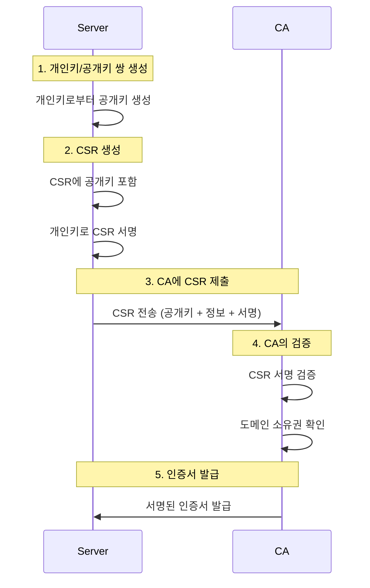
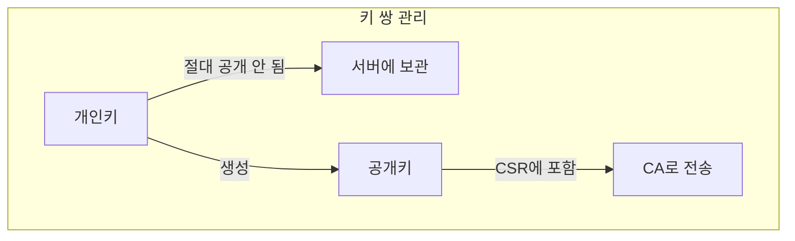
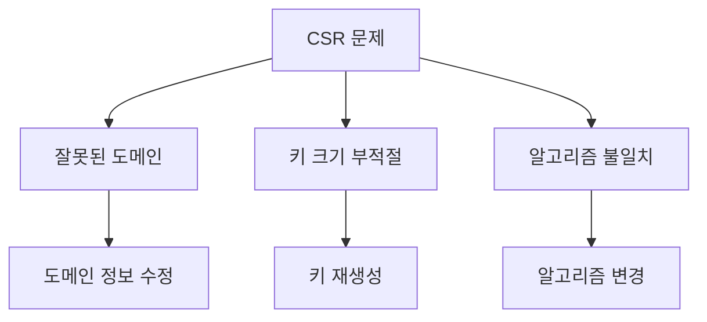

# 개념 이해

## CSR이란?
CSR(Certificate Signing Request)은 SSL/TLS 인증서를 발급받기 위해 인증기관(CA)에 제출하는 요청서이다. 서버의 공개키와 정보를 포함한다.

## 실생활 비유
여권 발급 신청서와 유사하다:
- 신청자 정보 제공 (도메인 정보)
- 신원 증명 (공개키)
- 공식 기관에 신청 (CA)
- 검증 후 발급 (인증서)

# CSR 구성 요소


# CSR 생성 과정

## 1. 기본 생성 과정


이 과정이 필요한 이유:

1. 키 쌍의 소유권 증명
   - 개인키로 CSR에 서명
   - 이는 "나는 이 키 쌍의 진짜 소유자"라고 증명

2. 보안적 이점


## 2. 실제 예시
```bash
# 1. 개인키 생성
openssl genrsa -out private.key 2048

# 2. CSR 생성 (이 과정에서 개인키로 서명)
openssl req -new -key private.key -out request.csr

# 1~2. 개인키 + CSR 동시 생성
easyrsa gen-req server nopass

# 3. CSR 내용 확인
openssl req -text -in request.csr -noout
easyrsa show-req server
```

검증 과정:
```text
1) Server: 개인키로 CSR 서명
2) CA: CSR의 서명을 공개키로 검증
3) CA: "이 사람이 진짜 개인키 소유자구나" 확인
4) CA: 도메인 소유권 등 추가 검증 수행
```

즉, 개인키는:
1. 공개키를 생성하는 원천
2. CSR의 신뢰성을 보장하는 서명 수단
3. 이후 SSL/TLS 통신의 기반

이 때문에 개인키로부터 CSR을 생성하는 것입니다.
# 실제 구현 예시

## OpenSSL을 사용한 상세 CSR 생성
```bash
#!/bin/bash

# 설정 파일 생성
cat > csr.conf << EOF
[req]
distinguished_name = req_distinguished_name
req_extensions = v3_req
prompt = no

[req_distinguished_name]
C = KR
ST = Seoul
L = Gangnam
O = My Company
OU = IT Department
CN = example.com

[v3_req]
basicConstraints = CA:FALSE
keyUsage = nonRepudiation, digitalSignature, keyEncipherment
subjectAltName = @alt_names

[alt_names]
DNS.1 = example.com
DNS.2 = www.example.com
EOF

# CSR 생성
openssl req -new -nodes \
    -keyout private.key \
    -out request.csr \
    -config csr.conf
```

# CSR 검증 및 문제 해결

## 1. CSR 내용 확인
```bash
# CSR 정보 확인
openssl req -text -noout -verify -in request.csr
```

## 2. 일반적인 문제 해결


# CSR 관련 보안 고려사항

## 1. 키 관리


## 2. 정보 보호
```bash
# 개인키 권한 설정
chmod 600 private.key

# 개인키 암호화
openssl rsa -aes256 -in private.key -out encrypted.key
```

# 다양한 CSR 형식

## 1. 표준 형식
```text
-----BEGIN CERTIFICATE REQUEST-----
MIICvDCCAaQCAQAwdzELMAkGA1UEBhMCVVMxDTALBgNVBAgMBFV0YWgxDzANBgNV
BAcMBlByb3ZvMRQwEgYDVQQKDAtBQ01FIFdpZGdldDEUMBIGA1UECwwLRW5naW5l
...
-----END CERTIFICATE REQUEST-----
```

## 2. SAN(Subject Alternative Name) 포함
```bash
# SAN을 포함한 CSR 생성
openssl req -new -key private.key -out request.csr \
    -addext "subjectAltName = DNS:example.com,DNS:www.example.com"
```

# 자동화 및 관리

## 1. 자동화 스크립트
```bash
#!/bin/bash

# CSR 생성 자동화
generate_csr() {
    domain=$1
    company=$2
    
    # 설정 파일 생성
    cat > "${domain}.conf" << EOF
    [req]
    distinguished_name = req_distinguished_name
    req_extensions = v3_req
    prompt = no
    
    [req_distinguished_name]
    CN = ${domain}
    O = ${company}
    
    [v3_req]
    basicConstraints = CA:FALSE
    keyUsage = nonRepudiation, digitalSignature, keyEncipherment
    subjectAltName = @alt_names
    
    [alt_names]
    DNS.1 = ${domain}
    DNS.2 = www.${domain}
    EOF
    
    # CSR 생성
    openssl req -new -nodes \
        -keyout "${domain}.key" \
        -out "${domain}.csr" \
        -config "${domain}.conf"
}

# 사용 예
generate_csr "example.com" "My Company"
```

# 결론

## CSR의 중요성
1. SSL/TLS 인증서 발급의 첫 단계
2. 서버 신원 확인의 기초
3. 보안 통신의 시작점

## 모범 사례
1. 강력한 키 크기 사용 (최소 2048비트)
2. 정확한 도메인 정보 입력
3. 안전한 개인키 관리
4. 자동화된 프로세스 구축