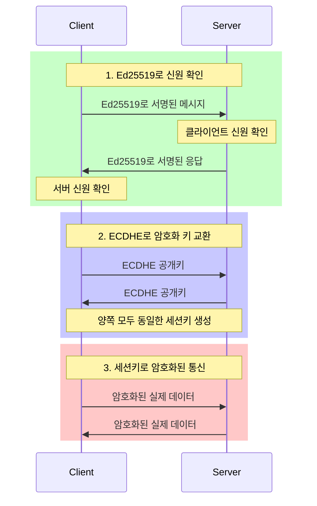
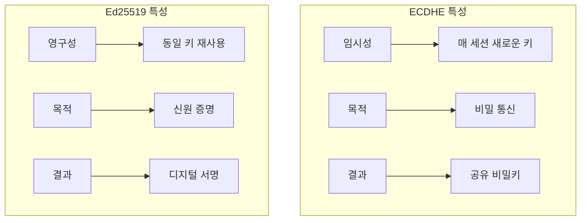
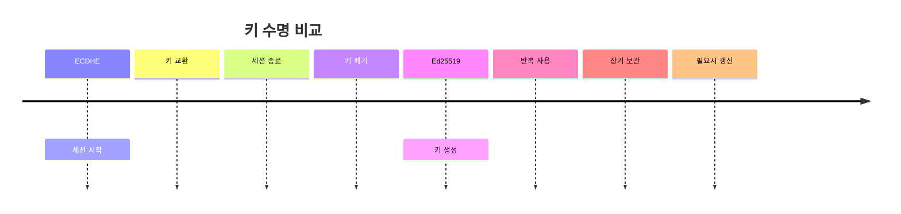
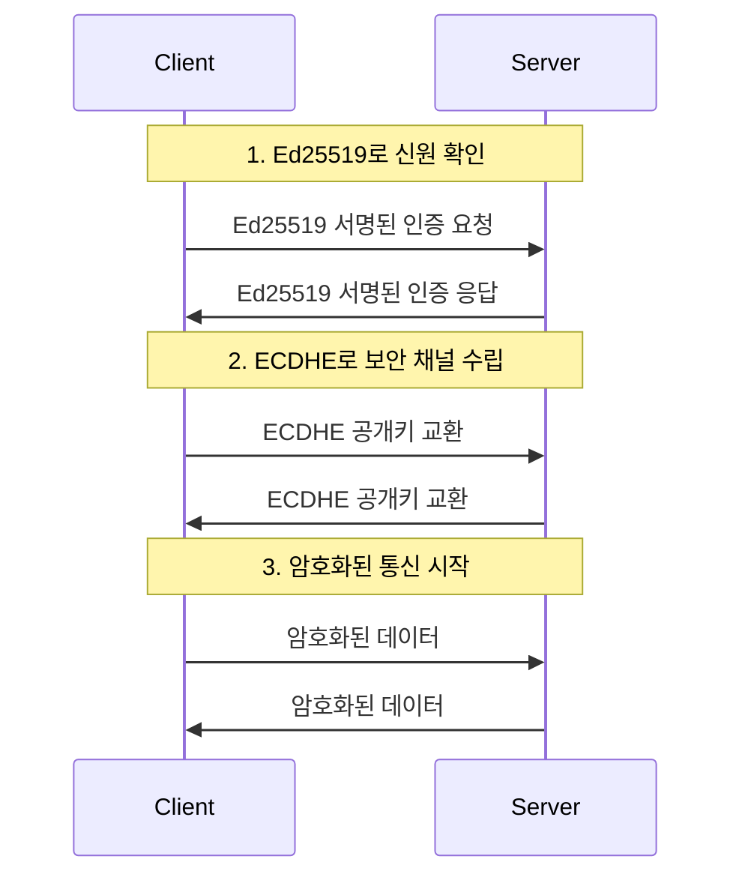
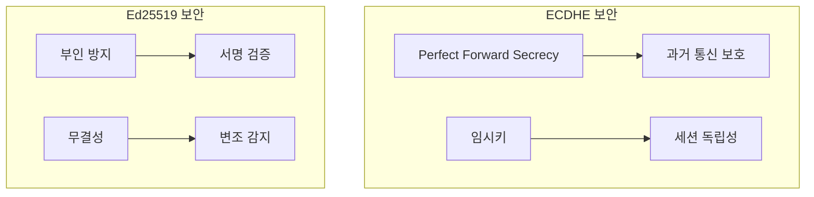
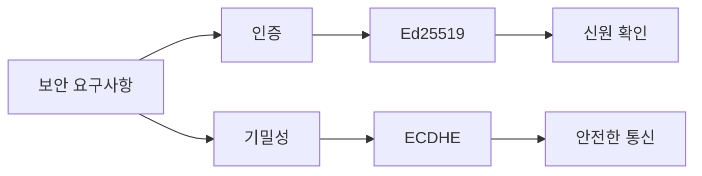
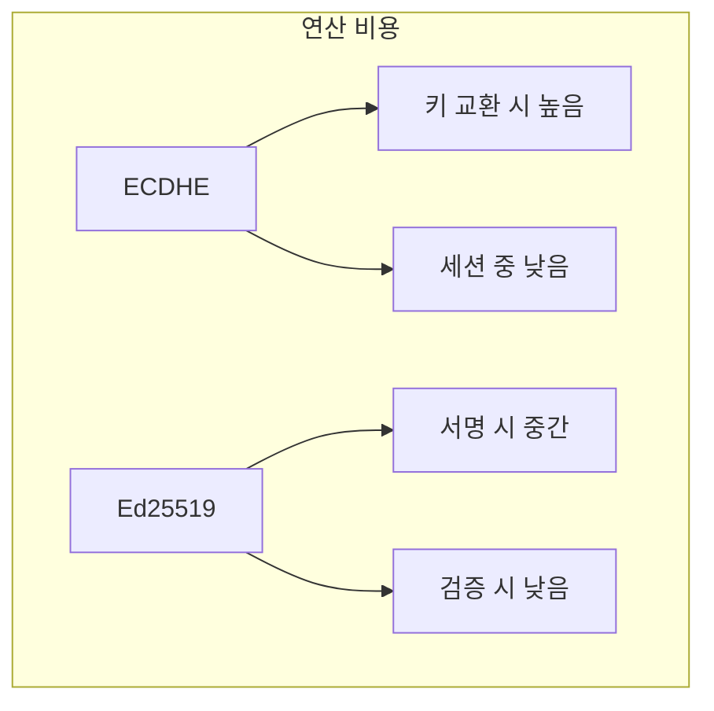

# 개념 이해

## 기본 목적의 차이
ECDHE와 Ed25519는 서로 다른 암호화 목적을 가진다:
- ECDHE: 안전한 키 교환 (비밀 통신 채널 수립)
- Ed25519: 디지털 서명 (신원 확인 및 무결성 검증)



즉:
1. Ed25519로 "너 진짜 구글이야?" 확인
2. ECDHE로 "우리끼리만 아는 비밀 암호" 생성
3. 그 비밀 암호로 실제 데이터 주고받기

## 실생활 비유
두 알고리즘의 차이는 다음과 같은 상황과 유사하다:
- [[Ed25519 - 디지털 서명 알고리즘|Ed25519]]: 편지에 서명하여 신원 증명
- [[ECDHE - 타원곡선을 이용한 키 교환|ECDHE]]: 비밀 대화를 위한 암호 방식 합의

# 핵심 차이점

## 특성 비교


## 키 수명


# 실제 사용 사례

## ECDHE 사용 예시
```python
def establish_secure_channel():
    """ECDHE를 사용한 보안 채널 수립"""
    # 매 연결마다 새로운 키 생성
    ephemeral_private = generate_private_key()
    ephemeral_public = derive_public_key(ephemeral_private)
    
    # 키 교환
    shared_secret = compute_shared_secret(
        ephemeral_private,
        received_public_key
    )
    
    # 세션 종료시 키 폐기
    del ephemeral_private
```

## Ed25519 사용 예시
```python
class DocumentSigner:
    """Ed25519를 사용한 문서 서명"""
    def __init__(self):
        # 한 번 생성하여 계속 사용
        self.private_key = load_permanent_key()
        
    def sign_document(self, document):
        # 동일한 키로 반복 서명
        signature = self.private_key.sign(document)
        return signature
```

# 실제 통신 과정

## 일반적인 보안 통신 흐름


# 보안 특성

## 각 알고리즘의 보안 특징


# 함께 사용하는 이유

## 상호 보완적 특성


# 구현 시 고려사항

## ECDHE 구현
```python
class ECDHESession:
    def __init__(self):
        self.private_key = None
        
    def start_session(self):
        # 새로운 세션키 생성
        self.private_key = generate_ephemeral_key()
        
    def end_session(self):
        # 세션 종료시 키 삭제
        self.private_key = None
```

## Ed25519 구현
```python
class Ed25519Identity:
    def __init__(self):
        # 영구적인 키 로드
        self.private_key = load_identity_key()
        
    def sign(self, data):
        # 동일 키로 서명
        return self.private_key.sign(data)
```

# 성능 특성

## 연산 부하


# 결론

## 각 알고리즘의 역할
1. ECDHE:
   - 안전한 통신 채널 수립
   - 세션키 교환
   - 임시 키 사용

2. Ed25519:
   - 신원 증명
   - 문서 서명
   - 영구 키 사용

## 최적의 사용
1. 인증은 Ed25519
2. 키 교환은 ECDHE
3. 두 알고리즘의 장점 활용